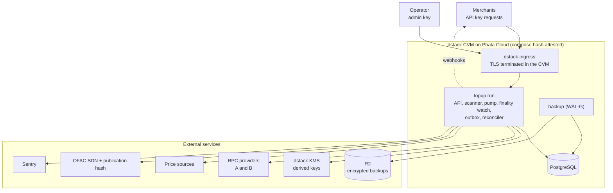
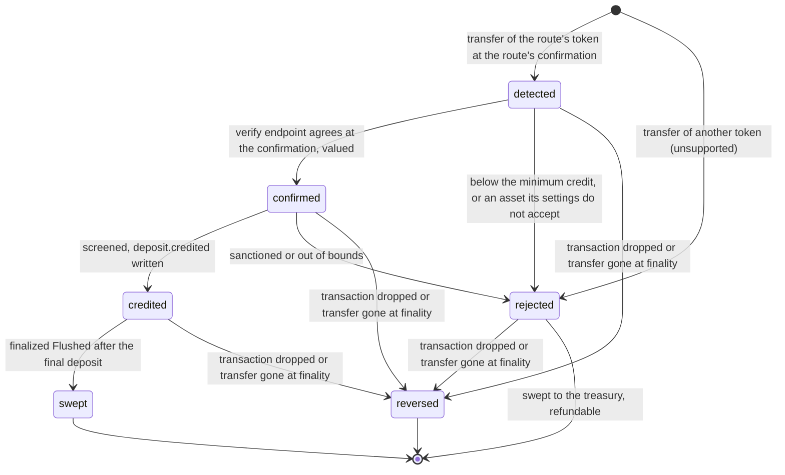
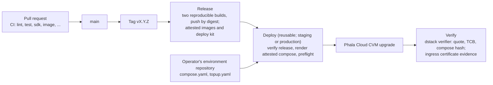

# Architecture

Implementation specification (multi-tenant, API-only; [design](design/multi-tenant.md)). Numbers marked *(policy)* are set by the operator's finance and risk owners;
this document fixes what they mean. Code comments and other documents cite its sections as
"architecture §N". For an introduction, read [How Phala Pay works](overview.md) first.

**Contents:** [0. Standards used](#0-standards-used) · [1. Goal](#1-goal) ·
[2. Design rules](#2-design-rules) · [3. Trust model](#3-trust-model) ·
[4. Contracts](#4-contracts) · [5. Stack](#5-stack) · [6. Schema](#6-schema) ·
[7. States and pump](#7-states-and-pump) ·
[8. Chain, valuation, screening](#8-chain-valuation-screening) · [9. Quotes](#9-quotes) ·
[10. Signing and sweeping](#10-signing-and-sweeping) ·
[11. Fulfillment webhook](#11-fulfillment-webhook) · [12. API and events](#12-api-and-events) ·
[13. Reconciliation](#13-reconciliation) ·
[14. Configuration and deployment](#14-configuration-and-deployment) ·
[15. Operating policies](#15-operating-policies) ·
[16. Observability and tests](#16-observability-and-tests) · [17. Delivery](#17-delivery) ·
[18. Feature map](#18-feature-map)

## 0. Standards used

Every mechanism follows a named practice. Where this design adapts a practice, the row says so.

| Mechanism | Standard or reference | Adaptation |
|---|---|---|
| Deposit addresses | CREATE2 forwarders, EIP-1167 via OpenZeppelin `Clones` with immutable args (BitGo `ForwarderFactory` as reference pattern) | The treasury is each clone's only immutable argument instead of per-clone init |
| Same address on every EVM chain | Arachnid deterministic deployment proxy `0x4e59b44847b379578588920cA78FbF26c0B4956C`, plain CREATE2 salts | The factory has no constructor arguments, so its init code is the build |
| Contract roles | None: public `flush` (BitGo's `flush()`), per-target failure isolation (Multicall3 `allowFailure`) | — |
| Rate-locked deposits | Invoice model (BTCPay Server, Coinbase Commerce): unique address, fixed amount, expiry | Exception rules (§9) are this service's policy profile, not a processor standard |
| Chain reads | JSON-RPC `latest`, `safe`, and `finalized` tags, `eth_getLogs`, receipts, two independent providers | Credit at a confirmation depth like exchanges and BTCPay's confirmation setting; watch to finality |
| Price | Chainlink and independent public exchange observations | — |
| Sanctions | Verified OFAC SDN snapshots + audited operator supplements | Direct list screening only; not KYT |
| Deposit identity | UUIDv5 (RFC 9562) over `chain_id:lowercase_tx_hash:decimal_receipt_log_index`; reorg handling as in chain indexers: the orphaned record is rolled back and the canonical log indexed as a new record | The log's position in its transaction's receipt, which survives re-inclusion. The position does not fix the content: when another transfer is final at a reversed deposit's position, it is a new deposit with the next revision, `…:decimal_revision`, that `replaces` it (§7) |
| Reversal | Etherscan "Dropped & Replaced", ethers `TRANSACTION_REPLACED`; Stripe's dispute after a failed ACH payment | A proven-dropped deposit becomes `reversed` and `deposit.reversed` |
| Job queue | PostgreSQL `SELECT … FOR UPDATE SKIP LOCKED` | — |
| Outbound effects | Transactional outbox; at-least-once with idempotent receivers | — |
| Merchant fulfillment | Stripe Checkout fulfillment: one signed event per paid session, one idempotent fulfillment function | The signature is asymmetric (the merchant holds only the public key); retries never stop; the event id is derived from the deposit id (§11) |
| API shape | Stripe's API conventions: top-level resources, the list object, the error object, prefixed ids, `expand[]`, the Event object, `client_secret` | Token amounts are decimal strings; §12 lists every departure |
| Idempotent API | `Idempotency-Key` on every `POST`, kept per account and mode with a request fingerprint and the response for 24 hours (Stripe; the IETF Idempotency-Key draft), the response committed with the request's changes (Brandur Leach, [Stripe-like idempotency keys in Postgres](https://brandur.org/idempotency-keys)) | An API key's secret is never stored for a replay |
| Merchant authentication | Bearer secret keys `ppay_sk_{test,live}_…` and restricted keys `ppay_rk_{test,live}_…`, stored as SHA-256, with GitHub's token format (prefix, random body, CRC32 checksum); Stripe's roll with an overlap of at most 7 days | Keys are created, rolled, and revoked through the API with a secret key; a restricted key holds only its granted permissions and never manages keys, treasuries, endpoints, webhook keys, or account settings; the operator issues the first and recovery keys (design D7, D8, PR 12) |
| Admin request signing | RFC 9421 HTTP Message Signatures, ed25519, `content-digest` | The operator's admin API only |
| Webhooks | Standard Webhooks | — |
| Money | Integer minor units; 8-decimal scaled prices | Precision is an application choice |
| Backup | WAL-G base backups plus continuous WAL, `archive_timeout` bounding RPO | — |
| TEE | dstack KMS derivation and attestation verification flow | — |

## 1. Goal

An API-only, multi-tenant crypto payments **software service**, in Stripe's shape
([design](design/multi-tenant.md)). The operator onboards each merchant as an account (`acct_…`)
through the admin API; there is no dashboard, signup, or user. It is open-source, self-hosted
software: each operator runs its own instance ([self-hosting](self-hosting.md)), and Phala's
serves only Phala Cloud. For every account the service
turns confirmed and screened deposits of configured tokens into USD-valued credits and tells the
merchant what to credit with one signed webhook per deposit, which the merchant fulfills once. It
holds no funds, sends no transactions, pays no merchant gas, and charges no fee (design §2):
payments reach only the merchant's own treasury, and the merchant sweeps and refunds with its own
wallet or Safe. Phala Cloud is an ordinary account. A deposit is credited at
the route's confirmation (two blocks on Ethereum, about 30 seconds after paying) and watched to
finality; the rare deposit a reorganization proves replaced is reversed with a signed
`deposit.reversed`, which the merchant handles like a refund (one whose transaction leaves the
chain without positively proven replacement stays credited and not final, with an alert, §7). There are two ways to deposit. A
**quote** fixes a price: the user states a USD amount, receives a locked price, an exact token
amount, a single-use address, and a countdown, then pays. This is the checkout model of Coinbase
Commerce and BitPay. A payment that does not match its quote (late, wrong amount, second
payment) is still credited, at the price observed when it is confirmed. A **deposit address**
(§9, [design §5a](design/multi-tenant.md#5a-deposit-addresses-d16)) is the customer's
persistent, rotatable address, one for every supported token on every supported chain, like the
stable bank-transfer details of Stripe's customer balance: any amount of a supported token sent to
it, active or retired, is credited at spot.

A deposit's `amount` is a valuation: the USD value of the tokens at the locked or observed rate,
which the merchant credits to its customer; the merchant receives the tokens themselves and
carries their price risk. The value is fixed once credited, unless the payment is reversed before
finality.

Success: eligible deposits are credited exactly once with no operator step, also after any
outage; balances reach the merchant's treasury whenever anyone flushes them, and the service
sends no transaction; chain, service, and merchant ledger reconcile.

Production-eligible routes use Chainlink-priced stablecoins; PHA is staging/noncommercial only
([price sources](configuration.md#price-sources)). New tokens and EVM chains are
new route files, which any account of the route's mode quotes on; new merchants are accounts the
operator creates (design D8), not configuration.

Out of scope: custody, withdrawals, trading, fiat, on-chain credits, fees and invoicing, and
everything the merchant owns (its customers' identity, balances, entitlements, billing policy,
and the goods it sells).

## 2. Design rules

1. **Addresses have no keys and no service state.** Every address is a CREATE2 forwarder that
   can only pay the treasury, and every salt derives from identifiers the merchant holds.
2. **Fast credit, recoverable reversal.** A deposit is recorded once its block reaches the
   route's confirmation on the read endpoint and credited once both providers show the same log there
   (§8). A watch re-reads every deposit by its receipt until it is final: a re-included
   transaction is followed, and only a known same-sender, same-nonce replacement independently
   agreed finalized by both endpoints, or a transfer missing at finality makes a deposit `reversed`. The display-only pending view shows
   a transfer as seen within seconds of its block; it never creates, rejects, values, or credits
   anything.
3. **Custody location is a chain fact, not a state.** A flush, sent by anyone, moves an
   address's whole balance to its treasury at log position `(block, log_index)`; a final deposit
   is flushed iff a finalized `Flushed` event on its address, token, and treasury is later than
   the deposit's own log position. This is computed from indexed finalized events, never stamped
   from database timing, and never depends on an unfinalized sweep.
4. **One state column, no failure state.** Five progress states plus `rejected` and
   `reversed`; anything else retries forever with capped backoff, and "stuck" is an alert on age.
   Finality is a timestamp (`final_at`), not a state.
5. **Price is observed together with the confirmation.** One step records the confirmation and
   the quote at the same instant; there is never a historical price lookup.
6. **Everything that affects money is measured.** Contracts, thresholds, and spreads live in the
   attested compose. Treasuries are proven by their owners through the API and a live change is
   time-locked and announced (§9); accounts, keys, endpoints, payment settings, and pause
   flags are the other runtime state, and every change to them is audited and an event.
7. **Cross-check every input, and let the merchant cap the output.** Two RPC providers, two
   price sources; the merchant may cap credits and verify chain evidence on its own node.

## 3. Trust model

The service runs in a dstack confidential VM. The host and cloud provider cannot read keys or
alter code without changing the attested measurement; merchants verify by attestation which
code holds their account's webhook keys; the database is inside the boundary.

Deposit addresses are forwarders with an immutable treasury, so **a full compromise of the
service cannot redirect deposited funds**. A credit exists only as a `deposit.credited` event
signed with the account's webhook key in the event's mode, derived inside the attested service,
which the merchant pins from attestation (design D11). A key is per account and mode, so an
event signed for one account never verifies at another. A compromised
service could still sign a credit no deposit backs, or issue addresses over a treasury that is
not the merchant's; the merchant's SDK recomputes every address from its own pins (the account,
the factory and implementation, and its own treasury per chain) and fails closed in live mode
without them (design §8). As with a card processor, the merchant
trusts the processor's signed event, and it may bound or check that trust with its own
per-deposit and per-period caps and by verifying the cited log on its own node (§11). The service
holds no key that can send a transaction, so it has no gas balance to lose.

## 4. Contracts

The contracts follow [design D3](design/multi-tenant.md#d3-contracts).

```solidity
contract Forwarder {                                   // EIP-1167 implementation; clone args = abi.encodePacked(treasury)
    address public immutable factory;                  // the factory that created the implementation
    uint256 public constant NATIVE_SEND_GAS = 50_000;
    function treasury() public view returns (address); // Clones.fetchCloneArgs(address(this))
    function flush(address token) external onlyFactory returns (uint256 amount);
        // SafeERC20 full balance → treasury; token == 0 → ETH via call{gas: NATIVE_SEND_GAS}
}
contract ForwarderFactory {                            // no roles, no admin, no constructor arguments
    Forwarder public immutable implementation;         // created in the constructor
    uint256 public constant BALANCE_OF_GAS = 30_000;   // gas for a token's balanceOf (staticcall)
    uint256 public constant FLUSH_GAS = 200_000;       // gas for one forwarder's flush
    function addressOf(address treasury, bytes32 salt) external view returns (address);
        // Clones.predictDeterministicAddressWithImmutableArgs
    function flush(address treasury, bytes32[] calldata salts, address token) external; // anyone
        // per salt: read the balance with BALANCE_OF_GAS; skip a forwarder holding nothing; clone if
        // no code (ForwarderCreated); call its flush with FLUSH_GAS and revert data truncated to
        // 256 bytes; Flushed on success, FlushFailed and continue; InsufficientGas if the caller's
        // gas cannot cover a call's whole bound
}
```

- A forwarder's CREATE2 address commits to the factory, the implementation, its treasury (the
  clone's only immutable argument), and its salt, so its funds can reach only that treasury.
  Anyone may call `flush`; its only effect is moving funds to their owner.
- Events carry the treasury: `ForwarderCreated(salt, forwarder, treasury)`,
  `Flushed(salt, forwarder, token, treasury, amount)`, and `FlushFailed(salt, forwarder, token,
  reason)`. `amount` is what left the forwarder. The factory emits events for every caller and
  treasury, so readers filter by treasury.
- A failing target (a blacklisted forwarder or treasury, a treasury refusing ETH, a token whose
  `balanceOf` reverts, burns gas, or returns short data, a token or treasury hook that burns gas)
  emits `FlushFailed` and the batch continues, like Multicall3's `allowFailure`. Every call a
  target makes is gas-bounded and copies at most 256 bytes of return data, so no token or treasury
  can consume the batch's gas: a token's `balanceOf` gets `BALANCE_OF_GAS`, a forwarder's `flush`
  `FLUSH_GAS`, and within it a native send `NATIVE_SEND_GAS`. The factory reverts with
  `InsufficientGas` rather than start a call with less than its bound, so a caller's gas limit
  cannot fail an honest target. Standard ERC-20s, including USDC- and USDT-like tokens behind
  proxies, use under 75 000 of `FLUSH_GAS` cold (`contracts/README.md`); a token needing more than
  200 000 per transfer cannot be swept through the factory and must not be enabled in a route. The
  factory's `flush` is non-reentrant (`ReentrancyGuardTransient`). Treasury `address(0)` is
  refused.
- `salt = keccak256(abi.encode(account, client_reference_id, "quote", quote_id))`, where `account`
  is the merchant's `acct_…` id, `client_reference_id` its customer's identifier, and `quote_id` the
  service-assigned `qt_…` id. A deposit address's salt is `keccak256(abi.encode(account,
  livemode, client_reference_id, "deposit_address", version))`, types `(string, bool, string,
  string, uint256)` (§9): it names no chain or asset, so the address is the same on every chain
  whose treasury is the same address. The merchant holds every input, including the treasury, so
  it recomputes an address before showing it.
- One factory per chain, deployed by anyone through the deterministic deployment proxy with the
  fixed salt `keccak256("phala-pay.ForwarderFactory.v2")`: no constructor arguments, so the same
  factory (`0x45466D37587E6E46DC35eB96b74ba3D3b1E5b747`) and implementation
  (`0x49F2F1F1a25269Ea0C6FF2AB1C7B09dCBE9c5bA9`) on every chain for the committed build
  (`deploy/CONTRACTS.md`). Each route records `forwarder_factory` and
  its `implementation`; the treasury is the account's, set through the API per chain and mode
  (§9, "Treasuries"), and every address row stores the treasury it was issued over.
- Plain ERC-20s with verified behaviour (PHA, USDC, USDT), including tokens whose `transfer`
  returns nothing.
  Fee-on-transfer and rebasing tokens are unsupported and must not be enabled in a route.
- Startup verifies on chain, on every provider: the canonical Multicall3 code hash (balance and
  `addressOf` reads go through it, §14; `topup run` refuses a chain without it), the factory and
  implementation runtime code against the recorded build, `implementation()`, the
  implementation's `factory()`, and `addressOf(sample treasury, sample salt)` against local
  derivation.
- The contracts are two files built from audited OpenZeppelin components (Clones, SafeERC20,
  ReentrancyGuardTransient); unit, fuzz, and invariant tests cover them.

## 5. Stack

Rust stable, `#![forbid(unsafe_code)]`, release `overflow-checks = true`. `tokio`, `axum` +
`utoipa`, `sqlx`, `alloy`, `dstack-sdk = "=0.1.3"` for the guest API of dstack 0.5.9, whose
guest agent the deployed OS image `dstack-0.5.9` runs (§14), `secrecy` + `zeroize`. That
crates.io release is the `rust-sdk-v0.5.9` source (commit
`282eeb27d22d8f091ad0fa5a90e638f85cf68751`) with only `hickory-dns` dropped from its `reqwest`
features (commit `f67b4f67ebabef0a27795705121698280a1038dc`); changing the SDK or the OS image
requires a spec change. The dstack 0.6 `/v1` guest API derives different keys for the same domain and no Phala
Cloud node offers a 0.6 image, so it is out of scope until a key migration is specified. `core` denies `arithmetic_side_effects`, `float_arithmetic`, `as_conversions`,
`unwrap_used`. `cargo-deny`, committed lockfile, reproducible distroless image by digest.
Contracts: Solidity with OpenZeppelin and Foundry (§4).



```text
crates/core       pure, no I/O: money, route schema, CREATE2 math, state machine, valuation, screening
crates/adapters   chain::evm, signer::dstack, pricing::{chainlink,binance,kraken,uniswap_v2}, risk::oracle (deprecated); topup::sanctions
crates/topup      binary: db, pump, scanner, finality, outbox, reconciler, api, cli
contracts/        Forwarder.sol, ForwarderFactory.sol, deploy scripts, Foundry tests
deploy/           compose, deployment scripts, runbooks; deploy/environments: each deployment's attested settings and routes
crates/topup/tests  integration tests on PostgreSQL and Anvil
```

## 6. Schema

Amounts are `numeric(78,0) CHECK (>= 0)` mapped to `U256`; `transitions` and `audit` are
append-only. Physical addresses belong to a quote or a deposit address, and so to an account, a
mode, and a chain;
routes are selected per deposit by `(chain_id, asset_contract)`. The multi-tenant tables (API keys, treasuries, payment settings, limits, and idempotency
keys) are listed in [design §14](design/multi-tenant.md#14-data-model); the
tables the service uses today:

```text
accounts      id, public_id (acct_ + hex, generated), name, contact, due_diligence, charges_enabled,
              restricted, paused_scopes text[], self_paused_scopes text[],
              webhook_key_version jsonb ({"live": n, "test": n}), max_unfinalized_credit, …
              -- the tenant, created by the operator; paused_scopes (the operator's): quotes |
              -- settlement | refunds; self_paused_scopes (the merchant's): quotes; empty = active
retiring_webhook_keys  account_id, livemode, version, expires_at
              -- a rolled webhook key version, still signing until expires_at (§10)
api_keys      id (key_ + hex), account_id, livemode, kind (secret|restricted), name, prefix, last4,
              key_hash UNIQUE (SHA-256), created_by (key_… | admin), expires_at, last_used_at,
              revoked_at                                              -- design D7
idempotency_keys  account_id, livemode, key, fingerprint, owner, response jsonb, created_at
              PRIMARY KEY (account_id, livemode, key)                  -- pruned after 24 h
              -- owner: the request holding the key, fresh per claim (§12)
customers     id, account_id, livemode, client_reference_id, paused_scopes text[]
              UNIQUE (account_id, livemode, client_reference_id)
              -- created by the customer's first quote or deposit address
              -- (`settlement` stops crediting: deposits wait in `confirmed`)
quotes        id (qt_ + hex), account_id, livemode, customer_id, route, route_version, amount_atomic,
              price_scaled, credit_minor, expires_at, cancel_requested_at, status, consumed_by (deposit_id) UNIQUE,
              client_secret_hash, metadata jsonb, restore_id, settings_revision_id, terms jsonb
              -- restore_id: re-issued after a restore, lock never applied; terms: the resolved
              -- terms the quote was issued with, kept for good (§9, Payment settings)
payment_settings_revisions  id (random, never reused), account_id, livemode,
              kind (unconfigured|configured|legacy), document jsonb, created_at, created_by
              -- immutable; the service may only insert
payment_settings_state  account_id, livemode, status (unconfigured|configured|held),
              current_revision_id, held_by (restore id)    PRIMARY KEY (account_id, livemode)
              -- one per account and mode, created with the account (unconfigured)
payment_settings_cutover  confirmation_policies jsonb, backfilled_at, recording_resumed_at, …
              -- historical 0.6.0 cutover state; startup requires completion (§14)
deposit_addresses  id (da_ + hex), account_id, livemode, customer_id, version,
              status (active|retired), created_at, retired_at, metadata jsonb
              -- one active per customer; versions count from 1 (§9)
addresses     id, account_id, livemode, chain_id, quote_id UNIQUE | deposit_address_id
              (exactly one), salt, treasury, address,
              superseded_at                       -- a deposit address network replaced after a
                                                  -- treasury change; one current per chain
              deployed_block                      -- finalized ForwarderCreated for the pair
              UNIQUE (chain_id, address)          -- treasury: the forwarder's clone argument
cursors       chain_id PK, scanned_block, scanned_block_time,       -- dual finalized coverage
              confirmed_block                                       -- per-block scan (§8)
pending_transfers  chain_id, tx_hash, log_index, receipt_log_index, block_number, block_hash,
              block_time, head_block, address_id, asset_contract, from_address, amount_atomic,
              first_seen_at
              PRIMARY KEY (chain_id, tx_hash, log_index)          -- display only (§8)
deposits      id, account_id, livemode, customer_id, chain_id, tx_hash, receipt_log_index,
              log_index, block_number, block_hash, block_time, address_id, route, route_version,
              asset_contract, from_address, amount_atomic, tx_from, tx_nonce, confirmations_at,
              final_at, state, reason, attempt, next_attempt_at, lease_token, lease_until,
              valuation_at, price_scaled, price_source (spot|lock), credit_minor, quote jsonb,
              metadata jsonb, revision, settings_revision_id, settings_hold_id, created_at, updated_at
              UNIQUE (chain_id, tx_hash, receipt_log_index, revision)
              UNIQUE (chain_id, tx_hash, receipt_log_index) WHERE state <> 'reversed'
              -- revision: deposits recorded at the position before this one, each reversed (§7)
              -- account, mode, and customer are the address's; log_index and the block columns are
              -- evidence that follows re-inclusion; tx_from and tx_nonce identify known replacement
              -- candidates; dual_verified_at records complete independently agreed evidence; swept requires final_at; metadata starts as the quote's or the
              -- deposit address's; exactly one of settings_revision_id (a revision of its account
              -- and mode) and settings_hold_id (the restore that held them): its binding (§9)
transitions   id, deposit_id, from_state, to_state, attempt, evidence jsonb, created_at
              -- also the finality watch's `final` and `followed` records (from_state = to_state)
flushed       chain_id, tx_hash, log_index, address_id, token, treasury, amount_atomic,
              block_number, block_hash      PRIMARY KEY (chain_id, tx_hash, log_index)
              -- finalized Flushed events, whoever sent them, for a known (address, treasury)
flush_failures  chain_id, tx_hash, log_index, address_id, token, reason (revert data, hex),
              block_number, block_hash      PRIMARY KEY (chain_id, tx_hash, log_index)
              -- finalized FlushFailed events for a known address; its deposits stay unswept
refunds       id, account_id, livemode, chain_id, deposit_id, amount_atomic, destination_address,
              tx_hash, receipt_log_index, paid_at, tx_from, tx_nonce,
              status (pending|succeeded|failed|canceled), failure_reason,
              metadata jsonb, created_at   -- paid by the merchant from the address's treasury
              UNIQUE (chain_id, tx_hash, receipt_log_index) among pending and succeeded refunds
              -- receipt_log_index: the log's position in its receipt, which survives
              -- re-inclusion; tx_from, tx_nonce: kept when a provider first returns the
              -- transaction, to prove it dropped
webhook_endpoints  id (we_…), account_id, livemode, url, enabled_events text[], status
              (enabled|disabled), disabled_reason (gone), description, metadata jsonb,
              created_at, deleted_at, last_attempt_at, last_attempt_status
              -- at most 16 not deleted per account and mode; last_attempt_*: delivery health
events        id (evt_…), account_id, livemode, type,
              object_type (deposit|quote|api_key|account|refund|treasury|webhook_endpoint),
              object_id, actor (key_… | admin | system), request_id (req_…),
              idempotency_key, data jsonb, created
              -- data: {object, previous_attributes?}, rendered in the transaction of the change
              -- and never changed: the service may only insert events
webhook_deliveries  event_id, endpoint_id, next_attempt_at, attempts, created_at, delivered_at,
              failed_at, url (an endpoint's notice of its own change), response jsonb
              PRIMARY KEY (event_id, endpoint_id)   -- one per endpoint of the event's scope that takes it
audit         id, account_id, actor_type (api_key|admin|system), actor_id, action, subject,
              reason, created_at
restores      id, detected_at, detected_by (restore_check|timeline), timeline_id, restore_point,
              restored_cursors jsonb, unfrozen_at, unfrozen_by, unfreeze_reason
              -- at most one not unfrozen: the restore freeze (§14)
restore_delivered_credits  deposit_id, event_id, restore_id, account_id, livemode, chain_id,
              tx_hash, address, asset_contract, from_address, amount_atomic, price_scaled,
              price_source, credit_minor, valuation_at, discarded_at, discarded_by, discard_reason
              -- the credit of a signed delivered deposit.credited or .reversed imported after a
              -- restore: the re-derived deposit's valuation, unless discarded (§14)
restore_deposit_tombstones  deposit_id, event_id, restore_id, successor_id
              -- a reversed deposit restored from a signed delivered deposit.reversed: it keeps its
              -- revision at its receipt position, and successor_id (the event's replaced_by)
              -- replaces it once the rescan records it (§14)
```

`metadata` on quotes, deposit addresses, deposits, and refunds is Stripe's (§12, Metadata): `NOT NULL DEFAULT '{}'`
with `CHECK (metadata_is_valid(metadata))`, the same limits the API validates.

Composite foreign keys tie each tenant row to its parent's account and mode (a quote to its
customer, an address to its quote, a deposit to its address and customer, a refund to its
deposit), so no row joins two accounts or two modes. `flushed` and `flush_failures` are finalized chain facts: the service inserts them
and never rewrites them.

Any ERC-20 transfer to one of our addresses becomes a deposit row. The route is chosen by
`(chain_id, asset_contract)`; no route → `rejected(unsupported_asset)`. The same insert binds the
deposit to the payment settings of its account and mode (§9).

Credit: `exp = asset_decimals + price_scale − unit_decimals`, where `unit_decimals` is 2 on every
route (credit is USD cents, the API's `amount`; a route file cannot set it),
`credit_minor = floor(amount_atomic × price_scaled / 10^exp)` (multiply when `exp < 0`),
512-bit intermediate, checked into `u64` or `rejected(out_of_range)`. Property tests:
monotone; splitting into `n` parts loses at most `n − 1` minor units.

## 7. States and pump



`core::next(state, outcome)` is the only function that picks a step's target;
`core::reverse(state)` is the finality watch's only transition, into `reversed` (terminal). A step that cannot
finish leaves the state, records the attempt in `transitions`, and retries with exponential
backoff and jitter, 30 s → 1 h, forever; an alert fires past the per-state age *(policy)*.
`rejected` is terminal for credit; its funds reach the treasury with any other when the forwarder
is flushed, and the merchant refunds them from there (§12, Refund). A `credited` deposit has no age alert: it waits for
its merchant's sweep, which has no deadline.

Transitions are applied with `UPDATE … WHERE id = $1 AND state = $expected AND lease_token =
$token`, writing transition and outbox rows in the same transaction. `N` pumps claim with
`FOR UPDATE SKIP LOCKED`, hold a 5-minute lease, run one step with shorter timeouts, persist
once. A step panic aborts the process; the lease expires and another pump re-claims the deposit.

| Step | Does |
|---|---|
| `detected → confirmed` | From both providers, by the transaction's receipt: the log at the deposit's receipt position, in the same block (same hash), and that block has reached the route's confirmation on each (§8, §14). Head-only probes use the fixed Depth six-position schedule, Safe three and Finalized seven probes every 384 s; one complete dual receipt set is reserved only after both heads qualify. Height-only window exhaustion enters L on the shared minute/ten-minute/hourly backoff and confirms without waiting for checkpoint. Missing, conflicting or changed evidence enters S, owned by the watcher under the same atomic lease. Fresh terminal evidence corrects provisional facts and feeds shared valuation without rereading the receipt. Full terminal proof may be reused for price retries; counters and deadlines never reset. If both are final past the row and neither has the log, the step retries with `log_absent_at_finality` until the finality watch decides; before finality it waits. For a `finalized` route, whose check reads `finalized`, the deposit is marked final (`final_at`) in the same transaction; otherwise the finality watch marks it. The confirmation waited for is the stricter of the chain's current floor, the deposit's bound requirement, and, for a payment of a quote's asset to its address, the quote's (§9). A deposit bound while its account's settings were held waits, unless its outcome was delivered before a restore (§14). Then the terms: those of the address's quote for a valid payment of it, otherwise those its binding resolves on its route; a binding that does not accept the asset → `rejected(asset_not_accepted)`, before any price is fetched. In the same step, fetch the quote (§8) and store `valuation_at`, `price_scaled`, `credit_minor`, `quote`. Below the terms' `min_amount` → `rejected(below_minimum)`. |
| `confirmed → credited` | decision-time local screening of `from` against the newest verified snapshot and active manual entries; the governing terms' `min_deposit_atomic ≤ amount ≤ max_deposit_atomic` (none for a credit delivered before a restore, §14); account, customer, and route not paused for `settlement`, and crediting of the treasury the deposit's forwarder pays not paused by the merchant or the operator (paused → `Wait`, never a rejection); a deposit not final yet only while its credit keeps the account's unfinalized credit within `accounts.max_unfinalized_credit` (below; past it → `Wait` until final). On a pass, the same transaction writes the `deposit.credited` outbox row (§11): the credit is owed to the merchant, whatever the merchant answers, unless the deposit is reversed before finality. |
| `credited → swept` | The deposit is final and a `flushed` row (a finalized `Flushed` event for its address, token, and treasury, whoever sent it) exists at a log position `(block_number, log_index)` greater than the deposit's. Applied in SQL, with the finalized `Flushed` event as evidence, when the scanner indexes the event, when the deposit is credited or becomes final, and by the reconciler's repair pass; the pump's credited step only waits. |

**Unfinalized credit cap.** Crediting before finality is the service's exposure to a
reorganization: a credit it must later take back with `deposit.reversed`. Per account and mode, the
`credit_minor` of credited deposits not final yet is capped by `accounts.max_unfinalized_credit`
(cents, the same for each mode; 100 000 by default, set by the operator with
`POST /v1/admin/accounts/{account} {max_unfinalized_credit}`; `0` credits everything at
finality). The screen step checks it after screening passes, and the transition re-checks it under
a transaction-level advisory lock per account and mode, so concurrent pumps cannot both pass it; a
deposit past the cap waits (`unfinalized_credit_cap`, retried every wait interval) and is credited
once final, whatever the cap, or once earlier credits become final. It is still credited, only
later; nothing is rejected. A merchant selling what it cannot take back requires `finalized`
confirmations in its payment settings instead (§9), which credits nothing before finality.

**Finality watch.** Whenever the independent ten-minute loop publishes an agreed checkpoint (§8),
and every minute besides, the deposits of the chain that are neither final nor reversed, whose
recorded block is at or below it, and whose recheck time (`finality_check_at`) has come are
re-read independently on both endpoints by receipt, transaction and block header, with the
agreed checkpoint as the finality boundary; nothing is read while
no deposit is due. A pass claims deposits in pages of 500, oldest block first, at most 10 pages,
with `FOR UPDATE SKIP LOCKED`, and schedules each claimed deposit's next recheck using the time
it first became due for finality: every 60 seconds for ten minutes, every ten minutes until
six hours, then hourly. The one-hour pending-after-reorg alert remains. A deposit the watch
keeps waiting on (the providers disagree, the transaction is
pending again, a read failed) comes back only at its own recheck time, so however many are stuck
at the head of the backlog, the later ones are read in the same pass, and one deposit's failed
read does not end the pass. A pass that stops at its page limit is followed by another at once. A
deposit re-included in a later block is found at its recorded block's finality and waits for its
new block's:

| Both providers show | Then |
|---|---|
| The receipt at or below `finalized`, with the same transfer at the deposit's receipt position | `final_at` is set, the evidence follows the block, and a credited deposit is swept by a finalized `Flushed` event after it. |
| The receipt in a newer block that is not final, with the same transfer | The transaction was re-included: the evidence (block, hash, block-wide `log_index`) is followed; nothing is reversed. |
| The receipt at or below `finalized` without the transfer at that position | `reversed` (a `detected` deposit with other agreed evidence to its address is left to its confirm step). If another transfer is at that position (the re-included transaction ran against other state: a router or swap paying another amount or recipient), it is recorded in the same transaction as a new deposit, as the scanner records one, when it pays an issued address: evidence `transfer_changed_at_finality` with `successor_deposit_id`. |
| No receipt, and exactly one service-known same-chain/same-sender/same-nonce different transaction is agreed finalized by both at or below the checkpoint | Positively proven replacement: `reversed`; read only that candidate (K=1). |
| No receipt, and more than one service-known replacement candidate | Read no candidates; raise an anomaly alert. No reversal: stay unresolved in stock S for operator resolution. |
| No receipt without positive replacement evidence | Wait; `TopupDepositReversalUnproven`, and `TopupDepositPendingAfterReorg` after an hour. Account nonce changes alone prove nothing. |
| Anything else (the providers disagree) | Wait for the deposit's recheck time. |

The operational allowance is S=1 unresolved deposit summed across all payment chains per
environment. A deposit enters S as soon as its first due finality check leaves it unresolved;
do not wait for the one-hour age alert. At most one new unresolved entry is allowed per
environment per rolling 24 hours, including entries since resolved. Sum the per-chain
`topup_finality_unresolved` gauge per environment for the current-stock alert, and use
`sum(topup_finality_unresolved_entries_24h) > 1` within that environment for the rolling-entry
alert. This per-chain DB-derived gauge counts deposits whose persisted `first_unresolved_at`
is within the last 24 hours, including resolved ones; use the exact gauge count directly.
The current-stock alert also fires above one. Keep the separate one-hour age alert. Above
either stock or rolling-entry limit, pause new quotes on the affected chain and escalate;
verification and reservations continue. Follow the
[finality recovery runbook](../deploy/runbooks/deposit-reversed.md#replacement-candidate-anomaly)
and [RPC stock/turnover budget](../deploy/RPC.md#worst-case-pilot-budget).

A reversal is one transaction: the `reversed` transition with its evidence; `deposit.reversed`
(event id `uuid_v5(NS, "deposit.reversed:" + deposit UUID)`) when the merchant was told of the
deposit (`credited` or `rejected`); and a quote the deposit consumed always opens again with
its reservation restored and no quote event. Coverage later expires or cancels it. Its pending
refunds without a transaction are canceled,
though none can exist while refunds require a final deposit (§12). The watch raises `TopupDepositReversed`. A reversed deposit is never claimed again,
never swept, and not counted in custody reconciliation (§13).

**A changed transfer at the same position** is handled as chain indexers handle a reorg: the
orphaned record is rolled back and the canonical log indexed as a new record. A receipt position
holds at most one deposit that is not reversed (a partial unique index); every deposit recorded
there has a `revision`, the number recorded before it, and its id is `uuid_v5(NS,
"{chain_id}:{tx_hash}:{receipt_log_index}")` at revision 0, so every earlier id is unchanged, and
`uuid_v5(NS, "{chain_id}:{tx_hash}:{receipt_log_index}:{revision}")` after. A transfer re-included
unchanged keeps its deposit, and the fast and dual coverage scanners record nothing for a position a deposit still holds, whatever its content; the per-block scan
never takes a position whose deposits were all reversed either, since that position is final and a
read of it before finality may be of a log a reorganization removed, so only finalized evidence (the
watch, dual coverage, restore rescans) records a revision above 0. So the watch,
which reverses the old deposit only once both providers show another transfer there at or below
`finalized`, records that transfer in the same transaction, when it pays an issued address at or
after the address's creation block, exactly as the scanner would (`detected` on its route, or
`rejected(unsupported_asset)`); the scanners may have passed its block while the old deposit held
the position. The new deposit is confirmed, valued, screened, and credited by the pump like any
other; its block is already final, so its confirm step marks it final and the cap on credit
before finality does not hold it. A later read of the transfer is a duplicate of it. It names the
reversed deposit (`deposits.replaces`, the API's `replaces`, and the reversed one's `replaced_by`)
when both are in the same account and mode; the reversal's evidence names it in any case
(`successor_deposit_id`). A quote the old deposit consumed, when the new one pays the same
address, is handed to it: it opens again whatever its window (the lock's in-time test is by block
time), and the new deposit's confirm step consumes it if it pays it, or it expires once no payment
to its address is left unconfirmed (§9); so no `quote.expired` precedes the credit that completes
it. The two deposits' events are delivered independently, in no set order (a new deposit's
`deposit.rejected` is written before the old one's `deposit.reversed`), and the balance rule
(§11) nets them whatever the order. Only a transfer whose content depends on chain state (a
router, a swap output) can change this way; a plain transfer of a routed token has its recipient
and amount fixed by its transaction, since routes never take fee-on-transfer or rebasing tokens
(§4). The deposit object carries its `receipt_log_index` and `revision` (and its `block_hash` and
`block_time`), so every delivered snapshot names its id's position and revision: after a restore
the reversed deposit is rebuilt from its signed `deposit.reversed`, and the transfer the rescan
reads at the position takes the successor's id and `replaces` again (§14).

## 8. Chain, valuation, screening

**Confirmation** (design D1) is per chain family, in reviewed code: a chain joins a family only
through a code change. The route's `chain.confirmations` is a depth `n` (`latest − block + 1 ≥ n`),
`safe`, or `finalized`; a block at or below `finalized` always qualifies, so `finalized`
reproduces crediting only final deposits. It is the chain's floor: every current route of a
chain must resolve to the same value, defaults included, or the route set is refused at load
(`topup config check` too), so the scanner, the confirm step, and the API read one floor. An
earlier route version keeps its own value only for the terms of the deposits it governs, so a new
version may raise the floor, and a deposit not yet credited waits for the new one. A
stricter value is a deeper depth, then `safe`, then `finalized`: `safe` outranks every depth, since
the sequencer can rewrite the unsafe head on its own however deep a block is in it, but not a block
derived from data posted to L1, which only an L1 reorganization reaching that data can change. A depth credits before finality on both families,
and the same code handles a reorganization on either: the finality watch (§7) follows a
re-included transaction and reverses a proven-replaced one, a transaction gone with its nonce
unspent stays credited and not final with an alert after an hour, and the per-account cap on
credit not yet final (§7) bounds what is exposed meanwhile.

| Chain family | Values | Default |
|---|---|---|
| Ethereum L1 (mainnet 1, Sepolia, Holesky, Hoodi, Anvil 31337) | a depth ≥ 1, or `finalized` | 2 (credited about 30 s after paying): depth-1 reorgs are routine, deeper ones were not observed |
| OP-stack L2 (OP 10, Base 8453, Base Sepolia, OP Sepolia) | a depth ≥ 1 on the sequencer's unsafe head, `safe` (derived from data posted to L1), or `finalized` | 3 (credited about 7 s after paying): Base reports one reorged L2 block ever and none after batching to L1 (design D1, owner decision of 2026-10-02) |
| Any other chain | `finalized` | `finalized` |

**Endpoints and evidence.** Each payment or price chain has one Ankr `read` and one independent
Infura `verify` endpoint. Every permanent fact and money decision requires independently decoded
agreement. State reads use EIP-1898 `{blockHash, requireCanonical: true}`; current pins come from
verify's latest minus two, finalized pins from the agreed checkpoint. Errors and disagreement
wait and alert. An endpoint failure makes only its chain or observing price feature not-ready.
The API and other chains continue. Both agreeing on unreviewed factory, implementation or
Multicall3 code freezes the chain; disagreement or unavailable code evidence only blocks readiness.

**Fast discovery** runs on read every 300 seconds. It requests recipient-topic ERC-20 logs in
chunks of 1,000 issued addresses, with no contract filter, and inserts routed, confirmed
candidates as `detected` with NULL `dual_verified_at`. It advances only `confirmed_block`.

**Transaction-hash hints** can record positive transfers after both endpoints independently
agree at the route's confirmation depth. They use the same receipt-position insertion identity
and inclusive `block_number >= created_block` boundary as the scanners, without advancing
coverage or making a negative decision. Read's head reaches depth before verify is polled.
RPC runs outside the chain lock; insertion strictly rechecks the address snapshot and inspects
all receipt-position history under that lock. Any reversed history defers the hint to scanning:
identical evidence cannot re-enter, and differing evidence needs the finalized successor path.
Root's admission decision is no per-IP limit on hints: controls are authenticated per-object
limits of 3/minute and 10/day, a hard daily cap of 80 tasks per environment per UTC day, and
at most four tasks in flight. See the operator [API admission limits](configuration.md#api-admission-limits).

**Agreed checkpoints** are checked and published independently every 600 seconds, only after
both sources agree on the new finalized boundary and retain the previous checkpoint's hash.
A conflict freezes the chain; finality, reversal and refunds consume these published advances.

**Finalized dual coverage** runs every 3,600 seconds, staggered by chain, using the stored
checkpoint without repeating its advance. Coverage ends at `e = min(checkpoint, cursor + L)`,
with `L = 3,000`, or 19,200 every sixth round (six-hour catch-up). Both endpoints must agree on
`e`'s hash and time. The coverage-lag warning is two hours.
Caught-up addresses scan `(cursor, e]`; at most 1,000 lagging addresses backfill from their own
`dual_covered_through + 1`, or `created_block` when NULL. Every log request must succeed.
The union of both candidate sets is resolved independently by receipt, transaction and header.
Active unmarked identities are read without trusting their stored block numbers. All receipt,
transaction, factory and boundary-header RPCs run without the chain lock. After taking that
lock, the scanner re-reads the unmarked ids as a set. Any added or removed id, or changed
address/coverage snapshot, aborts the round and discards all cached RPC evidence. One immediate
retry repeats the full RPC round; a second snapshot change waits for the next coverage tick. Independently agreed block time and nonce correct an existing `detected` row;
canonical receipts beyond the scanned range wait. A changed provisional recipient uses the
shared finality reversal/successor transaction before coverage is published. Historical
`reversed` revisions, including unmarked N-1 writes, are excluded from re-verification; a dual
reversal marks its old revision verified. Differing agreed evidence freezes a progressed row.
Factory events are always reverified. Only configured-factory events count.

One transaction writes evidence, dual markers, coverage at `e`, address progress at its actual
backfill end, and the N-1 compatibility cursor at the boundary reached by every address. The
cursor's header is read on both endpoints when it differs from `e`. It deletes pending rows at or below `e`. Only
caught-up addresses become `backfilled`. Issuance requires initialized dual coverage and respects
the 1,000-address chain cap. Empty chains start at the agreed checkpoint; an upgraded or restored
chain starts at `min(min(created_block).saturating_sub(1), checkpoint)`, with its header read on
both endpoints. Startup rebases an old cursor above dual coverage. Lowering `created_block`
atomically clears its dual marker, lowers the compatibility cursor as needed and clears its time.
Negative decisions require both chain coverage and the address's own caught-up marker.

Scheduled custody runs on the first tick and hourly thereafter using its last-run time and an
independent timer, even when a regular checkpoint round is skipped. This is independent
of the reconciliation interval, per chain and token route; manual and post-restore checks run immediately. Custody reads the full balance vector on both endpoints at the same EIP-1898 canonical hash at
`min(checkpoint, coverage)`. Errors and mismatches wait; only dual agreement can report a clean
ledger or freeze a discrepant chain.

See [chain reads](design/chain-reads.md) for complete evidence fields, boundaries and budgets.

**Valuation** happens inside the confirm step, so `valuation_at` is the confirmation
observation and the price uses current validated evidence. Routes declare `price.mode:
volatile | stablecoin`. PHA uses persisted Uniswap V2 PHA/WETH TWAP × Chainlink ETH/USD primary
and independent Kraken PHA/USD order-book mid check, with spread relative to mid bounded by
`max_deviation_bps`; wider spreads make the check unavailable (`wide_spread`), allowing ordered
failover or `source_failure` without recording price disagreement. Kraken evidence records bid,
ask and last trade, while pricing uses `(bid + ask) / 2`, rounded down. Its USDT/USD and USDC/USD
observations also use book mid. The existing volatile FX leg remains peg-checked and does
not multiply a USD check by USDT. Ordered role failover advances only on
unavailable, stale or malformed data; disagreement halts. Primary/check company sets are disjoint.
Stablecoins credit exactly one dollar iff a fresh source is within the peg band and no fresh
source is outside it. All source observations and the decision are audited. Identical adapters share
process-local observations across routes. Quotes may reuse an on-chain observation for up to 12
seconds; crediting (confirm) always fetches fresh, sharing only an in-flight fetch that started
after the caller arrived; it never reuses one completed before arrival. Every use still checks
each source's freshness limits. CEX prices and sequencer uptime only
coalesce concurrent fetches. Cached observations record their age in the pricing audit.

Chainlink uses pinned feed addresses, decimals and heartbeat plus margin, complete positive
rounds and independent RPC A/B agreement at one canonical hash-pinned block. PHA samples public pair
cumulatives once/minute (every 300 seconds on the staging PHA route) into PostgreSQL, requires a continuous thirty-minute window, and enforces
liquidity, spot divergence (default 3%), sample freshness and jump limits. PHA valuation uses
min(TWAP, current spot) × ETH/USD; independent Kraken order-book mid agreement checks current spot
× ETH/USD, so average lag cannot overvalue a falling market or reject ordinary agreeing spot moves.
Base additionally gates on the sequencer uptime
feed with recovery grace. Test tokens explicitly observe configured mainnet endpoint pairs. Licensing
verdicts are compiled into the attested provider registry: only Allowed can run in production;
Chainlink on-chain consumption is Allowed and is the stablecoin default. Kraken is
PermissionRequired; Binance/Coinbase/Coin Metrics are Prohibited for commercial use.
`environment: staging` plus explicit route opt-in permits noncommercial TWAP/Kraken PHA
rehearsal. PHA is production-ineligible until a second independent Allowed source exists;
see the [on-chain source](design/price-failover.md#pha-on-chain-follow-up). Coin Metrics remains disabled.
See [price failover](design/price-failover.md) and [configuration](configuration.md#price-sources).

**Screening** is direct sanctions-list screening plus per-deposit bounds. KYC, KYT, and the Travel
Rule are not part of the software: they are the operator's and the merchant's responsibility (§15).
New credit requires no hit, an active verified OFAC SDN snapshot no older than
`sanctions.max_staleness` (default 24h), and a successful manual-list read. A hit in either
active source rejects even if the snapshot is stale. Missing snapshots, stale negative answers,
or database failures hold with `sanctions_inconclusive` and retry using the newest snapshot.
Provenance records snapshot id, SHA-256, publication date, verification time, manual hit and
screening time. No historical block pin or clear-verdict cache applies to sanctions.
For credit delivered before restore, a hit records a compliance restriction and blocks sweep
while preserving credit; an uncertain replay records no hit and leaves that credit unchanged.

The service checks SLS hourly, immediately at startup. It obtains SDN.XML bytes and the SLS
PublicationPreview SHA-256 through separate paths, then verifies the exact hash, complete XML,
`Record_Count`, and nondecreasing `Publish_Date` before atomic activation. An unchanged official
hash advances only `verified_at`; failures retain all previous evidence. Both paths belong to
OFAC, the authoritative publisher; this is integrity verification, not independent publishers.
All digital-currency identifiers are retained, while valid 20-byte EVM addresses match across
all EVM chains without EIP-55 validation. Malformed `0x` values are counted without repair.
Snapshots are retained by default. Operator supplements use the signed admin API and audit log;
see the [sanctions runbook](../deploy/runbooks/sanctions-list.md).

## 9. Quotes

Quote pricing has a 15-second budget within the API request deadline. On-chain observations from
the same adapter may be reused for up to 12 seconds across routes, with each source's freshness
limits checked on every use. Crediting (confirm) always fetches fresh and only coalesces concurrent
fetches; it does not use this quote pricing budget. A fresh caller may join an in-flight fetch, but
never reuses an observation completed before it arrived.

Invoice model, with this service's exception profile:

- `POST /v1/quotes {client_reference_id, amount, currency, chain_id, asset}` returns the quote `{id,
  amount, amount_atomic, exchange_rate, address, payment_uri, status, expires_at, …}`.
  `price_lock = price_spot / (1 + spread)` with `spread = quote_spread_bps / 10 000` of the
  account's terms on the route; the user states USD cents and the token amount is rounded up, then
  up again to the route's `asset.quote_amount_decimals` token decimals (the operator's, since a
  coarse rounding costs the payer more than any spread) so the payer reads and types a short amount
  (the overpayment, below one unit of the last decimal, is the payer's; the credit is unchanged).
  `expires_at = now + quote_ttl_seconds`. The quote stores the terms it was resolved with, and its
  route version and settings revision, in its creation transaction, which holds the account's
  settings state `FOR SHARE` so the revision stays current until the quote commits. A quote's credit is reserved atomically at creation
  against the account's caps in its mode (`account_limits`, design §12) *(policy)*: open quotes
  (default 1 000 live, 100 test), their credit (default $50 000 live, $10 000 test), and one
  customer's credit (default $5 000); the operator sets them per account and mode
  (`POST /v1/admin/accounts/{account}`, `limits`). There is no global cap, and a test quote never
  uses live headroom (`400 exposure_cap_exceeded`, naming what is left); a
  customer creates at most the account's `quote_creations_per_customer_per_minute` quotes a minute
  (default 10, at most 60; `429 customer_rate_limit`). Repeating an `Idempotency-Key` with the same request within 24
  hours returns the first response (another request is `400 idempotency_key_reused`), also while
  `quotes` is paused.
- The lock is consumed by the first deposit to its address whose `block_time ≤ expires_at`,
  `asset` matches, and `|amount − locked| × 10 000 ≤ locked × quote_tolerance_bps` of the quote's
  own terms, two-sided (an overpayment within it is credited at the quote's credit); consumption is a
  single `UPDATE … WHERE consumed_by IS NULL`, in the confirm step. If that deposit is reversed
  (§7), the quote always opens again with its exposure reserved and no event; the
  coverage-driven flow later expires or cancels it. That deposit is valued at `price_lock` and the
  merchant receives exactly the `credit_minor` it showed the user.
- Any other deposit to a quote's address (late, wrong amount, second payment) is valued at spot
  under the payment settings it is bound to, with no grandfathering by the quote, and credited if
  they accept its asset; the merchant shows this rule before payment.
- Expiry and reservation release require the quote address's `dual_covered_through` to equal
  `chain_coverage.through_block`, the coverage time strictly past `expires_at`, and no in-window
  `detected` deposit. Lagging, restored and reissued addresses keep their quotes open until their
  own history catches up. Cancel before expiry, while open and without any deposit, records
  `cancel_requested_at = now()` and `expires_at = now()` and returns the quote still open.
  An in-window payment discovered later consumes it normally. Once dual coverage permits closure,
  a cancel-requested quote becomes `cancelled` with `quote.canceled`; otherwise `expired` with
  `quote.expired`. Both release the reservation atomically. With healthy endpoints, caught-up
  addresses and work within pilot allowances, expiry/cancel and unpaid reservation release
  target about 70 minutes after qualifying finality; backlog and outages can extend this.
- Fresh quote price snapshots use the DB daily budget: at most 60 per price chain per environment
  per UTC day. Exhaustion returns retryable `503 price_unavailable`, with no stale price. Quote
  reuse remains twelve seconds; confirmation always requests a fresh dual Multicall3 snapshot.
- Exposure counters sum `credit_minor` across routes, which every route counts in USD cents
  (§6).
- A "quote, then pay to a reusable address" variant is deliberately not offered: matching a
  quote by amount alone is ambiguous, and the single-use address is the processor-standard
  answer. A deposit address (below) carries no price.

**Payment settings** ([design](design/payment-settings.md), owner decision of 2026-10-02,
replacing the implicit model in which a treasury enabled a chain and every routed asset was
accepted). The attested routes are the operator's catalog; each route's `merchant` section holds
the default and bounds of every term an account may set (§14). Each account has, per mode, one
payment settings object (`GET|POST /v1/payment_settings`): the chains and assets it accepts, a
per-chain `confirmations` never weaker than the floor, and per asset its quote window, spread,
two-sided tolerance, minimum credit, deposit bounds, and refund floor, plus one customer's quote
creations per minute. A new account and mode is `unconfigured` and accepts nothing; `held` after a
restore (§14). Each change appends an immutable revision with a random id (`psrev_…`) and is
announced as `payment_settings.updated`; writes are last-write-wins under the state row's lock.
Reading needs `account.read`, writing `account.write`, which a restricted key never holds.

- **One resolver** (`crate::payment_config`): each value the account set or the route's default,
  clamped to the route version's bounds, then the whole tuple validated (`min_deposit ≤
  max_deposit`, `min_refund ≤ max_deposit`); a tuple a tightened bound breaks disables the pair
  (never quoted, listed, or credited; `TopupPaymentSettingsInvalid`). The effective config, the
  pairs of the current routes the current revision accepts and enables, with the chain's treasury,
  feeds quotes, deposit addresses, and `GET /v1/config`; the confirm and screen steps and refunds
  resolve a deposit's terms from its binding.
- **Binding.** A quote stores the terms it was issued with. A deposit is bound by the statement
  that inserts it to the revision current in that statement's snapshot (or, while held, to the
  restore that holds it); every recorder (scanners, finality-watch successor, reconciler,
  restore-check round) goes through one insert that first takes the account and mode's state row
  `FOR SHARE`, and every writer of the state takes it `FOR UPDATE`, so a write waits for the
  recorders that read the old state and later recorders read the new one. A rescan never
  overwrites a binding. A valid payment of a quote is governed by the quote's terms; every other
  payment by its binding, so a change applies to every deposit recorded after it and to none
  before. A deposit waits for the stricter of its bound confirmation and the chain's current floor.
- **Not accepted.** A routed asset the binding does not accept is `rejected(asset_not_accepted)`
  in the confirm step, after both providers agree and before pricing; it is refundable under the
  usual conditions (final, at or above the route's default dust floor, not sanctioned).

**Deposit addresses** ([design §5a](design/multi-tenant.md#5a-deposit-addresses-d16), restored
per the owner's 2026-09-21 requirement; one address per customer across every chain and asset
per the owner's 2026-09-28 decision). `POST /v1/deposit_addresses {client_reference_id}` returns
the customer's active address, issuing version 1 the first time, with its `networks`: for each
chain of the mode where the account's payment settings accept an asset (below) and it has a
treasury, the address there, the treasury it pays, and the tokens
it takes, each with an amount-less EIP-681 `payment_uri`; the top-level `address` is set when
every network shares one. `POST /v1/deposit_addresses/{id}/rotate` retires it and issues the next
version on every chain. Each network is an `addresses` row owned by the deposit address, bound to
its chain's treasury effective at issue; every transfer of a supported token to it, active or
retired, is a deposit valued at spot and runs the same states, events, sweeps, refunds, and
reconciliation as a quote payment, with `quote: null` and `deposit_address` set; a routed token
the binding does not accept is `rejected(asset_not_accepted)`, and an unsupported token is
rejected. The networks and assets shown are read from the effective config on each read. Creation adds a network on a chain supported since and supersedes a network
whose treasury is no longer the current one; a treasury change that applies on a chain does the
same, in the same transaction, for that chain's network of every address of the account and mode,
active or retired (below). Superseded networks and retired versions stay watched, are still
credited, and keep paying their old treasury, which the forwarder's clone argument fixes for good;
a refund of their deposits is paid from that old treasury. A network is issued only on a chain
where the account has a treasury (`400 treasury_not_set` when no issuable chain has one). Active addresses are capped per account and mode
(`account_limits.max_active_deposit_addresses`, default 100 000 live, 1 000 test, set by the
operator with the other caps;
`400 deposit_address_cap_exceeded`), a customer rotates at most 10 times per hour
(`429 customer_rate_limit`, with `Retry-After`), none is issued while `quotes` is paused, and a frozen chain gets no new
network.

**Treasuries** ([design D10](design/multi-tenant.md#d10-treasury-proof-and-changes)). Each
account sets one treasury per chain and mode through the API; quotes and new deposit address
networks pay the chain's current one (`400 treasury_not_set` without one), and each `addresses`
row keeps the treasury it was issued over, so a quote created before a change keeps its address.
`POST /v1/treasuries/challenge {chain_id, address}` issues an EIP-4361 message: `domain` is the
authority of the configured `public_origin` and `URI` the origin, the statement names the account and mode,
`Chain ID` is the chain, the nonce is single-use and bound to the account, mode, chain, and
address, and the message expires after 10 minutes, or 24 hours when the address holds code at
the read endpoint's latest block (a Safe's owners collect signatures, or approve on chain and wait for
`finalized`). `POST /v1/treasuries {chain_id, message,
signature}` requires the message exactly as issued and proves the address when the signature is an
EOA's EIP-191 `personal_sign` signature recovering to it (checked with Alloy), or when a contract
is deployed at it at the agreed checkpoint hash and `isValidSignature(eip191_hash(message),
signature)` returns `0x1626ba7e` there on both providers (EIP-1271). On a Safe the
CompatibilityFallbackHandler wraps that hash in the EIP-712 `SafeMessage(bytes message)` of the
Safe's domain and checks the owners' signatures of it, or a `SignMessageLib` approval with `0x`:
the Safe{Core} SDK's `signMessage` of the message text produces exactly those signatures, which
the integration tests check against Safe v1.4.1 built from its tagged source (integration guide
§1.6). An ERC-6492 wrapper (magic suffix
`0x6492…6492`) and a contract not deployed at `finalized` are refused (`treasury_proof_invalid`,
`treasury_not_deployed`); the providers disagreeing is `503`. The address is screened with the
newest verified sanctions lists (`400 treasury_sanctioned`), again by the time-lock worker when a pending
change is due (a listed one is canceled, `cancellation_reason: sanctioned`, instead of applied),
and daily while current: a listed current treasury pauses the account's `quotes` and `settlement`
(audited, `account.updated`, alert `TopupTreasurySanctioned`) until the operator resumes them with
`POST /v1/admin/accounts/{acct}/resume` after review. The chain's first treasury and every
test-mode change apply at once (`treasury.created`, `active`); a later live change is `pending`
for 48 hours (`treasury.created`), cancellable with `POST /v1/treasuries/{id}/cancel`
(`treasury.canceled`), and then applied by the time-lock worker (`treasury.updated`, and
`treasury.updated` for the treasury it replaces), which replaces the chain's deposit address
networks as above; one
change waits per chain (`400 treasury_change_pending`). The treasury events are account security
events: delivered to every enabled endpoint of the mode whatever its `enabled_events`, signed with
the account's key of that mode like every event.

**Crediting pause per treasury** (launch hardening, design §12). The merchant
(`POST /v1/treasuries/{id}/pause|resume`, a secret key) and the operator
(`POST /v1/admin/accounts/{acct}/treasuries/{trs}/pause|resume {reason}`, audited) each pause
crediting of deposits to every forwarder over one treasury address of a chain and mode, for
example a compromised former treasury: such deposits wait in `confirmed` as under a `settlement`
pause, no `deposit.credited` is sent, and resuming credits them. The owners are recorded in
`treasuries.crediting_paused_by` (`merchant`, `operator`); neither lifts the other's pause. Each
change is `treasury.updated` with `crediting_paused` and `crediting_paused_by`. No pause stops a
sweep (§10). Runbook: `deploy/runbooks/treasury-credit-pause.md`.

## 10. Signing and sweeping

```rust
pub trait Signer {
    async fn sign_webhook(&self, key: &WebhookKeyId, payload: &[u8]) -> Result<Signature>;
    async fn webhook_public_key(&self, key: &WebhookKeyId) -> Result<PublicKey>;
}
```

Each account has one ed25519 webhook key per mode and version (design D11): `signer::dstack`
derives `settlement/{acct}/{live|test}/v{n}` on demand and zeroizes it (dstack 0.5 derives a key
from its domain alone; each domain has one algorithm), so the service stores no secret and the
key is stable across releases. `accounts.webhook_key_version` holds each mode's current version;
`POST /v1/account/webhook_keys/roll {expires_in}` bumps it and keeps the previous version signing
beside it for at most 7 days, and in live mode at least 48 hours, the treasury time-lock
(`retiring_webhook_keys`), the Standard Webhooks multi-signature rotation. The roll's own
`account.updated` also carries the retiring version's signature whenever it is delivered
(`events.signing_key_version`), so the merchant's pinned key verifies the notice of its
replacement. The service holds no transaction key:
it sends no transactions and pays no gas (design D2, D4).

**Sweeping** is the merchant's transaction. Anyone may call the permissionless factory's
`flush(treasury, salts[], token)`; each forwarder pays only the treasury its address commits to,
so the only effect is moving funds to their owner. The merchant sends it from its own wallet or
Safe when sweeping is worth the gas (design D4). The SDKs build the call offline from
`GET /v1/forwarders?sweepable=<token>` (§12): `flush_transaction(s)` for any wallet, and
`safe_batch` for a Safe's owners, a Safe{Wallet} Transaction Builder `BatchFile`. The service learns of every sweep from the chain: the dual finalized coverage indexes `Flushed` and
`FlushFailed` for its addresses (§8), and deposits are swept by the rule in §7. A `FlushFailed`
target (a token or treasury refusing the transfer) keeps its balance and its deposits stay
`credited`; it is recorded in `flush_failures` for the merchant, not raised as a platform alert.

## 11. Fulfillment webhook

The service tells the merchant what to credit with one signed event per deposit, and the
merchant fulfills it once: the pattern of Stripe Checkout fulfillment. The deposit's state never
depends on the merchant's answer; delivery is tracked per endpoint (`webhook_deliveries`).

```http
POST {webhook endpoint url}
webhook-id: evt_<hex of uuid_v5(DEPOSIT_NAMESPACE, "deposit.credited:" + deposit UUID)>
webhook-timestamp: <Unix seconds of this attempt>
webhook-signature: v1a,<base64 ed25519 by settlement/{acct}/{mode}/v{n} over
                   "{id}.{timestamp}.{raw body}">, one entry per key during a rotation

{ "id": "<webhook-id>", "object": "event", "account": "acct_…", "livemode": true,
  "type": "deposit.credited", "created": 1790409590, "actor": "system", "request": null,
  "data": { "object": { "id": "dep_…", "object": "deposit", "livemode": true,
                        "client_reference_id": "<customer>",
                        "quote": "qt_…", "status": "credited", "amount": 1234,
                        "currency": "usd", "price_source": "quote", … } } }
```

- The screen step writes the event in the transaction that moves the deposit `confirmed →
  credited` (§7), seconds after the transfer reaches the route's confirmation (§8). The outbox row names the account and the deposit; `data.object`, the deposit
  as `GET /v1/deposits/{id}` returns it, is rendered in that same transaction, after every write
  of the transition, and never changed (Stripe: an event's data is rendered when it is created,
  <https://docs.stripe.com/api/events/object>), so every endpoint, retry, resend, and read gets
  the same body. `amount` is the quoted credit when `price_source`
  is `quote`, otherwise the spot credit at finality (§9). `quote` is the receiving address's
  quote, also when a late or wrong-amount payment was valued at spot.
- A credited deposit that a reorganization proves replaced before finality (its transaction's
  service-known same-sender/same-nonce replacement agreed finalized on both endpoints, or
  another transfer at its position at finality; §7) is `reversed`, and
  `deposit.reversed` follows, with the same derived-id rule. This is Stripe's pattern for a
  payment that fails after success (an ACH failure after `succeeded` becomes a dispute): rare,
  signed, and handled by the merchant like a refund: the snapshot's `amount_reversed` takes the
  whole credit back.
- Delivery is the outbox (§12): at least once, in no order, to every enabled endpoint of the
  account and mode that subscribes to the event (`enabled_events`, or `*`). `2xx` acknowledges;
  a redirect (never followed), anything else, or no answer within 20 s is retried with
  full-jitter backoff (ceiling 30 s doubling to 1 h) until delivered, forever, and a `429` or
  `503` with `Retry-After` (delay-seconds or an HTTP date) is retried no sooner than it asks, at
  most 1 h later; the endpoint's cooldown (below) waits as long. A failing
  endpoint is never disabled automatically, since without an email channel a disabled endpoint
  would leave a paid deposit uncredited silently (owner decision, design §11). Only `410 Gone`
  disables an endpoint (`disabled_reason: gone`), as Standard Webhooks asks, announced to the
  account's other endpoints as `webhook_endpoint.updated`. A disabled or deleted endpoint's
  pending deliveries stop; the merchant re-enables it and resends what it missed
  (`POST /v1/events/{id}/resend`). Each endpoint has at most 4 deliveries in flight and free
  slots go round-robin across endpoints, so a slow receiver holds only its own slots; after a
  failure an endpoint cools down on the same backoff and is then probed one delivery at a time
  until one succeeds, so a dead endpoint costs one slot and about one attempt an hour whatever
  its queue; test and live events have separate delivery workers
  (`topup-outbox-test`, `topup-outbox-live`), so test traffic cannot delay live deliveries
  (design §9). An undelivered event raises the outbox age warning after 24 hours. The daily
  report counts undelivered `deposit.credited` per route and lists every enabled endpoint whose
  oldest undelivered event is older than `failing_for_hours` (24 by default). The merchant sees
  the same health on its endpoint objects (`pending_deliveries`, `oldest_pending_at`,
  `last_attempt`) and lists what an endpoint missed with `GET /v1/events?delivery_success=false`.
- Every delivery leaves through the smokescreen sidecar (`topup run --webhook-proxy`), the only filter
  of the addresses a merchant's URL may reach: it refuses loopback, private, link-local and cloud
  metadata, CGNAT, and IPv4-embedding IPv6 addresses, and IPv4-mapped IPv6 as the IPv4 it maps
  (design §8; deploy/README.md, "Webhook egress"). The service itself checks only the URL's
  scheme and port (§12).
- The event id is derived from the deposit id, so every retry, resend, and re-emission after a
  restore carries the same `webhook-id`, and the outbox stores one row per deposit. Every
  delivery, including a resend, is signed at send time with the account's current keys.

Merchant obligations:

1. Verify the Standard Webhooks `v1a` signature over the raw body against the pinned
   `(keyid, public key)`, with a timestamp tolerance of 300 seconds. SDK time options must be
   finite and tolerance non-negative; zero requires an exact timestamp match. The delivery
   timestamp is an ASCII decimal integer in the JavaScript safe-integer range. A verified
   envelope has string `id` and `type` fields, and `data` and `data.object` are JSON objects,
   never arrays or values converted to objects by the receiver.
2. Credit `amount` to `client_reference_id` at most once per deposit id (`dep_…`): the credit
   and its record in one transaction under a unique index, committed before answering `2xx`.
   A repeat is acknowledged without a second credit. A repeat with a different amount can
   only follow a service restore that re-priced a spot deposit (§14); keep the first credit and
   report it.
3. Refuse by holding, never by failing the delivery: a credit for an unknown or closed
   customer, a suspended customer, or above the merchant's own caps is recorded as held, answered
   `2xx`, and returned through a refund (§12, Refund; §15).
4. Apply `deposit.refunded` and `deposit.reversed` by the balance rule, from each event's deposit
   snapshot: the deposit nets to `amount − amount_refunded − amount_reversed` while `credited` or
   `reversed`, and 0 otherwise, where `amount_refunded` (the refunded share of the credit, pro
   rata to the refunded tokens, rounded down, all of it once fully refunded) and
   `amount_reversed` (all of `amount` once reversed) are cumulative and computed by the service.
   Per deposit, serially, merge the snapshot into the stored view (the later status wins,
   `pending` < `credited` = `rejected` < `reversed`; the larger cumulative amounts win) and move
   the balance by the change in what it nets to. Events arrive in any order: the merge makes the
   result independent of it, so a `deposit.reversed` before its `deposit.credited` nets to 0 and
   the late credit changes nothing. A held credit was never applied. Until a deposit is final
   (about 15 minutes on Ethereum), its credit can still be reversed.

Optional hardening, each the merchant's choice: fetch `GET /v1/deposits/{id}` and require
`status: "credited"` with the same amount; recompute the deposit UUID `uuid_v5(NS,
"{chain_id}:{tx_hash}:{receipt_log_index}")`, where `receipt_log_index` is the transfer's
position among its transaction's receipt logs, and verify the cited log on its own node at
finality (a deposit with `replaces` set has another id, §7);
per-deposit and per-period caps as review holds. None is needed for correctness: the credit is
authorized by the service's signature alone.

Phala Cloud's account, for example: find-or-create an `Order` (`provider = crypto_topup`, `order_flow_code =
'crypto-top-up'`, `provider_order_id` = the deposit id `dep_…`, partial unique index on
`(team_id, provider_order_id)` for that flow), the credit transaction tagged `funding_source =
crypto:<asset>:<chain>`, and `complete_order_payment`, in one transaction. Non-card top-ups skip
the welcome promotion by existing rule.

## 12. API and events

The API follows Stripe's documented conventions, so an integrator who knows Stripe
knows it. Where it departs, the last column says why.

All `/v1` tenant and credential responses carry `Cache-Control: no-store`, including admin
responses, public `client_secret` views, idempotent replays, and errors rejected before a handler
runs. Credential-bearing requests to other paths also carry it. Unauthenticated health and
OpenAPI documents remain outside this policy.

The merchant OpenAPI document includes the shared authentication/authorization `403`, rate
admission `429`, and temporary-unavailability `503` responses on every operation. The admin
document also includes shared `503` responses. Every `429` sends a positive integer `Retry-After`
in seconds. A `503` can send it (`1` for database admission/conflicts and global request overload,
`300` for restore gates); other temporary-unavailability responses may omit it. Clients respect
the header when present.

Quote lists select the account and mode's page before fetching payment observations. One batched
deposit read and one batched pending-transfer read cover only the selected address ids; an empty
page performs neither. Rendering keeps the same consumed-deposit priority, recorded-before-pending
order, reversed-deposit exclusion, matching rules, and cursor/`has_more` semantics as detail reads.
Within each address, observations sort by block number and log index, then by deposit id or
pending transaction hash to break ties deterministically.

| Convention | Stripe | Here |
|---|---|---|
| Resources | Top-level nouns, actions as `POST …/{id}/cancel` ([API reference](https://docs.stripe.com/api)) | `/v1/quotes`, `/v1/deposits`, `/v1/refunds`, `POST /v1/quotes/{id}/cancel` |
| Caller | The secret key identifies the account | Same: `Authorization: Bearer ppay_sk_…` (secret) or `ppay_rk_…` (restricted); the key also selects the mode |
| Customer reference | Checkout's `client_reference_id` | Same name: the merchant's own id for its customer (for Phala Cloud, a workspace); a customer is created by its first quote or deposit address |
| Status and flags | `status` plus booleans (Charge's `refunded`) | A deposit's `status` is `pending`, `credited`, `rejected`, or `reversed`; `final` and `swept` are booleans. The internal states of §7 (`detected`, `confirmed`, `swept`) appear only in the admin view |
| Ids | Prefixed opaque ids | `qt_`, `dep_`, `re_`, `evt_` and the 32 hex digits of a UUID; the deposit and event UUIDs are UUIDv5, so they stay recomputable (§0, §11) |
| Amounts | Integer minor units, lowercase currency ([currencies](https://docs.stripe.com/currencies)) | `amount` in US cents with `currency: "usd"`; token amounts are decimal strings (`amount_atomic`), since 18-decimal values exceed JSON's safe integers |
| Timestamps | Unix seconds | Same: `created`, `expires_at`, `valued_at` |
| Lists ([pagination](https://docs.stripe.com/api/pagination)) | `{object: "list", url, has_more, data}`, newest first; `limit` 1–100, `starting_after` or `ending_before`; `created[gt\|gte\|lt\|lte]` | Same on every list; `created` bounds on deposits and events |
| Expansion ([expanding](https://docs.stripe.com/api/expanding_objects)) | `expand[]`, depth ≤ 4 | `expand[]` for a deposit's `quote`, a quote's `deposit`, and a refund's `deposit`; depth 1 |
| Errors ([errors](https://docs.stripe.com/api/errors)) | `{error: {type, code, message, param, doc_url}}`; `400` for a request that cannot succeed, `409` for a conflict with another request (an idempotency key in use), `429` with `Retry-After` | Same; `doc_url` points at the code's section of the API reference |
| Request ids ([request IDs](https://docs.stripe.com/api/request_ids)) | `Request-Id: req_…` on every response; an event's `request` names it | Same |
| Metadata ([metadata](https://docs.stripe.com/api/metadata)) | `metadata` on updatable objects: ≤ 50 string pairs, keys ≤ 40 characters without `[`/`]`, values ≤ 500; merged on update, `""` unsets a key, `metadata=""` unsets all | Same on quotes, deposits, and refunds, as JSON; a deposit starts with a copy of its quote's (below) |
| Updates | `POST /v1/{object}/{id}` with the updatable parameters | Same, for `metadata` only |
| Idempotency ([idempotent requests](https://docs.stripe.com/api/idempotent_requests)) | `Idempotency-Key` on `POST`, pruned after 24 h; the result is saved once the endpoint starts executing, `500`s included, but not an authentication, authorization, or validation failure | Same, per account and mode (`429` and `503` are not saved either), with the result committed in the transaction of the request's changes (below); a different request with the same key is `400`, and a replayed key creation omits the key's `secret` |
| Browser reads | A PaymentIntent's [`client_secret`](https://docs.stripe.com/api/payment_intents/object#payment_intent_object-client_secret) with a publishable key | A quote's `client_secret` alone, for a public subset (below) |
| Events ([Event object](https://docs.stripe.com/api/events/object)) | `{id, object: "event", account, livemode, type, created, request, data: {object, previous_attributes}}`, `data` rendered when the event is created; `Stripe-Signature` | Same body, plus `actor`; Standard Webhooks `v1a` signatures by the account's key per mode, asymmetric, so the merchant holds only a public key |
| Test mode | `livemode` and test keys | Each key is live or test and sees only its mode's routes and objects; every object and event carries `livemode` |
| Onboarding | Connect accounts created through the API, `stripe_dashboard.type = none` | The operator creates every account after offline due diligence; there is no dashboard (design D8) |

Every merchant request carries an API key, `Authorization: Bearer ppay_sk_{test,live}_…` (secret)
or `ppay_rk_{test,live}_…` (restricted, design PR 12); HTTP Basic is refused. A key whose checksum fails is refused without a database read;
otherwise its SHA-256 is looked up, and a revoked or unknown key is `401 api_key_invalid`, a rolled
key past its expiry `401 api_key_expired`. The server builds the request's scope, the key's account
and mode, from the key alone, and every query filters on both (design D13). Each route declares
the permission it requires where the routes are declared (`crate::api`), checked after
authentication and before the idempotency layer: a secret key holds every permission, and a
restricted key one it was granted (`api_keys.permissions`; a `write` includes its resource's
`read`) that its kind may hold (`crate::tenancy::Principal`). A restricted key never holds
`api_keys.write`, `treasury.write`, `endpoints.write`, or `account.write`: it cannot manage keys, treasuries and their crediting pause,
webhook endpoints or resends, webhook keys, or account settings (design, launch hardening). A live key of an account the operator has not
enabled for live mode is `403 testmode_charges_only`. Requests are rate-limited per account and
mode in the process, 100 per second live and 25 test, with a 500 per second test-mode ceiling
across accounts (`429 rate_limit`, `Retry-After: 1`). API-key authentication uses a bounded
database slot gate; exhausted slots return `503 unavailable` with `Retry-After: 1`. See
[API admission limits](configuration.md#api-admission-limits) for the authentication gate and
protection model.

Every response carries `Request-Id: req_…`,
and an event a request causes records it with the request's `Idempotency-Key`. A request for
another account's object, or for the same account's object in the other mode, answers `404` as for
a missing one.

Every `POST` is idempotent by `Idempotency-Key` (above), and its result commits with its changes
(Brandur Leach, [Implementing Stripe-like Idempotency Keys in
Postgres](https://brandur.org/idempotency-keys)). Authentication and authorization run first, so a
key never replays a response to a request it may not make, and their refusals are not saved (nor
is a handler's `401` or `403`, such as `testmode_charges_only`). The
request then claims its key under a fresh `owner`. Its handler makes its external calls (the price
fetch, sanctions screening, EIP-1271 checks) before any transaction, then makes its changes,
rechecking in the transaction what those calls relied on, renders its response, and saves the
response to the key's row in the same transaction, which first locks the row and checks the request
still owns it. A saved response therefore exists exactly when the request's changes committed,
whether or not the client received it: a repeat replays it and never runs the request twice. A key
without a saved response, whose request stopped, lost its client, or has not reached its
transaction, is taken over by a repeat of the same request after a minute under a new owner, and
the repeat runs the request: nothing of the first one committed, and the first one can no longer
commit. A request already in its transaction holds the row lock, so the repeat waits for it (at
most five seconds, `lock_timeout`, then `409 idempotency_key_in_use`), and replays its response
once it commits. This relies on READ COMMITTED, PostgreSQL's default, under which the waiting
takeover re-checks the committed row. A database that cannot begin the transaction, or a deadlock
or serialization failure, answers an unsaved `503` to retry. A failure that rolled
back is saved afterwards as the request's result while the request still owns the key, as Stripe
saves a `500`.

A secret key manages its mode's keys (`/v1/api_keys`): create (a secret key, or a restricted key
with a subset of the grantable permissions), list, roll (the old key works for up to 7 days, or is
revoked at once; a key rolling itself keeps working for at least an hour, so the response of a
roll it lost can be recovered with it), and revoke, except the mode's last secret key that is neither revoked nor
expiring. The operator's admin API, authenticated with RFC 9421 signatures of the
admin key (verified against the configured `public_origin`, §14, single-use
within the acceptance window), creates accounts with their contact, due diligence record, live
mode, and first keys, updates them, issues recovery keys, pauses and resumes, nudges, and lifts
reconciliation blocks (§13); it never registers or replays a merchant's webhooks. Each change
writes
`audit`, and each key or account change is also an `api_key.*` or `account.updated` event with
its actor.

The attested `maintenance_keys` configuration holds a second, maintenance-only admin credential,
separate from the operator's full admin key. Each entry names a key ID (`id`) and Ed25519
public key (`public_key`); the private key is a deployment secret. It uses the same RFC 9421 signature verification and
replay protection, but authorizes only `POST /v1/admin/instance/pause` and
`POST /v1/admin/instance/resume`. Every other admin route, including maintenance inspection,
returns audited `403 permission_denied` for this credential. The full admin key still works.
The pause admits no new mutations, returns unsaved `503 service_maintenance` with `Retry-After`,
and expires automatically if deployment fails. See the deployment reference's
[planned-upgrade procedure](../deploy/README.md#planned-upgrade-admission-and-downtime).

```text
GET    /v1/account                                                the key's account, in its mode
GET|POST /v1/api_keys, GET|DELETE /v1/api_keys/{id}, POST /v1/api_keys/{id}/roll {expires_in}
POST   /v1/treasuries/challenge {chain_id, address}               EIP-4361 message to sign (§9)
GET|POST /v1/treasuries {chain_id, message, signature}, GET /v1/treasuries/{id}   ?chain_id&status&limit
POST   /v1/treasuries/{id}/cancel                                 a pending live change
POST   /v1/treasuries/{id}/pause | resume                         the merchant's crediting pause of a treasury
GET    /v1/config                                                 the effective payment config: accepted assets and terms
GET|POST /v1/payment_settings {chains?, quote_creations_per_customer_per_minute?}   what the account accepts, per mode (§9)
POST   /v1/account/pause | resume {scopes: ["quotes"]}             the merchant's own quotes pause (design §12)
POST   /v1/quotes {client_reference_id, amount, currency, chain_id, asset, metadata?} single-use address + locked price; Idempotency-Key
GET    /v1/quotes?client_reference_id&status&limit&starting_after&ending_before
GET    /v1/quotes/{id}                                            resume a checkout; with ?client_secret= and no key: the payer's view
POST   /v1/quotes/{id} {metadata}                                 update metadata, in any status
POST   /v1/quotes/{id}/cancel                                     cancel an unpaid quote; later payments credit at spot
POST   /v1/deposit_addresses {client_reference_id, metadata?}  the customer's active address on every network, issued once (§9)
GET    /v1/deposit_addresses?client_reference_id&status&limit&starting_after&ending_before
GET    /v1/deposit_addresses/{id}                             with ?client_secret= and no key: the customer's view
POST   /v1/deposit_addresses/{id} {metadata}                      update metadata, active or retired
POST   /v1/deposit_addresses/{id}/rotate                          retire it and return the next version
GET    /v1/deposits?client_reference_id&quote&deposit_address&status&tx_hash&created[gte|lte]&limit&starting_after&ending_before
GET    /v1/deposits/{id}                                          expand[]=quote
POST   /v1/deposits/{id} {metadata}                               update metadata (`deposits.write`)
POST   /v1/refunds {deposit, destination_address, amount_atomic?, metadata?}  pending; the merchant pays it from its treasury (§15)
POST   /v1/refunds/{id}/mark_paid {transaction_hash, receipt_log_index?}  verified at finality: succeeded or failed
POST   /v1/refunds/{id}/cancel                                    a pending refund not marked paid
GET    /v1/refunds?deposit&status&limit&starting_after&ending_before, GET /v1/refunds/{id}
POST   /v1/refunds/{id} {metadata}                                update metadata
GET    /v1/balance                                                unswept amounts per chain and token (Stripe's Balance)
GET    /v1/sweeps?chain_id&forwarder&token&limit&…                finalized Flushed events (Stripe's Payouts)
GET    /v1/forwarders?chain_id&quote&deposit_address&sweepable&limit&…   (factory, salt, treasury) of every address
GET    /v1/attestation?nonce=…                                    the key's account's webhook keys (§14)
POST   /v1/account/webhook_keys/roll {expires_in}                 next webhook key version (§10)
GET|POST /v1/webhook_endpoints {url, enabled_events, description?, metadata?}   at most 16 per mode
GET|POST|DELETE /v1/webhook_endpoints/{id} {url?, enabled_events?, description?, disabled?, metadata?}
POST   /v1/webhook_endpoints/{id}/test                            a webhook_endpoint.test event to it alone
GET    /v1/events?type&types[]&delivery_success&created[gt|gte|lt|lte]&limit&starting_after&ending_before   notifications and audit log
GET    /v1/events/{id}
POST   /v1/events/{id}/resend {webhook_endpoint}                  deliver it again to an enabled endpoint

GET|POST /v1/admin/instance/pause                              planned-upgrade mutation admission pause with owner and lease; GET reads the current pause (scopes, owner, expires_at)
POST   /v1/admin/instance/resume                               release the owned maintenance pause
POST   /v1/admin/accounts {name, contact, due_diligence, charges_enabled, reason}   + first keys
GET    /v1/admin/accounts/{acct}                               the account, its caps, and its payment settings per mode
POST   /v1/admin/accounts/{acct} {charges_enabled?, restricted?, contact?, max_unfinalized_credit?, reason}   enabling live → first live key
POST   /v1/admin/accounts/{acct}/api_keys {livemode, revoke_existing, reason}   recovery key
POST   /v1/admin/accounts/{acct}/pause | resume {scopes, reason}   the operator's account pause
GET    /v1/admin/deposits/{id}            the Deposit with `admin`: state, route, transitions, events
POST   /v1/admin/accounts/{acct}/customers/{client_reference_id}/pause | resume {scopes, livemode}
POST   /v1/admin/accounts/{acct}/treasuries/{trs}/pause | resume {reason}   the operator's crediting pause
POST   /v1/admin/routes/{r}/pause | resume {scopes}
POST   /v1/admin/deposits/{id}/nudge          next_attempt_at = now; no state change; audited; detected or confirmed only (else 400 deposit_unexpected_state)
POST   /v1/admin/reconciliation_blocks/{block_key}/lift {reason}   manual lift (§13); repeat → same lift
GET    /v1/admin/reports/daily                 unflushed, open quotes, rejected holds, undelivered credits, global exposure, reconciliation blocks
GET    /v1/admin/metrics                      RPC calls per provider, chain, and method since start (Prometheus text; deploy/README.md)
GET    /v1/admin/attestation {account, livemode, nonce}   GET /v1/attestation of any account and mode, also while frozen (§14)
GET    /v1/admin/restore                      restore freeze, rescan per chain, imported events vs the ledger (§14)
POST   /v1/admin/restore/api_keys/revoke {account, id | prefix+last4, reason}   revoke again after a restore
POST   /v1/admin/restore/treasuries/verify {account, livemode, treasuries, reapply, reason}   cancellations and crediting pauses again
POST   /v1/admin/restore/treasuries/apply {delivery, reason}   a change that applied after the restore point, from its signed treasury.updated
POST   /v1/admin/restore/webhook_endpoints/delete {account, livemode, id, reason}
POST   /v1/admin/restore/deposit_addresses {account, livemode, client_reference_id, address | version, id?, client_secret?, reason}   re-issue identically, over a treasury in force since the restore point
POST   /v1/admin/restore/quotes {account, livemode, id, client_reference_id, chain_id, asset, amount, amount_atomic, exchange_rate, address, created, expires_at, metadata?, client_secret?, reason}   re-issue identically, over the treasury in force at created; the lock never applies
POST   /v1/admin/restore/events {deliveries, reason}   import signed deliveries of deposit events as delivered; their credit stands, a reversed deposit is rebuilt
POST   /v1/admin/restore/delivered_credits/discard {deposit, reason}   release a deposit whose transfer contradicts its delivered event
POST   /v1/admin/restore/unfreeze {reason, checklist}   once every chain is rescanned; audited
```

**Metadata.** Quotes, deposits, and refunds carry Stripe's
[`metadata`](https://docs.stripe.com/api/metadata): up to 50 key/value pairs of strings, keys of
1 to 40 characters without square brackets, values of up to 500 characters, set on create and by
`POST /v1/{quotes|deposits|refunds}/{id}`. An update merges into the object's metadata
([Metadata guide](https://docs.stripe.com/metadata)): a key with a value is set, a key with `""`
is unset, other keys are kept, and `metadata: ""` unsets every key; the 50-key limit applies to
the result. A violation is `400 parameter_invalid` naming `metadata` or `metadata[key]`, and the
database checks the same rules. Deposit addresses carry metadata too
(`POST /v1/deposit_addresses/{id}`; a create request's is merged into the returned address's, and
rotation carries it). A deposit's metadata is initialized from its quote's, or its deposit
address's, when the deposit is recorded and is independent afterwards, as Stripe Checkout's
`payment_intent_data.metadata` sets the PaymentIntent's and a PaymentIntent's metadata is
snapshotted to its Charge; this lets an order id set at checkout arrive in `deposit.credited`.
Every API key read and webhook `data.object` returns it; the payer's `client_secret` view omits
it, as Stripe omits metadata from publishable-key reads. An `Idempotency-Key` identifies the
whole request, metadata included. The service never reads metadata; merchants must not store
sensitive information in it.

Admin paths take an object's prefixed id or, for ids handed out before prefixed ids, its bare
UUID; admin responses show prefixed ids.

**Config.** `GET /v1/config` is the account's effective payment config (§9, Payment settings):
one `assets` entry per current route of the key's mode that the account's settings accept and
enable, on a chain where it has a treasury: chain, asset code, contract, decimals, pricing mode,
and its terms (`min_amount` in cents, `min_deposit_atomic`, `max_deposit_atomic`,
`min_refund_atomic`, the quote window, spread, tolerance, and amount decimals), `confirmations`
(a depth such as `"2"`, `"safe"`, or `"finalized"`: the stricter of the chain's floor and the
account's), the typical credit time (`typical_credit_seconds`: 30 at depth 2), and the typical
finality time; and `quote_creations_per_customer_per_minute`.
`max_open_quotes`, `max_open_amount_per_account`, and `max_open_amount_per_customer` are the
account's effective caps in the key's mode (§9): its open quotes, their credit, and one customer's
(`client_reference_id`) credit, which also bounds any single quote. The remaining exposure is not
served: a quote above it fails with `400 exposure_cap_exceeded`, whose message states the
remaining amount. The
forwarder factory and implementation are not served: the merchant pins them from the attested
deployment (`deploy/CONTRACTS.md`), like its webhook keys and its own treasuries, because the
service cannot vouch for its own addresses.

**Quote.** `{id, object: "quote", livemode, client_reference_id, amount, currency, chain_id,
asset, amount_atomic, exchange_rate, address, treasury, payment_uri, status, expires_at, created,
payment, deposit, client_secret, metadata}`. `exchange_rate` is the locked price in USD per token, exactly, with 8 decimal
places. `status` is `open`, `complete` (a matching payment consumed it), `expired`, or `canceled`
(Checkout Session's and PaymentIntent's names; the database keeps `consumed` and `cancelled`).
`chain_id` and `asset` are required, so a second route for the same asset is not a breaking change.
Cancel returns `canceled`, also on a repeat, and refuses with `400 quote_payment_received`,
`quote_window_closed`, or `quote_unexpected_state` (complete or expired).

`payment` (display only, §8) is the payment the page should show, chosen by the §9 consumption
rule: the deposit that consumed the quote; otherwise the first payment that would consume it,
recorded deposits before transfers seen above `finalized` that are not deposits yet; otherwise
the first payment at all. A reversed deposit is no payment. It carries `status` (`seen` in a
block, `recorded` once it is a deposit at the route's confirmation), `chain_id`, `asset`,
`tx_hash`, `amount_atomic`, and, while `seen`, `confirmations` and `estimated_final_at`
(block time plus 15 minutes, the typical Ethereum delay to `finalized`; an estimate);
`matches_quote` (right asset, in time, and within tolerance: it will be credited at the quoted
price); and `deposit`, the `dep_` id it has or will have. On a canceled quote no payment matches.
A seen transfer can disappear in a reorg; only deposits and `deposit.credited` reflect credit. The view ignores pause
scopes, and while a chain is frozen (§13) it stops updating.

**Client secret.** `POST /v1/quotes` returns `client_secret`, `{quote id}_secret_{nonce}{tag}`,
for the payer's checkout page, all lowercase hex after `_secret_`. Under the key
`k = get_key("client-secret/v1")`, derived like the service's other keys (§14) so every release
and CVM checks the same secrets:

- `nonce` is `{random}{owner}`: 8 random bytes, then the owner tag, the first 8 bytes of
  `HMAC-SHA256(k_owner, "owner:{acct}:{id}:{random}")`, where `acct` is the account's `acct_` id,
  `id` the quote's `qt_` id, `random` the 16 hex digits as they appear in the secret, and the
  subkey `k_owner = HMAC-SHA256(k, "client-secret/owner/v1")`;
- `tag` is the first 16 bytes of `HMAC-SHA256(k, "{id}_secret_{nonce}")`.

A read checks `tag` alone, in memory, so a forged secret costs no database work; a restore's
re-issue (§14) also checks the owner tag, so a secret proves which account the service issued its
id to. Only its SHA-256 is stored with the quote, so no read returns it; a repeat with the same `Idempotency-Key` within 24 hours replays the first response,
secret included. `GET /v1/quotes/{id}?client_secret=…` without `Authorization` returns the public subset `ClientQuote`: `{id, object, livemode, status, amount,
currency, asset, decimals, chain_id, amount_atomic, address, payment_uri, expires_at,
payment_status, confirmations, amount_credited, typical_credit_seconds}`, where `payment_status`
is `none`, `seen`, `confirming` (at the route's confirmation, being valued and screened),
`credited`, `rejected` (the reason is not exposed), or `reversed`; `amount_credited` is the
credited deposit's `amount` while `credited`, and `typical_credit_seconds` the typical credit
time at the account's confirmation for the chain. No account,
price, deposit id, or transaction hash. Every such response, errors included, allows any
origin (`Access-Control-Allow-Origin: *`) and exposes `Request-Id` and `Retry-After`; the secret
is the bearer. A secret that is not the quote's is `404`. These reads, and a deposit address's,
are checked in memory first: a secret whose tag does not verify, forged or malformed, is `404`
(in constant time) with no database work and no budget spent, so forgeries cannot throttle real
checkouts. A genuine secret is then charged, still before the database, to its object's budget of
120 reads per minute (`429 rate_limit`, `Retry-After` the rest of the minute), and waits at most
250 ms for one of the in-process slots of anonymous reads, half the database pool (`429
rate_limit`, `Retry-After: 1`). Its database work, the lookup of the secret's SHA-256, which a
retired or replaced secret fails with `404`, and the view, is bounded to 2 s (`503`).

**Deposit.** `{id, object: "deposit", livemode, client_reference_id, quote, deposit_address,
status, final, swept, rejection_reason, chain_id, asset, asset_contract, amount_atomic, amount,
currency, exchange_rate, price_source, valued_at, address, from_address, tx_hash, log_index,
block_number, amount_refunded_atomic, refunded, amount_refunded, amount_reversed, replaces,
replaced_by, created, metadata}`. `status` is the merchant's
view of the state machine (§7): `pending` (`detected` or `confirmed`), `credited` (`credited` or
`swept`), `rejected`, or `reversed`; `final` is whether its block is final and `swept` whether a
finalized `Flushed` event after it moved its forwarder's balance; a refund is not a state, because it neither moves custody nor
has to be whole: like Stripe's Charge, the deposit carries `amount_refunded_atomic` and
`refunded`. `amount_refunded` is the cents of `amount` the succeeded refunds take back,
`floor(amount × amount_refunded_atomic / amount_atomic)` over the cumulative refunded amount (it
never exceeds the refunded share, only grows, and is all of `amount` once fully refunded);
`amount_reversed` is `amount` once `reversed`, else 0. Every `deposit.*` event carries them, so the
merchant's balance follows the latest snapshot whatever the delivery order (§11). `amount` and `exchange_rate` are set once valued; `price_source` is `quote` or `spot`;
`asset` is `null` for a token without a route; exactly one of `quote` and `deposit_address` is
set, naming what the receiving address belongs to. Routes, versions, and valuation evidence are in the admin view.

**Deposit address payments and client secret.** A deposit address carries `payments`, its payments
of the last 24 hours in the quote's `payment` shape (`matches_quote` is `null`). Each create or
rotation returns a new `client_secret`, `da_…_secret_…`, built and checked as a quote's with the
`da_` id; the newest 10 per address stay valid
(`deposit_address_client_secrets`, SHA-256 only), as several pages of one customer may be open.
`GET /v1/deposit_addresses/{id}?client_secret=…` without `Authorization` returns
`ClientDepositAddress`, `{id, object, livemode, status, address, networks, payments}`, each network
with its `typical_credit_seconds` (at the account's confirmation on the chain, as `GET /v1/config`
reports it, one value for all its tokens since a chain has one floor (§8)), and each payment with
its progress (`seen`, `confirming`, `credited`, `rejected`, `reversed`) and no deposit id,
treasury, customer, or metadata, under the quote reads' CORS and rate limit.

**Balance, sweeps, forwarders.** `GET /v1/balance` sums per chain and token what the account's
forwarders hold (deposits not reversed minus finalized `flushed` amounts) and its final part.
`GET /v1/sweeps` lists `flushed` rows as `sw_…` objects (the id is a UUID of the event's identity).
`GET /v1/forwarders` exports every address row with its `(factory, salt, treasury)`; with
`sweepable=<token>` only rows with a final unswept balance of it, none holding a `sanctioned`
deposit, and none paying a treasury the active lists name at request time; sweepable listing
queries the local lists at decision time (`503` if screening cannot answer), so an SDK-built `flush` never sweeps a sanctioned deposit
or pays a sanctioned treasury.

**Refund.** `{id, object: "refund", deposit, amount_atomic, destination_address, treasury, status,
failure_reason, transaction_hash, receipt_log_index, created}`, Stripe's Refund statuses in BTCPay's
payout flow (design D5). `amount_atomic` defaults to the unrefunded remainder and is reserved
while the refund is `pending`. `treasury` is the one the deposit's address pays, which the merchant
pays the refund from and attaches with `mark_paid`. At `finalized`, both providers must show a
`Transfer` of the deposit's token from that treasury to the destination for exactly the amount, in
a log no other refund holds, named by its position in the receipt (`receipt_log_index`, which
survives the transaction's re-inclusion, as a deposit's identity does); then `succeeded` and
`deposit.refunded`, otherwise `failed` with `failure_reason` and the reservation released. Once
`mark_paid` attaches a transaction the refund cannot be canceled, since the transaction may still
be mined: it stays `pending` and reserved until verified, or `failed` as `transaction_dropped`
(no receipt on either provider while, at `finalized` on both, the sender's nonce, kept when a
provider first returned the transaction, is used by another) or `transaction_not_found` (no
provider returned it within 24 hours of `mark_paid`); the merchant then requests a new refund. An ineligible deposit is
`400 deposit_not_refundable`; one that is not final yet, and so could still be reversed, is
`400 deposit_not_final`; an amount above the remainder is `400 amount_too_large`; a sanctioned
destination is `400 destination_sanctioned`. A reversed deposit is not refundable.

**Errors.** Codes are stable; messages are not.

| Status | `type` | `code` |
|---|---|---|
| 400 | `invalid_request_error` | `parameter_missing`, `parameter_invalid`, `parameter_unknown`, `amount_too_small`, `amount_too_large`, `destination_sanctioned` (each with `param`) |
| 400 | `idempotency_error` | `idempotency_key_reused` (the same key with another request) |
| 401 | `invalid_request_error` | `api_key_missing`, `api_key_invalid`, `api_key_expired`; `signature_invalid` (admin) |
| 403 | `invalid_request_error` | `testmode_charges_only`, `permission_denied` |
| 404 | `invalid_request_error` | `resource_missing` |
| 400 | `invalid_request_error` | the business-state failures: `api_key_inactive`, `last_api_key`, `exposure_cap_exceeded`, `quote_payment_received`, `quote_window_closed`, `quote_unexpected_state`, `deposit_address_cap_exceeded`, `deposit_address_retired`, `deposit_not_refundable`, `deposit_not_final`, `refund_unexpected_state`, `transfer_already_used`, `paused`, `chain_frozen`, `treasury_not_set`, `treasury_*`, `webhook_endpoint_cap_exceeded`, `webhook_endpoint_disabled` |
| 401 | `invalid_request_error` | `signature_replayed` (admin: the signature was already used) |
| 409 | `idempotency_error` | `idempotency_key_in_use` (a request with the key still runs; retry); the only `409` |
| 429 | `invalid_request_error` | `rate_limit` (requests per account and mode; reads of a public view by `client_secret`), `customer_rate_limit` (quote creations per minute and deposit address rotations per hour of one customer); each with `Retry-After` |
| 503 | `api_error` | `unavailable` (no fresh price, database unavailable, including API-key authentication slots exhausted), `service_maintenance` (planned upgrades pause new mutations; reads continue while the process is up; retry after `Retry-After` with the same `Idempotency-Key`, since the request has not executed), `service_restoring` (every merchant request with an API key, reads included, while the service is frozen after a restore, §14; with `Retry-After`) |
| 400 | `invalid_request_error` | admin only: `restore_not_frozen`, `restore_rescan_incomplete` (§14) |
| 500 | `api_error` | `internal_error` |

Every error carries `doc_url`, the code's section of the API reference
(`https://phala-network.github.io/phala-pay/#section/Errors/<code>`), built from the committed
`openapi.json` with Redoc and published by `.github/workflows/api-reference.yml`. The SDK retries
`429` (after `Retry-After`), `5xx`, transport errors, and `idempotency_key_in_use`, with the same
`Idempotency-Key`, and raises a response marked `Idempotent-Replayed` as it is.

**Events** (Standard Webhooks, signed with the account's webhook key in the event's mode) are
Stripe's Event object, `{id: "evt_…", object: "event", account, livemode, type, created, actor,
request, data: {object, previous_attributes}}`; every object carries `livemode`, `actor` names who
caused the event (an API key id, `admin`, or `system`), and `request` the API request that did,
`{id: "req_…", idempotency_key}`, or `null` for the service's workers. The SDK's `construct_event` fails closed unless a
signature verifies with a pinned key and `account` and `livemode` are the receiver's: `deposit.credited`,
`deposit.rejected`, `deposit.reversed` (the deposit's transaction left the chain before finality;
sent for a deposit reported as credited or rejected), and `deposit.refunded` (one per final
refund) carry the deposit, `refund.failed` (the attached transaction is final but does not pay the
refund; one per refund) the refund with its `failure_reason`, `refund.created` and
`refund.updated` (requested, marked paid, canceled, succeeded, failed, or its metadata changed)
the refund, `quote.canceled` and `quote.expired` the quote, and `treasury.created`, `.updated`,
and `.canceled` the treasury (§9; random event ids, like `api_key.*`). `data.object` is the object
as the API returns it, rendered in the transaction that changes it, after all its writes, by one
path (`db::enqueue_in`, over `db::enqueue_rendered_in`), and never changed: the service's role may
insert events but not update or delete them, so every endpoint, retry, resend, and read gets the
same body, however the object changes later. Every `*.updated` event (`account.updated`,
`api_key.updated`, `refund.updated`, `treasury.updated`, `webhook_endpoint.updated`) carries
`data.previous_attributes`: the object's representation before the change, rendered in the same
transaction, diffed field by field (a changed object field such as `metadata` holds only its
changed keys; an added field is `null`). The system-caused event ids are
`uuid_v5(NS, "{type}:{object UUID}")`, the object being the refund for `deposit.refunded` and
`refund.failed`, so a
re-emission after a restore deduplicates them. `deposit.credited` is the fulfillment
event (§11) and `deposit.reversed` claws it back like `deposit.refunded`; the others are
informational and never change balances. Nothing is sent before the route's confirmation: the
checkout page reads the quote's `payment`. The outbox does not order events, so
`quote.expired` can arrive after the `deposit.credited` of a late payment; receivers must act on
state (the deposit or quote they fetch), never on event order. Object changes are additive;
receivers must ignore unknown fields.

**Account events** (`account.updated`, `api_key.created|updated|revoked`,
`webhook_endpoint.created|updated|deleted`, and `treasury.created|updated|canceled`) are the
account's security notices and reach every enabled endpoint of the mode whatever its
`enabled_events`, GitHub's `meta` precedent (design §11). A change to an endpoint is announced to
that endpoint first, at the URL it had before, even when the change disables or deletes it, so a
leaked key cannot redirect or silence an endpoint unseen; `webhook_endpoint.updated` carries the
replaced values in `data.previous_attributes`. `GET /v1/events` lists every event of the mode,
filterable by `type` (or a group, `deposit.*`), `types[]` (up to 20), `delivery_success`, and
`created[gt|gte|lt|lte]`: the merchant's notifications and its audit log (design §13). `POST /v1/webhook_endpoints/{id}/test` sends `webhook_endpoint.test` to
one endpoint. Endpoint URLs are `https` on port 443, or in test mode also `http` on 80; the
egress proxy decides which addresses they may reach (§11).

OpenAPI comes from `utoipa`, finished in `api/openapi.rs` (servers, tags, the reference's
introduction with one section per error code, a single-value `enum` on each `object`, and an
example of every object and body; statuses stay plain strings so a new value never breaks a
client). There are two documents: `crates/topup/openapi.json`, the merchant API the SDKs are
generated from and the reference is built from, and `openapi.admin.json`, the operator's; both
are also served (`/openapi.json`, `/openapi.admin.json`). The SDKs (`phala-pay` for Python,
`@phala/pay-server` for JavaScript) verify webhooks, recompute addresses from the merchant's pins, build
sweeps offline, and export an account; they ship with a runnable integration example
(`sdk/examples/fastapi_app.py`) and a versioning and deprecation policy (integration guide §5.9).
Integrators build against production test mode (Sepolia routes, test keys); the local sandbox
(`make sandbox-local`, `deploy/sandbox`) scripts happy, late, under, over, and rejected payments.

### Customer experience obligations (product UI)

These are the merchant's, following exchange and payment-processor conventions, and are part of
the integration checklist:

| Topic | Requirement |
|---|---|
| Default flow | Quote first: amount input → locked price, exact token amount, single-use address, QR as an EIP-681 URI carrying token and amount, countdown to `expires_at`, and the rule for late or wrong-amount payments. |
| Warnings | Network name and chain id, full token contract, "only PHA on Ethereum", minimum deposit, and that below-minimum deposits are not credited. Never truncate addresses or hashes. |
| Waiting | After payment the user sees "Payment received" within seconds of the block, then "Credited" about 30 seconds after paying (depth 2), from the quote's `payment` and the payer's `payment_status`, with a transaction-hash lookup and an explorer link. A seen payment is not credited and may still disappear in a reorg. |
| History | Each deposit shows token amount, rate, valuation time, USD credited, transaction hash, status, and quote. |
| Quote page | Shows spread, that network and exchange withdrawal fees are the user's, the lock window, remaining limits, the customer's name, and what happens on underpayment, overpayment, or late payment. Supports cancel and re-quote; the page is resumable by the quote id. |
| Underpayment | Shows the amount received, the shortfall, and a "top up the difference" re-quote; multiple payments are not accumulated against one lock. |
| Exceptions | Wrong asset or below minimum: "contact support"; the funds reach the merchant's treasury once swept, and the merchant may return them per its refund policy (§15). Overpayment beyond tolerance is not an exception: it is credited at spot for the full amount (§9). Sanctions: "under compliance review, contact support"; the reason code stays server-side. A credit the merchant held (closed or suspended customer, the merchant's caps): "under review, contact support", then a refund to an address the user supplies (§15). Paused: "deposits temporarily unavailable", address hidden. |
| After credit | Shows the new available balance, debt settled, and whether service resumed. |
| Notifications | Email or in-app notice on `deposit.credited`, `deposit.rejected`, `deposit.reversed`, `deposit.refunded`, and `quote.expired`; the waiting screen's "payment received" comes from the quote's `payment`. |
| Support | Support staff can look up by transaction hash, address, quote, customer, or order and see the full timeline; every case has an owner and a response target. |

### Deposit status for exchange users (product UI)

Exchange users expect one progress line per deposit. The merchant maps service states to these UI
states. The service reports a deposit once it reaches the route's confirmation (§8); the first
state comes from its display-only pending view (§12): the quote's `payment` with
`status: "seen"`. That view is not a
credit and can disappear in a reorg, and only routed tokens
appear in it; other tokens first show as `rejected(unsupported_asset)` once final (§13). Drive the UI
from fetched state, never from webhook order.

| UI state | Service state | Copy |
|---|---|---|
| Detected, N confirmations | none yet: the quote's `payment.status` `seen` (display only) | "Payment received: N confirmations. Crediting in about T." (T from `typical_credit_seconds`) When `matches_quote` is false, add: "This payment does not match the quote, so it will be credited at the rate when it is confirmed." |
| Confirming | `detected` | "Confirmed on Ethereum. Checking the payment and fixing the rate." |
| Crediting | `confirmed`, or `credited` before the merchant has applied the credit | "Crediting your balance." |
| Completed | `credited`, `swept`, and the merchant's own credit recorded | "Credited $X at $rate." When a payment to a quote's address was valued at spot (late, wrong amount, second payment), add: "Credited at the rate when your payment was confirmed because it did not match the quote." |
| Needs attention | `rejected` | By reason, below. The reason code itself is never shown. |
| Reversed | `reversed` | "A reorganization proved this payment replaced before finality, so its credit was reversed. If you still want to top up, pay a new quote." |

| `reason` | "Needs attention" copy |
|---|---|
| `unsupported_asset` | "This token is not accepted here, so it was not credited. Contact support to have it returned." |
| `below_minimum` | "This payment is below the minimum deposit of X, so it was not credited. Contact support; amounts at or above the refund minimum can be returned." |
| `out_of_bounds`, `out_of_range` | "This payment is outside the deposit limits, so it was not credited. Contact support to have it returned." |
| `sanctioned` | "This payment is under compliance review. Contact support." |

### Quote and address copy (product UI)

- Quote page, next to the single-use address: "Paying from an exchange? Exchanges may hold new
  withdrawal addresses and deduct withdrawal fees; the amount received must still equal the
  quote, or it is credited at the rate when it is confirmed."
- QR codes: a quote's QR is an EIP-681 URI (token and amount), always shown with copy-address
  and copy-amount buttons for wallets and exchanges that do not read the URI.
- When a quote's `expires_at` has passed, hide its QR code and address and show "Payment
  window closed. A payment sent in time is still credited at the quoted price." Offer a re-quote; the quote stays `open` until chain-time expiry (§9).
- Deposit address page: "One address for all supported tokens and networks; send only supported
  tokens." The payer picks a network and a token; the page shows that network, the token contract,
  the address with a copy button, and a QR of that token's EIP-681 URI (no amount), with "Send
  only PHA, USDC on Ethereum, Base. Any amount is credited at the market rate when it arrives,
  usually in about 30 seconds on Ethereum and about 7 seconds on Base," each network's time from
  its `typical_credit_seconds` in the public view; until the view is loaded, "once it is confirmed
  on its network". Where a network's address differs (another treasury), show each network's own
  address. After a rotation, stop showing the retired address; a payment to it is still credited.
- Network warning on every address: "Ethereum mainnet only. Payments sent on any other network
  are not credited." Support handles such a payment with the
  [wrong-network deposit runbook](../deploy/runbooks/wrong-network-deposit.md).

## 13. Reconciliation

The reconciler runs a round every 10 minutes (`--reconcile-interval-s`) in which the agreed checkpoint
advanced on some chain since the last complete round, using the head the scanner
published (a round with nothing newly final is skipped and checks in healthy), and stores each
finding once; repairs are silent, every other finding raises `TopupReconciliationMismatch` (§16).
Chain reads stay proportional to what changed: each stored `(address, salt, treasury)` is checked
against `addressOf` once per process (a changed row is checked again), and balances are read only
of forwarders holding unswept funds by the ledger.

| Check | Action |
|---|---|
| `credit_minor` ≠ recomputation from stored inputs | alert |
| Final `credited` deposit with a `flushed` row at a later log position | sweep it (replay of indexed events) |
| Per forwarder whose ledger holds unswept funds (Σ deposits ≠ Σ flushed), at block `B` = min(checkpoint, dual coverage cursor), pinned to its canonical hash: its token balance at `B` ≠ Σ deposits at or below `B` (not reversed) − Σ `flushed.amount_atomic` at or below `B` | freeze chain, alert |
| `addressOf(treasury, salt)` on chain ≠ stored address, with each address's own treasury | freeze chain, alert |
| After a restore, in the read-only restore-check instance (§14) | the checks above, on the restored ledger alone: the service's record is authoritative for its credits, so the check asks the merchant nothing and does not depend on it being reachable; the merchant's records enter only through the operator's reconciliation (§14) |

**Reconciliation per forwarder** (design §13). A forwarder whose ledger is swept to zero is not
read: a transfer its ledger lacks is a finalized transfer to an issued address, which dual coverage finds. Every transfer to an issued address and every
factory event about one is indexed at or below the scanner cursor, and only finalized events are
indexed, so at `B` the chain and the ledger describe the same state whoever flushed. A forwarder is
compared only once its dual address marker equals chain coverage and every deposit of it at or below `B` is settled (final or
reversed); one the finality watch has not settled waits a round. Anyone can flush, so no sweep is
"in flight" from the service's side. A mismatch means the ledger is wrong: crediting on the chain
stops (§7, the freeze) until an operator lifts it.

Dual coverage (§8) supplies complete log history; reconciliation has no separate missing-deposit
scan. Custody uses `B = min(checkpoint, chain_coverage.through_block)` only for caught-up
forwarders, pinned to `B`'s canonical hash. Both endpoints must agree on the complete balance vector before concluding the ledger is
clean or freezing it. Factory events are already dual-verified at the coverage boundary.

A chain block stays until the cause is investigated and signed off. The admin API's
`POST /v1/admin/reconciliation_blocks/{block_key}/lift {reason}` first runs a fresh dual contract
check; without a passing check it refuses the lift. A passing check allows the audited lift,
recording the reason and removed block in one transaction. It does not erase evidence or
checkpoint history.

## 14. Configuration and deployment



One route file per chain and asset pair, with its chain settings inline, in the compose, hence
attested. The file names only what differs per route or environment: route name and version,
`livemode` (false on a test network such as Sepolia or Anvil, true on a mainnet; startup checks it
against a built-in list of test networks), chain id, forwarder factory, asset symbol,
contract, and decimals, price sources, and, under `merchant`, the operator's default and bounds of
each account's terms (minimum credit, deposit bounds, refund floor, quote window, spread, and
tolerance; §9). Exposure caps are the accounts' (`account_limits`, §9), not the route's. A route names no product and no treasury: every account quotes on the routes of its
key's mode, paying its own treasury of the chain (§9).
Every other value is a code default, overridable under its key in the same file, and as attested
as the file because the image digest is part of the compose hash. `topup route show FILE` prints
the resolved route, every value explicit (JSON, itself a valid route file); preflight reads the
defaulted addresses from it. The defaults and why:

| Value | Default |
|---|---|
| `chain.confirmations` | per chain family (§8): 2 on Ethereum L1, 3 on OP-stack, `finalized` elsewhere; a route may require more (for example `finalized`), and a family accepts only its values |
| `chain.implementation` | the factory's first `CREATE` (nonce 1), which its constructor deploys; startup verifies `implementation()` on chain (§4) |
| `chain.sanctions_oracle` | Deprecated: parsed for N-1 rollback, unused by N; removed in N+1. |
| `sanctions.max_staleness` | Service configuration, default `24h`; maximum successful verification age for a clear verdict. |
| `rpc` | required read/verify endpoint pair for each route and price chain, with independent hosts and explicit sealed keys ([RPC configuration](configuration.md#the-configuration-file), [runbook](../deploy/RPC.md)) |
| `price.mode`, role lists | explicit `volatile` or `stablecoin`; no implicit providers |
| `price.max_age_s`, `peg_band_bps`, `max_deviation_bps`, `max_fx_deviation_bps` | 90, 100, 100, 100; Chainlink uses its pinned heartbeat + 600 s |
| `price.primary[].twap` | 1800 s window, 180 s sample age/gap, $100,000 WETH reserve, 300 bps spot divergence, 500 bps sample jump; samples every 60 s |
| `merchant.min_amount`, `max_deposit_atomic`, `min_refund_atomic` | the default is required; an account may raise the minimum credit and lower the maximum deposit, and keeps the refund floor unless the operator sets `min` and `max` |
| `merchant.min_deposit_atomic` | 0, which an account may raise: `min_amount` rejects dust *(policy: finance confirms before production)* |
| `merchant.quote_ttl_seconds`, `quote_spread_bps`, `quote_tolerance_bps` | defaults 900, 50, 100; bounds 30 to 3 600 seconds and 0 to 500 basis points. The code refuses an operator bound above 86 400 seconds, a spread above 5 000, or a tolerance above 1 000 basis points |
| `asset.quote_amount_decimals` | 4, or `asset.decimals` if fewer: a quote asks for, say, `273.9185` PHA rather than 18 decimals; at most `asset.decimals` |
| `alerts.stuck_after_s` | detected 1 800, confirmed 1 800 (a credited deposit waits for its merchant's sweep and has no threshold) |

The defaults are the launch numbers *(policy)*: finance confirms each, including the zero token
floors, before production, and a route overrides any it does not accept.

Crediting before `finalized` is limited to the reviewed chain families of §8. Accounts, their API
keys (hashed), and their webhook endpoints live in the database, not in configuration.
Changing a value, including a default, is a new version and compose hash; deposits keep the
version that created them. The service sends no transactions, so a route has no operator key,
flush schedule, or gas policy (design §14). Pause flags are the only runtime-mutable state. Every
other setting (RPC URLs, admin key, object storage location, public origin, Sentry environment)
is rendered into the compose, so it is attested too; a keyed RPC URL is attested with a `{key}`
placeholder. The only dstack encrypted environment variables are the object-storage credentials,
the Sentry DSN, and the RPC providers' API keys that fill those placeholders. The in-CVM database's passwords
are the hex of `get_key("db/owner/v1")` and `get_key("db/app/v1")`, handed to PostgreSQL and its
clients as tmpfs files (`POSTGRES_PASSWORD_FILE`, `PGPASSFILE`), identical on every CVM of the app
id; the service derives `get_key("client-secret/v1")` itself, the key of client secrets (§12).
Startup refuses to run without the dstack
socket, two RPC providers, or the on-chain contract checks of §4.

All enabled versions are loaded at startup. The highest enabled version of a route is current for
new API operations, while older versions remain available for historical deposits. A chain is
scanned only while it has a loaded route, and its quotes expire only by its scanner's cursor
(§9), so a route version or a chain's last route is removed only after its open locks and
in-flight deposits have resolved (`deploy/runbooks/route-retirement.md`).

Engineering limits that do not decide money are code constants, such as the RPC timeout. Reads
over every issued address (token balances, `addressOf`) are
aggregated through the canonical Multicall3 (`0xcA11bde05977b3631167028862bE2a173976CA11`) with
`aggregate3` and `allowFailure = false`, one `eth_call` per 200 calls (a code constant bounding
calldata and gas), at the block each read needs (`finalized` for custody reconciliation). They
never use JSON-RPC batches, which public providers throttle far below their single-request limits
(Tenderly's public gateway refuses a batch of more than five `eth_call`s), nor one request per
address, which grows with every address ever issued. The price scale (8) is fixed by §8 and §11;
Chainlink feed metadata is pinned in the attested provider registry, not configured at runtime.

```yaml
services:
  topup:    { image: ghcr.io/phala-network/phala-pay@sha256:…, command: ["topup", "run", "--config", "/etc/topup/topup.yaml", …] }
  smokescreen: { image: ghcr.io/phala-network/phala-pay@sha256:…, command: ["smokescreen", …] }  # webhook egress (§11)
  postgres: { image: ghcr.io/phala-network/postgres-walg@sha256:…,     # postgres:18 + WAL-G
              volumes: [pgdata:/var/lib/postgresql] }   # archive_timeout=60, archive_command=walg-cron wal-push %p
  backup:   { image: ghcr.io/phala-network/postgres-walg@sha256:…, command: ["walg-cron", "backup-push", "0 3 * * *"] }
```

Every public setting is in the configuration file `topup run --config` reads, committed per
deployment and inlined into the attested compose (`docs/configuration.md`,
`docs/design/deploy-config.md`); the env holds only secrets. Its `public_origin` is the service's
public scheme and authority, `https://<custom domain>` (no path), whose TLS the official
dstack-ingress terminates inside the CVM with the certificate evidence published
(`deploy/README.md`, "Custom domain"); `topup run` refuses to start without a valid value.

Postgres on the CVM's encrypted disk; WAL-G daily base backups and continuous WAL with
`archive_timeout=60` and a one-row heartbeat a minute, encrypted with `get_key("backup/v1")`
before leaving the CVM, one key per backup prefix (RPO ≤ 1 min, RTO ≤ 1 h). Restore is a
bootstrap from backup: a new instance of the same app boots the attested restore-check variant of
the compose, whose PostgreSQL restores and promotes with archiving off, whose `topup` is
read-only on its own port, and which runs the post-restore check (§13) and reports it on
`/healthz`; resume upgrades that instance to the service compose (`deploy/RESTORE.md`). A
restore loses at most the RPO window, and restoring the database does not restore the business
state within it, so a restored service starts in **restore mode** (design §13): `restore-check`
records the restore, and `topup run` also freezes on a PostgreSQL timeline newer than the one it
acknowledged (every promotion out of archive recovery starts one), so a restore that booted
straight into the service compose is caught too. The freeze is a `restores` row. While frozen,
the admin API and `/healthz` stay up, every merchant request with an API key answers
`503 service_restoring` with `Retry-After`, reads included (the restored `api_keys` can hold a key
revoked after the restore point as valid, so no key authenticates until the operator has revoked
such keys again and unfrozen), and the pumps, finality watch, refund verification, quote expiry,
treasury time-lock, webhook delivery, and idempotency key pruning wait; the scanner rescans from the restored cursor and
the reconciler runs. The operator reconciles through the admin API (`/v1/admin/restore/…`, each
action audited; `deploy/runbooks/restore.md`): keys revoked again, treasury cancellations, the
merchant's treasury crediting pauses, and endpoint deletions applied again; a treasury change that
applied after the restore point applied again while frozen, from its signed `treasury.updated`
(the `v1a` signature verified with the account's webhook keys; the change still pending in the
restored database, its time-lock ended, screened again when screening answers, otherwise by the
daily screening after the unfreeze), at the event's `created`, audited in its transaction and not
announced again (the merchant has its events; new ones would carry the restore's time), so each
treasury is in force when it was; deposit addresses and quotes given out after the restore point
re-issued identically from their deterministic salts over a treasury in force when each was issued,
within 5 minutes for clock and rounding skew between the issuer's clock and the recorded
application time, which the time-lock takes under the account's lock as the change applies, or the
event's second for a restored change (every candidate is the merchant's own, and the salt binds the address): for a
deposit address, every one since the restore point, each re-issued version keeping a superseded
network over each, whether it is sent by address or by version; for a quote, around its `created`,
and none created well before the restore point, which the restored database holds (a restore
without a restore point re-issues nothing), backfilled from the restored cursor, with the
client secrets the merchant holds when the service issued them for those ids to that account
(§12); and the events merchants received imported from their signed deliveries, so a deposit
rebuilt from the chain keeps its `deposit.credited` event id and delivered body and is never
re-emitted. Nothing of this waits for the unfreeze, so the unfreeze's checklist can be met. A settled amount is immutable: the confirm step values a rebuilt deposit at the credit
its imported `deposit.credited` or `deposit.reversed` carries (`restore_delivered_credits`), not at
spot, so its `amount_refunded` and `amount_reversed` reference what the merchant was told; a
deposit whose transfer contradicts its delivered event is held, not credited, until the operator
discards the delivered credit. A re-issued quote's locked price is the merchant's record, not the
service's, so it never applies: its payment is credited at a delivered credit or at spot. A quote
no merchant reports is lost: the scanner watches only issued addresses and its salt derives from
its random id. `POST /v1/admin/restore/unfreeze` lifts the freeze once every chain has finalized
past the restore's detection with every address backfilled, recording the reason and checklist in
`audit`. The unfinalized-credit cap and a deposit's `amount_refunded` and `amount_reversed` are
computed from ledger rows, so they hold after a restore: a deposit credited in the window is
credited again within the cap, and the finality watch settles every restored credited deposit that
is not final. Payment settings may have changed after the restore point, and no delivery proves
the merchant's latest (it may be undelivered, and `created` has one-second precision), so the
transaction that records the restore holds every account and mode's settings (`held`) before any
recorder runs (the restore-check round's reconciler included): issuance answers
`400 payment_settings_unconfirmed`, and a deposit recorded meanwhile is bound to the hold, not to a
revision, and waits. Only the merchant's `POST /v1/payment_settings` with its complete configuration
lifts it: in one transaction under the barrier (§9), it writes a revision and binds every held
deposit of the account and mode to it. A delivered outcome stands whatever the settings: a rebuilt
deposit with an imported `deposit.credited` is credited at it with no bound checked, and one with an
imported `deposit.rejected` is rejected again with its reason; only a chain-identity contradiction
holds it. A deposit whose delivery is not imported is credited again with the same event id,
so the merchant ignores the repeat and keeps its first credit (§11). When the backup lacks a deposit that
was reversed because another transfer took its position (§7), the rescan finds only the final
transfer; so an imported `deposit.reversed` (valued or not: a rejected deposit may never have been)
rebuilds the reversed deposit from its snapshot, whose id must be the one its `receipt_log_index`
and `revision` derive (`restore_deposit_tombstones`): at its revision, reversed, valued at its
delivered credit if it had one. The rescan then records the final transfer at the next revision,
under the successor's id, and links it to the reversed deposit the delivery named (`replaces`), so
it is valued at the successor's delivered credit and its events are recorded already. An import
after the rescan reached the position cannot rebuild it (the import never rebuilds it over a deposit the
rescan recorded there, and reports it `rescanned`, as does the restore's status): the rescan then
records the final transfer under the reversed deposit's id, whose imported credit contradicts it,
so it is held until the operator discards the credit and settles both with the merchant. The reversal and its
successor commit in one transaction, so a backup holding the reversed deposit holds its successor
too. The restore drill runs weekly in CI
on a local stack, including the freeze and the reconciliation; the staging drill restores
staging's real backups. Ingress via the
dstack gateway to dstack-ingress, which terminates TLS for the custom domain in the CVM; egress limited to providers, price sources, object storage, Sentry, and merchants' webhook URLs,
which leave only through the smokescreen proxy (§11). The CVM runs the approved non-dev OS image `dstack-0.5.9`; deploy preflight refuses any other image
and a node set that does not offer it. Upgrade = release tag on `main` → reproducible build → digest and attested deploy kit (Release)
→ compose hash of the operator's environment directory → CI deploy (the reusable Deploy workflow,
called from the operator's environment repository; the dispatcher is accountable; no approval
gate) → attested read-back. Keys come from Phala Cloud's
KMS, with no on-chain compose-hash allow-list: funds go only to the immutable treasury, so a
malicious upgrade could cause downtime, read service data, or sign credits no deposit backs, up
to whatever caps the merchant keeps (§3, §11), but not move funds; the attested compose hash makes
it detectable.

**Payment settings upgrades.** An instance whose historical payment-settings cutover is
incomplete refuses to start with `payment settings cutover is incomplete; upgrade through 0.9.x
first`. Complete the cutover on 0.9.x before upgrading. New databases complete it in the existing
migration SQL, and recording starts immediately. Historical `legacy` revisions remain immutable
and continue to govern the deposits and quotes bound to them.

`GET /v1/attestation?nonce=`, authenticated with an API key, returns the key's account's webhook
keys in the key's mode (current first, then any rolled key still signing; each `public_key` in
Standard Webhooks' `whpk_` form, the base64 of the 32 raw bytes `report_data` binds) and the dstack
attestation (TDX quote and event log) of `/Attest` with `report_data = sha256(len(nonce) ‖ nonce
‖ len(account) ‖ account ‖ livemode ‖ (version ‖ public_key)*)` (one-byte lengths, the UTF-8
`acct_` id, one byte `1` live or `0` test, each version as 4 big-endian bytes; the vector is
`report_data_matches_the_published_vector` in `crates/adapters/src/attestation.rs`); the service
holds no transaction key, so nothing else is bound. Verifiers
run the official dstack verifier of the pinned release on it (`deploy/dstack-verifier.sh`: quote
and TCB, RTMR3 event-log replay, OS image; then the app id and deployed compose hash), check that
the verified report data is this hash zero-padded to 64 bytes, and then pin the public keys,
which are stable across releases; a production CVM exposes no logs or shell. `topup attest
--account acct_… [--live] [--version N]` prints the same evidence inside the CVM.

## 15. Operating policies

| Topic | Rule |
|---|---|
| Addresses | A quote's address is single-use; a later payment to it is credited at spot. A deposit address is the customer's one persistent address for every supported token on every chain (the same wherever the treasury is the same), rotatable; payments to it, active or retired, are credited at spot, and retired ones stay monitored. |
| Dust and mistakes | Below-minimum and unsupported-asset deposits are recorded, visible, and not credited. Rejected deposits of a routed token reach the treasury with everything else when the forwarder is flushed; an unsupported token stays in its forwarder until someone flushes that token. |
| Refunds | Only a final deposit is refunded (`400 deposit_not_final` before), so nothing is paid back for a payment that could still be reversed; a reversed deposit is not refundable. Refundable: wrong token (`unsupported_asset`, `asset_not_accepted`); below the minimum credit but at or above the refund floor of the deposit's governing terms, or the route's default floor for a deposit no terms govern; rejected for any reason other than sanctions; funds arriving after the merchant closed the customer. A credited deposit is refunded only by the merchant's decision, for a credit it did not apply or has reversed; an overpayment beyond tolerance is credited at spot for the full amount (§9) like any other credit. Not refundable: sanctioned funds and dust under the refund floor. The merchant's staff request a refund by deposit id with a destination address the payer controls (never defaulted to `from_address`, which may be an exchange hot wallet), screened for sanctions; the merchant pays it from the treasury of the deposit's address and attaches the transaction; the service verifies it at finality and emits `deposit.refunded`. Refunds are in the original token. |
| Customer closure | Unused credit and in-flight deposits follow the merchant's closure policy; the customer's addresses stay monitored, and later funds are held for refund: the merchant holds a `deposit.credited` for a closed customer instead of crediting it and refunds it (§11); the service has no closure check of its own. Account closure is an operator action at the merchant's request (design §13, PR 13). |
| Compliance | Direct sanctions screening of payers, refund destinations, and treasuries (§8, §9); the operator screens each merchant, its owners, and its jurisdiction in offline due diligence (design D8). Phala Pay is software: each operator is responsible for its own compliance, and each merchant for its customers' (KYC, KYT, the Travel Rule, customer information requests). |
| Fees and exposure | No fee. The merchant pays its own sweep and refund gas and the payer its payment gas; the service pays none, and credit is never reduced. The merchant bears price exposure between valuation and its sale of the tokens, open quote exposure up to the caps (§9), and credit before finality up to `max_unfinalized_credit` (§7). |
| Rotation | Webhook key: the merchant rolls it (`POST /v1/account/webhook_keys/roll`); both keys sign every delivery for 48 hours (live minimum) to 7 days while the merchant pins the new one from attestation, and the roll's notice is always signed by the retiring key. API key: the merchant rolls it (`POST /v1/api_keys/{id}/roll`), the old key working for up to 7 days; the operator issues a recovery key to an account that lost its keys (§12, design D7). Backup key: a new domain and a new prefix; the old prefix is kept until the new one holds a full retention window. |
| Retention | Deposits, refunds, events, transitions, and audit: 7 years *(policy)*; transitions, audit, and events are append-only. |
| Kill switches | Pause scopes (`quotes`, `settlement`, `refunds`) at account, customer, or route level, and a crediting pause per treasury (merchant or operator, each lifting only its own) that holds deposits to every forwarder over it; no pause stops a sweep, since anyone can flush a forwarder to its own treasury. Each scope's customer-facing effect is documented and shown; `settlement` stops crediting (deposits wait in `confirmed`); pausing never rolls back a credited fact. Incidents are announced to affected merchants through their recorded contact, and by each merchant to its customers. |
| Runbooks | [deploy/runbooks](../deploy/runbooks/README.md), one per alert or incident: among them API key compromise and key recovery, provider disagreement, price outage, outbox backlog (undelivered credits), restore and reconciliation after it, chain frozen, treasury crediting pause, and deposit reversed. |

## 16. Observability and tests

A production CVM has no logs, no shell, and no metrics collector, so Sentry is the one monitoring
pipeline. Errors and panics are events. An alert is a warning tagged with its name and
low-cardinality grouping tags (route, state, check, chain, scope), fingerprinted by them and
linked to its runbook: `TopupDepositStateAgeExceeded` (age in state past the route's
`alerts.stuck_after_s`), `TopupReconciliationMismatch`, `TopupLockExposureNearCap`,
`TopupLockExpiryFailing`, `TopupUnsupportedInflows`, `TopupDepositReversed` (a deposit's
transaction left the chain before finality: a chain-health signal), `TopupDepositPendingAfterReorg`
(a deposit's transaction has been out of every block for an hour without positive replacement proof),
`TopupSanctionsListStale` (no snapshot or verification older than 6h),
`TopupSanctionsListVerifyFailed` (hash, XML, count or date validation failure),
`TopupRefundDestinationSanctioned` (pending refund destination hit),
`TopupTreasurySanctioned` (a current treasury is listed; §9), `TopupDeliveredCreditSanctioned` (a
credit delivered before a restore whose sender is now listed: the credit stands and its forwarder
is never offered for a sweep; §14). Alerts
are platform health only (design §13): an unswept balance or a `FlushFailed` target is the
merchant's, recorded for it, not an alert. Each loop checks in to a Sentry Crons
monitor, which pages on scanner lag, backup age over 2 minutes, a failed reconciliation check, and
any stopped loop; a Sentry Uptime monitor watches `/healthz`. Business state (deposits by state and
age, unflushed balance, open lock exposure, undelivered `deposit.credited` events and their age,
reconciliation) is in the daily admin
report (`GET /v1/admin/reports/daily`); RPC calls per provider, chain, and method are counters in
the admin-signed `GET /v1/admin/metrics` (Prometheus text), read on demand since no collector
runs. The standard Prometheus client encodes HTTP request counters and latency histograms and
RPC health snapshots. HTTP labels are matched route templates (or `unmatched`), a fixed method
set (or `other`), and status class. No raw path, query, secret, customer, account, peer address or
request id becomes a metric label. Metrics wrap authentication, ingress/load-shed rejection and
read-only rejection, measuring time to response headers, including middleware and database/RPC
waits; response-body streaming time is excluded. Buckets are 5, 10, 25, 50, 100, 250, 500 ms and
1, 2.5, 5, 10, 30 s, plus infinity. Counters reset with the process.

RPC operational alerts use the same Sentry integration, fingerprints, runbook links and
repeat suppression as other alerts. Endpoint failures make only their chain or price feature
not-ready. `TopupRpcDisagreement` reports differing independent evidence;
`TopupContractCodeMismatch` freezes an agreed incorrect deployment and
`TopupContractCheckUnavailable` reports a pending check without freezing. Checkpoint and
permanent evidence conflicts freeze through `reconciliation_blocks`. An audited chain lift
requires a fresh passing dual-source contract check. Coverage lag, lagging addresses, daily
price budgets and provider run-rates are defined in [RPC alerts](../deploy/rpc-alerts.yaml),
with recovery steps in [RPC health](../deploy/runbooks/rpc-health.md).

### Service objectives and measurement

These are operational targets, reviewed over 30 days; deliberate safety freezes, restore drills,
merchant pauses and invalid client requests are recorded separately. Safety takes precedence over
availability. Production has no deployed metrics collector, so Prometheus snapshots provide
on-demand diagnostics, not automatic rolling SLO accounting or alert evaluation. Sentry is the
only alert channel. HTTP percentages/percentiles below require an explicitly recorded observation
interval and counter deltas from the same process; do not claim a continuous 30-day result from
one snapshot. A restart ends that interval. Sentry Uptime history supplies external availability;
Crons and issue history supply worker/incident evidence.

| Objective | Target and evidence | Operational response through Sentry |
|---|---|---|
| API availability | 99.9% successful `/healthz` probes over 30 days; inspect Sentry Uptime history. Authenticated API diagnostic error ratio is 5xx / (2xx + 3xx + 5xx). | Uptime failures page; inspect load-shed and 5xx request counts on demand. |
| API latency | During an observed interval, p95 successful GET/HEAD response headers ≤ 250 ms and POST ≤ 1 s. Use HTTP histogram bucket deltas for matched routes; exclude admin reports/attestation and intentional waits. | This percentile is a diagnostic target with no automatic alert; investigate an Uptime or worker incident using snapshots. |
| RPC evidence availability | Every configured read/verify pair is ready; three consecutive request failures make its endpoint not-ready, and recovery probes run at most every 30 s. Infura 402 remains unavailable until UTC midnight. | `TopupRpcEndpointUnavailable` after five minutes; `TopupRpcDisagreement` and chain freezes require immediate triage. Address capacity warns at 70% and 90%. |
| Deposit progress | For unpaused, supported deposits, target 99% leaving `detected` and `confirmed` within 30 minutes after satisfying the configured confirmation policy (for example `depth2`, `depth3`, or `finalized`), rather than starting all clocks at finalization. Review the policy, daily report ages and deposit timelines; this target is not a measured percentile. | Route age alerts and scanner/finality Crons identify stalled work. Sanctions holds alert after the configured confirmation window. Fast and coverage scanner monitors expect 5-minute and 60-minute check-ins with 2-minute margins; checkpoints publish independently every 10 minutes. This is not an automatically computed percentile. |
| Reconciliation and backup | Every scheduled reconciliation succeeds before its next round; backup success marker age ≤ 2 minutes. Inspect Sentry Crons and the daily report. | Existing reconciliation and backup monitors alert; backup requires three stale observations to avoid restart noise. |

Configure Sentry issue rules by the above alert names and existing Crons/Uptime monitors; this
change adds no collector, Prometheus alert rules, new monitoring endpoint or deployed service.
Replay/coverage backlogs and HTTP latency remain diagnostic snapshots; ongoing incident review
must confirm those backlogs drain after provider recovery. Log lines and their spans (`deposit_id`, `chain_id`,
`state`, `attempt`) serve local stacks.

Tests. `core`: exhaustive transitions, `proptest` on credit math, CREATE2 math against
Foundry, route schema. Contracts: Foundry unit, fuzz, and invariant tests (`flush` can only
pay the treasury; clone address prediction; ETH path; reentrancy with a hook token).
Integration on `anvil` + Postgres: happy path; duplicate logs; provisional evidence corrected
after provider agreement; racing pumps; stale lease; stale or divergent prices; sanctions hit;
credit and its `deposit.credited` event (payload and derived id) in one transaction; a repeated
event id stored once; lock exact, over, under, late, double payment; a third party's flush
sweeping a final deposit only once it is finalized, and a deposit not yet final only when it
becomes final; a `FlushFailed` target recorded and left unswept while the batch's other target
is swept; factory events about unknown `(address, treasury)` pairs ignored; a forwarder whose
balance disagrees with its ledger freezing crediting on the chain; a
restore check that asks the merchant nothing and keeps recorded credits; restore mode (the
freeze, `503 service_restoring`, and each reconciliation action); fast credit with `anvil_reorg` (a depth-1 reorg before credit changes
nothing; a transaction re-included in a later block keeps its deposit id and is followed, not
reversed, when its block-wide `log_index` changes; a transaction replaced with the same nonce is
reversed with one `deposit.reversed` and its quote reopened; a lagging verify endpoint delays the
credit; independent receipt fields agree before credit; the 300-second discovery cadence and
bounded dual coverage commit only scanned ranges, with errors aborting the range and address
reissues catching up before negative decisions). Tenancy
(`404` across accounts and modes), API keys, restricted key permissions, treasuries (EOA, Safe
v1.4.1 messages and `SignMessageLib`), webhook endpoints and fair delivery, refunds, deposit
addresses, metadata, and the exposure cap. The suite's shared route fixture credits at `finalized`, so it also checks
that `finalized` reproduces crediting only final deposits. The reference product's tests cover the §11 obligations (credit once across
redeliveries, forged deliveries refused, holds); `topup-sdk send-test-event` checks any receiver;
`signer::dstack`
against the simulator when explicitly enabled; attestation report-data construction against a known vector and the simulator
response when available.

## 17. Delivery

The plan and its status are [docs/plan.md](plan.md); the design's PR plan is
[design §16](design/multi-tenant.md#16-plan).

1. **Launch set** (design PRs 1–12): multi-tenant accounts, keys, modes, treasuries, webhook
   endpoints, merchant sweeps and refunds, deposit addresses, restricted keys, launch hardening,
   ledger correctness, and restore mode; then the deployment, these documents, and the staging
   reset (PR 11).
2. **Before mainnet**: the HUMAN-ONLY factory deployment on each chain (`deploy/CONTRACTS.md`).
3. **Phala Cloud** is onboarded as the first live account and integrates like any merchant
   (design §16, "Phala Cloud"). Acceptance on mainnet: an address recomputed by the merchant from
   its pins; a quote paid exactly and credited at the amount shown, and a late or wrong-amount
   payment at spot; a deposit recovered after restart and provider interruption; duplicates and
   concurrency yield one ledger mutation; every forwarder's balance matches its deposits minus its
   finalized `Flushed` events; one merchant sweep and one refund end to end; restore drill passed.
4. **Later**: Base mainnet routes through route files, the same addresses wherever
   the treasury is the same (staging already serves test routes on Base Sepolia); account closure
   (design PR 13).

## 18. Feature map

Ownership: **S** service, **M** merchant (its UI, billing, and support), **O** operator.

| Feature | Owner | Launch | Later |
|---|---|---|---|
| Quote-first checkout: spread and fee disclosure, exact amount, EIP-681 QR, countdown, resume, cancel, re-quote (`<Checkout>`) | S+M | ✓ | |
| Deposit addresses: one per customer on every chain and token, rotation, the customer's page (`<DepositAddress>`) | S+M | ✓ | |
| Underpayment shortfall and top-up re-quote; overpayment beyond tolerance credited at spot | S+M | ✓ | |
| Waiting screen with distinct stages from the quote's `payment` and the payer's `payment_status` | S+M | ✓ | |
| Deposit history with filters and pagination; export of every list (`export_account`) | S+M | ✓ | |
| Notifications and audit log: events API, webhook endpoints, test send, resend, delivery health | S | ✓ | |
| Merchant refunds (request → pay from treasury → `mark_paid` → verified at finality → `deposit.refunded`) | S+M | ✓ | |
| Merchant sweeps: balance, sweeps, forwarder export, SDK `flush` and Safe Transaction Builder batch | S+M | ✓ | |
| Treasuries through the API with proof, time-lock, and crediting pause | S+M | ✓ | |
| API keys and restricted keys through the API; recovery key from the operator | S+O | ✓ | |
| Account creation after offline due diligence; live enablement; limits; incident pauses; daily report | O | ✓ | |
| Restore mode and operator reconciliation | S+O | ✓ | |
| Support lookup by hash, address, quote, customer; manual `nudge` of a deposit | S+O+M | ✓ | |
| Sanctions screening of payers, refund destinations, and treasuries | S | ✓ | |
| SDKs with webhook verification, address pinning, idempotent client, examples; versioning policy; local sandbox | S | ✓ | |
| Account closure (design PR 13) | S+O | | ✓ |
| Base mainnet routes (test routes on Base Sepolia run on staging) | S | | ✓ |
| Merchant dashboard, users, logins, self-serve onboarding, fees, custody | — | | never (design, owner ruling of 2026-09-28) |

New snapshot activation also re-screens current treasuries, pending treasury changes and pending
refund destinations. The signed admin metrics and daily report expose the active publication,
hash and verification time; the hourly loop sends Sentry Crons check-ins.
