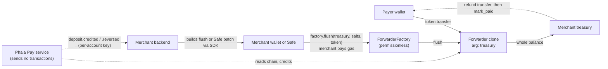
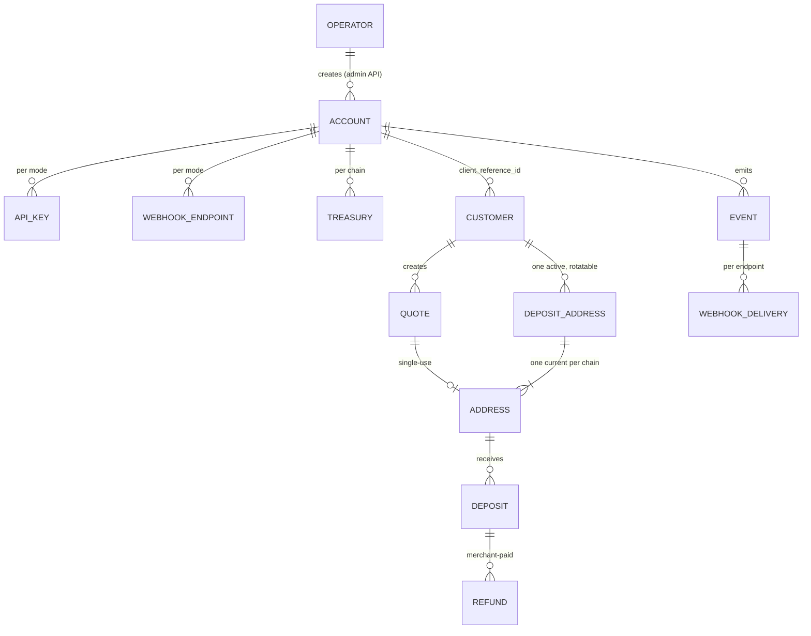
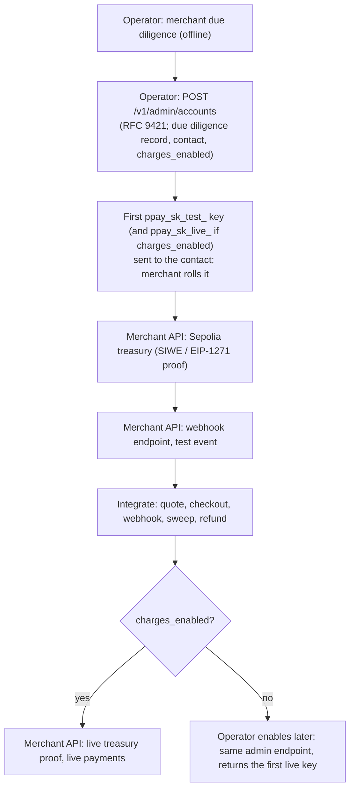

# Design: standard multi-tenant Phala Pay

Status: implemented by v0.5.0; later amendments are recorded below and in the linked designs.

Accepted (the owner delegated every decision; owner rulings of 2026-09-27, 2026-09-28,
2026-09-29, and 2026-10-01 are applied). Scope: turn Phala Pay from Phala Cloud's internal cashier
into a Stripe-shaped, API-only crypto payments **software service** for any merchant the operator
onboards. Phala Cloud becomes an ordinary account. This document records decisions; the
[architecture](../architecture.md) stays the specification and is rewritten by the PRs in §16.

Every mechanism names the established practice it follows. External claims were checked on
2026-09-27 and 2026-09-28 against the linked sources; where a source could not be verified, the
text says so.

**Amendment of 2026-10-02 (owner decision, Astra's review): per-account payment settings.** The
implicit model, in which a treasury enabled a chain and every routed asset was accepted, is
replaced ([design](payment-settings.md)). The attested routes are the operator's catalog, with a
default and hard bounds for each merchant term; each account has, per mode, one opt-in payment
settings resource (`GET|POST /v1/payment_settings`) choosing the chains and assets it accepts and
its terms, and a new account accepts nothing. `confirmation_policies` and `POST /v1/account` are
removed; a chain's stricter confirmation is part of the settings (D1). Quotes keep the terms they
were issued with, a deposit is bound to the settings current when it is recorded, and a routed
asset the settings do not accept is `rejected(asset_not_accepted)` and refundable.

**Amendment of 2026-09-28 (owner ruling).** There is no merchant dashboard and no self-serve
onboarding. The operator creates every account through the admin API after due diligence done
offline; merchants manage everything else through the API and SDKs with secret keys. Users,
login, passkeys, members, sessions, and email are removed; PRs 1–3 are implemented and the plan
(§16) is re-numbered.

**Amendment of 2026-09-29 (owner ruling): self-hosted.** Phala Pay is open-source, self-hosted
software ([self-hosting](../self-hosting.md)). Phala's instance serves only Phala Cloud; Phala
offers no hosted service.

**Amendment of 2026-10-01 (owner ruling): compliance is the operator's.** Phala Pay is software,
and each operator is responsible for its own compliance, including KYC, KYT, and the Travel Rule
for its merchants and their customers. Phala's instance serves only Phala Cloud, which collects its
own revenue, so the legal review that was to gate live mode for third-party merchants on Phala's
instance (D12, the former §17) no longer applies and is removed. Direct sanctions screening (§8)
stays a product feature.

**Amendment of 2026-09-28 (owner ruling, PR 8 review): webhooks are never auto-disabled.** The
3-day retry limit followed by disabling the endpoint (Stripe's live mode) is reversed: deliveries
retry until delivered, with backoff capped at 1 h, and only the receiver's `410 Gone` or the
merchant disables an endpoint. With no email channel, a disabled single endpoint would fail
silently and a paid deposit would never be credited (§11, D11).

**Amendment of 2026-09-28 (owner's API audit, PR 10).** The sweep builder and address export
follow Stripe's shapes: `GET /v1/balance` (per chain and token, unswept and final unswept amounts,
Stripe's Balance), `GET /v1/sweeps` as the history of finalized `Flushed` events (`sw_…`, Stripe's
Payouts), and `GET /v1/forwarders` (`fwd_…`) replacing `GET /v1/addresses`; the `flush` calldata is
built by the SDKs offline, and `GET /v1/forwarders?sweepable=<token>` keeps §8's guarantee (no
forwarder holding a sanctioned deposit, no sanctioned treasury). A deposit's `status` is `pending`,
`credited`, `rejected`, or `reversed`, with the booleans `final` and `swept`; a quote's `payment`
reports `seen` or `recorded`, and deposit addresses carry the same `payments` with a
`client_secret` (Stripe's CustomerSession) for the customer's page. `<Checkout expectedAddress>` is
required.

**Amendment of 2026-09-28 (API conformance).** An audit against Stripe's documented conventions,
checked on 2026-09-28 against the linked pages, is applied; nothing was live, so the API changed
without aliases:

1. *Event snapshots* ([Event object](https://docs.stripe.com/api/events/object): an event's data
   is rendered when it is created and does not change). Every event's `data.object` is rendered
   in the transaction that changes its object, after the change, by one path, and the service's
   database role can no longer update or delete events. Events carry
   `request: {id, idempotency_key}` (`null` for the service's workers), and every `*.updated`
   event (`account`, `api_key`, `refund`, `treasury`, `webhook_endpoint`) carries
   `data.previous_attributes`, diffed from the object rendered before the change in the same
   transaction.
2. *Events.* `refund.created` and `refund.updated` join `refund.failed` and `deposit.refunded`,
   and refund creation, `mark_paid`, and cancel are audited and announced; `quote.canceled` is
   added. The treasury events are named after their top-level resource (`/v1/treasuries`):
   `treasury.created` (every proven treasury, `pending` or at once `active`), `treasury.updated`
   (a pending one took effect, or was replaced), `treasury.canceled`; they stay account events,
   delivered whatever an endpoint subscribes to.
3. *Delivery health, visible without a dashboard* (retries never stop, §11): endpoints report
   `pending_deliveries`, `oldest_pending_at`, and `last_attempt {at, status_code}`;
   `GET /v1/events` takes `delivery_success` and `types[]`
   ([list events](https://docs.stripe.com/api/events/list)); the operator's daily report lists
   endpoints failing longer than `failing_for_hours` (24).
4. *Statuses and codes* ([errors](https://docs.stripe.com/api/errors)): a request that cannot
   succeed in the objects' current state is `400` (`deposit_not_final`, `quote_unexpected_state`,
   `paused`, `treasury_not_set`, `*_cap_exceeded`, …); `409` is only `idempotency_key_in_use`;
   the generic `conflict` code is removed; a customer's quote-creation and rotation limits are
   `429 customer_rate_limit`, apart from the API's `429 rate_limit`; every `429` carries
   `Retry-After`; every error carries `doc_url`. The admin API's `signature_replayed` is `401`,
   an authentication failure.
5. *Request ids* ([request IDs](https://docs.stripe.com/api/request_ids)): `Request-Id: req_…`
   replaces `x-request-id`, and an event names the request that caused it.
6. *Idempotency* ([idempotent requests](https://docs.stripe.com/api/idempotent_requests)): the
   result is saved once the handler starts executing, `500`s included, and replayed; a request
   that failed validation (`parameter_*`), was rate limited, or met `503 unavailable` is not
   saved and runs again. A quote and its `client_secret` are created in one transaction, so a
   retry never creates a second quote.
7. *Quote salt tag*: `"quote"`, as D3 says (the code used `"lock"`).
8. *Admin paths* are snake_case plural resources: `/v1/admin/reconciliation_blocks/{key}/lift`
   and `/v1/admin/reports/daily`.
9. *OpenAPI*: single-value `object` enums, `servers`, `tags`, an example of every object and body,
   `status` fields kept plain strings (the SDKs give `Literal` hints), `limit`/`starting_after`/
   `ending_before` on every list and `created[gt|gte|lt|lte]` wherever `created` filters; the admin
   API is `openapi.admin.json`, out of the merchant SDK.
10. *API reference*: built from `openapi.json` with Redoc (`@redocly/cli`, pinned by lockfile) and
    published to GitHub Pages from `main`; its `Errors` section has one heading per code, the
    target of `doc_url`.

**Amendment of 2026-09-28 (launch hardening, final design review).** An external review of funds
direction and permissions found five risks; each is closed with a standard mechanism, and nothing
was live, so the API and SDKs changed directly:

1. *Treasury pinning is mandatory in live mode* (§8, "Compromised service"). The SDKs recomputed
   an address over the treasury the response named, so a compromised service returning an
   attacker's treasury with that treasury's valid `CREATE2` address passed the check. The merchant
   now configures its account id, the forwarder factory and implementation, and its own treasury
   per chain in its server; every address is derived from those pins, never from the response's
   `treasury`, and a live-mode check fails closed without them (Python `TopupClient`/`PhalaPay`,
   JS `verifyQuoteAddress`/`verifyDepositAddress`). Test mode may fall back to the response's
   treasury with a warning. The integration guide makes pinning a setup step.
2. *Restricted keys join the launch set* (PR 12, D7; Stripe's
   [restricted keys](https://docs.stripe.com/keys#limit-access)). `ppay_rk_{test,live}_` keys hold
   the permissions they are created with (`api_keys.permissions`), within what the authorization
   table grants `key:restricted`, which no longer includes `account.write` or `endpoints.write`
   (it never held `api_keys.write` or `treasury.write`): a restricted key cannot manage keys,
   treasuries, webhook endpoints, webhook keys, or account settings. A `write` grant includes its
   resource's `read`, as Stripe's. Secret keys stay for administration and are kept offline; the
   guide recommends running production with a restricted key.
3. *Webhook key trust continuity* (D11). A live roll keeps the previous key signing for at least
   48 hours, the treasury time-lock (`expires_in: 0` is refused in live mode; test mode keeps it),
   so a leaked secret key cannot cut the merchant's pinned key off before a treasury change it made
   applies; and the roll's `account.updated` is signed by the retiring version whenever it is
   delivered (`events.signing_key_version`), so the pinned key always verifies the notice of its
   own replacement. Precedent: the Standard Webhooks multi-signature rotation, with the overlap
   bounded below as a TimelockController's minimum delay bounds a change.
4. *Crediting pause per treasury* (§12, incident control). The merchant (`POST
   /v1/treasuries/{id}/pause|resume`, secret key) and the operator (`POST
   /v1/admin/accounts/{acct}/treasuries/{trs}/pause|resume {reason}`, audited) each pause
   crediting of deposits to every forwarder over one treasury address, for example a compromised
   former treasury: deposits stay `pending` (`confirmed`, held as by a `settlement` pause), no
   `deposit.credited` is sent, and resuming credits them. Neither owner lifts the other's pause,
   as with the account's `paused_scopes` and `self_paused_scopes`; each change is
   `treasury.updated` (`crediting_paused`, `crediting_paused_by`). Runbook:
   `deploy/runbooks/treasury-credit-pause.md`.
5. *Wording* (integration guide): a quote is a locked-price payment instruction, and under-, over-,
   and late payments are credited at spot, so a quote is paid in full only when the deposit's
   `price_source` is `quote`; the USD `amount` is a valuation, and the merchant receives tokens and
   carries their price risk; the same deposit address on every EVM chain holds only with the same
   factory deployment and treasury address on a chain with the same `CREATE2` rule.

**Amendment of 2026-09-28 (ledger correctness, final design review).** Accounting rules are
tightened with standard mechanisms; nothing was live, so the API changed without aliases:

1. *Service-computed claw-backs.* A deposit carries, in every `deposit.*` snapshot, the cumulative
   `amount_refunded` (the cents of `amount` its succeeded refunds take back:
   `floor(amount × amount_refunded_atomic / amount_atomic)`, over the cumulative refunded amount,
   so it never exceeds the refunded share, never decreases, and is all of `amount` once fully
   refunded) and `amount_reversed` (`amount` once `reversed`). The merchant's balance rule: a
   deposit nets to `amount − amount_refunded − amount_reversed` while `credited` or `reversed`,
   0 otherwise. Events may arrive in any order; a merchant processes each deposit's events
   serially and merges each snapshot into its view (the later status wins, `pending` <
   `credited` = `rejected` < `reversed`; the larger cumulative amounts win), so the result does not
   depend on the order, and a `deposit.reversed` before `deposit.credited` nets to zero.
2. *A refund marked paid is not canceled* (the double-payment risk): it stays reserved and
   tracked until verified, or `failed` as `transaction_dropped` (no receipt on either provider
   while the sender's nonce, kept when a provider first returned the transaction, is consumed at
   `finalized` on both, the rule D1 uses for deposits) or `transaction_not_found` (never returned
   by a provider within 24 hours of `mark_paid`); then the merchant requests a new refund.
3. *Refund logs by receipt position.* `mark_paid` names the paying log by its position in the
   receipt (`receipt_log_index`), not the block-wide `log_index`, which changes when the
   transaction is re-included; a deposit's identity uses the same position (D1).
4. *No starvation in the finality watch.* It claims due deposits in bounded pages, oldest block
   first, and gives each its own recheck time, so deposits it keeps waiting on cannot hold back
   later ones; the reconciler's missing-deposit scan requests each window as the scanner does,
   one request per window in token mode whatever the number of addresses ever issued.
5. *Exposure cap.* Per account and mode, the credit of deposits credited but not final is capped
   (`accounts.max_unfinalized_credit`, $1 000 by default, set by the operator per account); a
   deposit past it waits and is credited at finality. Merchants selling what they cannot take
   back require `finalized` confirmations in their payment settings (D1).
6. *Reference implementations.* The FastAPI example and the reference product apply every
   `deposit.*` snapshot by the balance rule, with tests of partial refunds, reversals, and
   out-of-order delivery.

## 1. Context

Before this design (architecture before PR 1): a **product** was the tenant, registered by the
operator; requests were signed with RFC 9421; one attested key signed every webhook; one factory
per route paid an immutable treasury (Phala's finance Safe) and the service's operator key swept
and paid gas; deposits were credited at finality (about 15 minutes); refunds were approved by
finance. Mainnet is not deployed; Phala Cloud's integration is a draft PR and is not live.

## 2. Principles

1. **Software, not custody.** Phala Pay prices quotes, detects payments, sends webhooks, and serves
   checkout and an API. It holds no merchant funds, sends no transactions, pays no merchant
   gas, and charges no fee.
2. **One mechanism per job, for every account.** Phala Cloud is an ordinary account: same
   onboarding, keys, treasury setup, sweep, refunds, limits, and notifications as any merchant.
   No v1/v2 or legacy paths; nothing is live, so staging is reset and v1 retired.
3. **The operator runs the platform, never a merchant's business.** The admin API creates
   accounts, decides live access, issues a first or recovery key, suspends abusive accounts, sets
   platform limits, and handles incidents. It does not set treasuries, move funds, record refunds,
   or replay a merchant's webhooks.
4. **Fast credit, recoverable reversal.** Credit at a small confirmation depth; watch to finality;
   a rare reorg becomes a `deposit.reversed` event, handled like a refund.

## 3. Decisions at a glance

| # | Topic | Decision | Standard followed |
|---|---|---|---|
| D1 | Credit timing | Credit at the stricter of the route floor and the account's payment settings (Ethereum depth 2, about 30 s after paying; OP-stack depth 3 on the unsafe head, about 7 s); identity by receipt log position; follow re-inclusion; `reversed` + `deposit.reversed` only for a proven-dropped transaction | Exchange confirmations (Kraken, Binance); BTCPay confirmation setting; Etherscan "Dropped & Replaced"; Stripe post-success ACH failure → dispute |
| D2 | Custody | Non-custodial: forwarders pay only the merchant's treasury | BTCPay Server; FinCEN FIN-2019-G001 §1.1, §4.2 |
| D3 | Contracts | One permissionless factory per chain; clones carry `treasury` as the only immutable arg; public `flush` with per-target failure isolation | OZ `Clones.cloneDeterministicWithImmutableArgs` (pinned 5.7.0); BitGo public `flush()`; Multicall3 `allowFailure` |
| D4 | Sweeping | The merchant sweeps with its own wallet or Safe and pays gas; the SDK builds the call or a Safe Transaction Builder batch | BTCPay (merchant wallet); Safe Transaction Builder JSON |
| D5 | Refunds | Declare destination and amount → pay from treasury → attach tx → verified | BTCPay payouts `mark-paid` |
| D6 | Names | Account `acct_`; `client_reference_id`; API keys; webhook endpoints; no users | Stripe |
| D7 | API auth | Bearer `ppay_sk_{live,test}_…` keys, hashed; created, rolled, revoked through `/v1/api_keys`; restricted `ppay_rk_` later | Stripe keys; Cloudflare tokens via API; GitHub token format |
| D8 | Onboarding | The operator creates each account through the admin API (RFC 9421), recording offline due diligence and issuing the first key; no dashboard, users, or signup | Stripe Connect API onboarding with no Stripe Dashboard |
| D9 | Test/live | One deployment; key selects mode; `livemode` on every row, object, and event; Sepolia = test | Stripe test mode |
| D10 | Treasury | Set through the API with an EIP-4361 proof (EOA) or EIP-1271 (deployed Safe); live changes time-locked 48 h, cancellable, announced as events | EIP-4361, EIP-1271; timelock; Stripe `account.external_account.updated` |
| D11 | Webhooks | Standard Webhooks `v1a` with one key **per account and mode**; endpoints per account; retries until delivered, never auto-disabled (owner decision, 2026-09-28); only `410 Gone` or the merchant stops an endpoint | Standard Webhooks; Stripe endpoints |
| D12 | Go-live | The operator sets `charges_enabled` when creating the account (or later, same endpoint) | Stripe `charges_enabled` |
| D13 | Isolation | Typed `Scope (account_id, livemode)` built server-side; each route's required permission declared with the routes; per-account limits | Stripe rate limits; OWASP authorization |
| D14 | Economics | No fee, no invoicing; merchants pay their own sweep and refund gas | BTCPay ("no transaction fees") |
| D15 | Metadata | `metadata` on quotes, deposits, and refunds with Stripe's limits and merge rules; a deposit starts with a copy of its quote's | Stripe [metadata](https://docs.stripe.com/api/metadata); Checkout `payment_intent_data.metadata` |
| D16 | Deposit addresses | One persistent, rotatable address per customer for every token the account accepts on every chain (owner's decision, 2026-09-28; accepted assets per the 2026-10-02 amendment), the same address wherever the treasury is the same; any amount credited at spot; restored per the owner's 2026-09-21 requirement | Stripe customer balance funding instructions (a stable virtual account per customer) |

## 4. Fast credit and reversal (D1)

**Decision.** One credit rule, evaluated per chain family by reviewed code (a new family needs a
reviewed code change, as today). A transfer is credited when both RPC providers report the same
block hash and the same log and the block has reached the **required confirmation**:

| Chain family | Confirmation values | Default |
|---|---|---|
| Ethereum L1 (mainnet, Sepolia) | a depth `head − block + 1 ≥ n`, or `finalized` | 2 |
| OP-stack L2 (Base, when enabled) | a depth on the sequencer's unsafe head, `safe` (derived from data posted to L1), or `finalized`; any depth < `safe` < `finalized` | 3 |

The required confirmation is the **stricter of the route's value and the account's policy**. The
route value is the floor and default; an account may require more for a chain (for example
`finalized` for irreversible goods), never less. BTCPay stores set the same knob: "the minimum
amount of confirmations after which the invoice gets the 'confirmed' status"
([BTCPay stores FAQ](https://docs.btcpayserver.org/FAQ/Stores/)). A block at or below `finalized`
always qualifies, so `finalized` as the policy reproduces today's behaviour: one rule, one
parameter per account.

**Why 2 on Ethereum.** 0 confirmations is a mempool transaction the payer can still replace.
Depth-1 reorgs are routine on post-Merge Ethereum: Etherscan's forked-blocks list, sampled on
2026-09-27, shows 224 031 forked blocks in total, and the latest 1 000 (about April to September
2026) all have reorg depth 1 ([Etherscan forked blocks](https://etherscan.io/blocks_forked)).
Crediting at 1 would credit, reverse, and re-credit several times a day. Depth-2 reorgs did not
appear in that sample; proposer boost exists to prevent short-range reorgs, and reverting a
finalized block costs at least one third of staked ETH
([ethereum.org, proof-of-stake](https://ethereum.org/developers/docs/consensus-mechanisms/pos/)).
The owner accepts the residual risk because a reversal is recoverable (below).

**Why 3 on OP-stack (owner decision, 2026-10-02).** This replaces the earlier rule of crediting
an OP-stack chain only at `safe`, about 5 minutes, and never on the sequencer's unsafe head. The
owner asked for credit as fast as is reasonable, under the protections Ethereum's depth 2 already
has: the finality watch below and the per-account cap on credit that is not final yet
(`max_unfinalized_credit`; a deposit past it is credited at finality). Depth 3 is a product-risk
choice, not a proof that the unsafe head is as safe as Ethereum at depth 2. Base, sampled on
2026-10-02, reports that "Only a single Base L2 block has ever reorged" at L2 inclusion, about 2 s
after sending, and that "There has never been a reorg of L2 blocks that were batched to Ethereum
L1"; its sequencer keeps a lag from the L1 tip, "so typical L1 reorgs have no effect"
([Base, transaction finality](https://docs.base.org/base-chain/network-information/transaction-finality)).
The OP Stack calls a block *unsafe* until verifiers derive it from posted data, then *safe*, then
*finalized* with L1 ([OP Stack overview](https://docs.optimism.io/stack/rollup/overview)).
Precedents, not proofs of equivalence: Circle's CCTP Fast Transfer attests a Base or OP Mainnet
burn after 1 block confirmation, and bounds the risk with "a global allowance to mitigate
reorganization risks"
([Circle, required block confirmations](https://developers.circle.com/cctp/required-block-confirmations));
Coinbase's default x402 facilitator settles a payment once it has the transaction's first receipt
([coinbase/x402, `exact` EVM facilitator](https://github.com/coinbase/x402/blob/main/typescript/packages/mechanisms/evm/src/exact/facilitator/eip3009.ts)).
Depth 3 is the block and two more, 4 s after inclusion, typically credited about 7 s after paying
(`typical_credit_seconds`), twice the depth of the one reorg Base reports; the account cap plays
the role of Circle's allowance, per account.

*Residual risk.* A sequencer outage that loses unsafe blocks, or a batcher that lets the
sequencing window lapse so that derivation replaces the unsafe chain with blocks without the
sequencer's transactions, reorganizes more blocks than any small depth covers. When the payment's
transaction is re-included, the watch follows it; when another transaction spends the payer's
nonce, or another transfer holds the payment's receipt position at finality, the deposit is
reversed with `deposit.reversed`. When the transaction is simply gone and its nonce is unspent, no
replacement is proven, since it could still be included: the watch keeps the deposit credited and
not final, holding its share of the cap, and alerts (`TopupDepositPendingAfterReorg`) after an hour,
for the operator to resolve. That is the trade-off Ethereum's depth 2 already accepts, and the cap
bounds it. `safe` and `finalized` stay available, to a route or an account, as stricter values:
`safe` outranks every depth because the sequencer cannot rewrite a block derived from data posted
to L1 on its own; only an L1 reorganization reaching that data can.

**What others use.** Kraken lists 30 confirmations for Ethereum-network assets
([Kraken](https://support.kraken.com/articles/203325283-cryptocurrency-deposit-processing-times));
Binance announced 12 in 2021, before the Merge
([Binance](https://www.binance.com/en/support/announcement/d57bbb741ecf408c8599e97e8dcc9083)).
Exchanges credit withdrawable balances to anonymous users; a merchant crediting a known customer
can claw back, so a shallower default is proportionate, and the account policy raises it.

**Mechanics (implemented by PR 1, specified in architecture §7, §8, §11).** One scanner per
chain polls the head once per block time (2 s on an OP-stack chain crediting at a depth), locked
onto block arrival, scans each new block for
transfers to every issued address in one request, and confirms on provider B at the required
confirmation, then
values, screens, and credits in the same pass: **credited in about 30 seconds** at Ethereum's
default and **about 7 seconds** at OP-stack's;
`GET /v1/config` reports the typical credit time for the account's policy. A deposit's identity
is its transfer's position in its transaction's receipt (`receipt_log_index`), which survives
re-inclusion; the position holds at most one deposit that is not reversed, and a deposit recorded
after one there was reversed takes the next revision and a new id (architecture §7). A finality watch re-reads every not-yet-final deposit's receipt on both providers
once its recorded block is final:
same log at or below `finalized` → `final`; re-included in a newer block → followed, not
reversed; the transfer gone at finality, or the transaction **proven dropped** (no receipt and
the sender's nonce consumed at `finalized`: Etherscan's "Dropped & Replaced",
[Etherscan](https://info.etherscan.com/transaction-dropped-replaced/); ethers'
`TRANSACTION_REPLACED`, [ethers](https://docs.ethers.org/v6/api/utils/errors/)) → **`reversed`**
(terminal); another transfer at the position at finality (a contract-mediated transfer
re-executed against other state) → the deposit **`reversed`** and that transfer, if it pays an
issued address, a **new deposit** (`replaces` the old one) credited through the normal path, as
indexers re-index the canonical log after a reorg; no receipt and the nonce not consumed → wait, alert after one hour.

- `deposit.reversed` is sent for a reversed deposit that was reported as credited or rejected; a
  quote it consumed re-opens if its window is still open; its pending refunds without a
  transaction are canceled.
- The merchant takes the credit back by the snapshot's `amount_reversed`, as it takes a refund's
  share back by `amount_refunded` (ledger correctness amendment). This is Stripe's pattern for
  payments that fail after success: "In rare situations, Stripe might receive an ACH failure from
  the bank after a PaymentIntent has transitioned to `succeeded`. If this happens, Stripe creates a
  dispute" ([Stripe ACH](https://docs.stripe.com/payments/ach-direct-debit/accept-a-payment?payment-ui=direct-api)).
- A reversal raises the platform alert `TopupDepositReversed` (a chain-health signal); the
  `deposit.reversed` event is the merchant's notice.
- Refunds require `final` (D5). Deposits are marked `swept` only from **finalized** `Flushed`
  events after the deposit's log position, so swept accounting never depends on an unfinalized
  sweep.

## 5. Funds: custody, contracts, sweeping, refunds (D2–D5, D14)

### D2: non-custodial

Each account sets a treasury per chain (an EOA or a deployed Safe). Every forwarder issued for that
account can pay only that treasury; nothing Phala runs can move funds anywhere else. This is BTCPay
Server's model: "Payments with BTCPay go directly to your wallet"
([BTCPay FAQ](https://docs.btcpayserver.org/FAQ/General/)).

At a high level, and not as legal advice: FinCEN classifies intermediaries by "whether the person
acting as intermediary has total independent control over the value"
([FIN-2019-G001](https://www.fincen.gov/sites/default/files/2019-05/FinCEN%20Guidance%20CVC%20FINAL%20508.pdf)
§4.2), treats processors that "collect the CVC from the customer and then transmit" it as money
transmitters (§4.6), and notes that a "developer or seller of … a software application … may be
exempt" (§1.1) while "suppliers of tools (communications, hardware, or software) … are engaged in
trade and not money transmission" (§4.5.1(b)). Phala Pay never controls value, collects no fee,
and sends no transactions. Each operator assesses its own obligations (amendment of 2026-10-01).

### D3: contracts

Implemented by PR 2 (`contracts/README.md`, architecture §4). A permissionless
`ForwarderFactory` (no roles, no admin, no constructor arguments, deployed through the Arachnid
deterministic deployment proxy, so anyone can deploy it at the same address on every chain)
creates `Forwarder` clones with `Clones.cloneDeterministicWithImmutableArgs`, whose only
immutable argument is `treasury` (OpenZeppelin 5.2.0+, pinned v5.7.0,
[Clones.sol](https://github.com/OpenZeppelin/openzeppelin-contracts/blob/v5.7.0/contracts/proxy/Clones.sol)).
The salt is `keccak256(abi.encode(account, client_reference_id, "quote", quote_id))`, so the
merchant recomputes every address. `flush(treasury, salts[], token)` is public, like BitGo's
`flush()` ([ForwarderV4.sol](https://github.com/BitGo/eth-multisig-v4/blob/c175a6a56d4fd049d67417970b318e0500315f67/contracts/ForwarderV4.sol)):
the destination is fixed in the address, so no party needs to be trusted with the timing. Per
salt it skips empty addresses, deploys the clone if needed (`ForwarderCreated`), and moves the
whole balance to the treasury (`Flushed`), or records `FlushFailed` and continues, like
Multicall3's `allowFailure`. Every call a target makes is gas-bounded (the token's `balanceOf`,
the forwarder's `flush`, and within it a native send), so no token or treasury can revert or
exhaust the batch; a token needing more than the factory's `FLUSH_GAS` (200 000) per transfer
cannot be swept and must not be enabled in a route (amended 2026-09-28). The independent review
before mainnet (`docs/plan.md`) covers the contracts.

### D4: sweeping — the merchant's transaction

Every account sweeps the same way, with one `factory.flush(treasury, salts[], token)` call per
token:

- The SDK's `flush_transaction(factory, treasury, salts, token)` encodes the call offline from the
  forwarder list (`GET /v1/forwarders`, §13); `GET /v1/forwarders?sweepable=<token>` lists the
  forwarders to pass it, never one paying a sanctioned treasury or holding a sanctioned deposit
  (§8). `GET /v1/balance` reports unswept amounts per chain and token, and `GET /v1/sweeps` the
  finalized `Flushed` events (amended 2026-09-28).
- **EOA treasury or any wallet:** send the call as an ordinary transaction (a script, a cron job,
  or any wallet).
- **Safe treasury:** the SDK's `safe_batch(chain_id, safe, calls)` writes the calls as a Safe
  Transaction Builder batch file (`{version, chainId, createdAt, meta: {name,
  createdFromSafeAddress}, transactions: [{to, value, data}]}`, the app's `BatchFile` type,
  [tx-builder models.ts](https://github.com/safe-global/safe-react-apps/blob/development/apps/tx-builder/src/typings/models.ts)).
  An owner imports it in Safe{Wallet}'s Transaction Builder, which is built for exactly this
  hand-off: "build a long list of transactions, preparing the necessary data and then pass this
  JSON to another user to import and execute them"
  ([Safe help](https://help.safe.global/en/articles/40841-transaction-builder)); the owners sign
  and execute it as any Safe transaction.

The merchant pays the gas and chooses when to sweep; funds left in forwarders can only ever reach
the treasury. The flusher, operator keys and gas reserve, and their runbooks are removed.

### D5: refunds

The merchant refunds from its own treasury, in two steps (BTCPay's payouts: the store pays from its
own wallet, and Greenfield's `POST /api/v1/payouts/{payoutId}/mark-paid` records it;
[BTCPay payouts](https://docs.btcpayserver.org/Payouts/)):

1. `POST /v1/refunds {deposit, amount_atomic, destination_address}` → Refund `pending`; requires
   the deposit to be `final` (`400 deposit_not_final` otherwise) and refundable, the amount to fit
   its unrefunded remainder (reserved), and `destination_address` to pass sanctions screening.
2. After paying, `POST /v1/refunds/{id}/mark_paid {transaction_hash, receipt_log_index?}`. At `finalized`
   (refunds need no speed), both providers must show a `Transfer` of the deposit's token with
   `from == addresses.treasury` of the deposit's own address (not the account's current
   treasury), `to == destination_address`, `value == amount_atomic`, a log not used by another
   refund. Then `succeeded` and `deposit.refunded`; otherwise `failed` with `failure_reason` and
   the reservation released. `POST /v1/refunds/{id}/cancel` cancels a pending refund without a
   transaction; one marked paid stays reserved until verified or proven dropped (ledger
   correctness amendment); a deposit that becomes `reversed` cancels its pending refunds without
   a transaction.

Statuses are Stripe's Refund names (`pending`, `succeeded`, `failed`, `canceled`).

### D14: economics

No fee and no invoicing. Merchants pay their own sweep and refund gas; payers pay their payment
gas. Phala's infrastructure costs (CVM, RPC, price data) are out of scope of this design.
Route minimums (`min_credit_minor`) stay route-level for every account; merchants judge sweep
economics themselves.



## 5a. Deposit addresses (D16)

**Status.** Restored per the owner's requirement of 2026-09-21 that each customer gets a
**persistent, rotatable deposit address**, the EVM exchange practice. PR #163 ("quotes are the only
flow") removed the earlier implementation without the owner's approval; this section restores the
decision and fits it to the multi-tenant design. Quotes stay the flow for a fixed price.

**Amendment, 2026-09-28 (owner's decision): one address per customer.** #194 issued one address
per customer, chain, and asset. The owner decided that **a customer has one deposit address across
all chains and all assets**, following exchange practice: an exchange gives a user one deposit
address for every token, and the same address on every EVM chain. Reasoning: a customer should see
and save one address, not one per token and network; a payer who picks another supported token or
network still reaches the customer; and the forwarder design already allows it, because the
factory and implementation are at the same address on every chain (design PR 2), so `CREATE2`
gives the same address wherever the salt and treasury are the same. The salt therefore drops the
chain and the asset. What cannot be the same is made explicit, never hidden: a chain whose
treasury is a different address has a different forwarder address, and the API shows it per
network.

**Precedent.** Stripe's customer balance gives each customer stable bank-transfer details: "In
live mode, Stripe supplies each customer with a unique set of bank transfer details", created or
retrieved with `POST /v1/customers/{id}/funding_instructions`, and "Funds sent to any address are
routed to the customer balance"
([Stripe, funding instructions](https://docs.stripe.com/payments/customer-balance/funding-instructions),
checked 2026-09-28). A deposit address is that virtual account on chain: one per customer, for any
supported token on any supported chain, any amount, credited to the customer.

**Resource.** `deposit_address` (`da_…`), per account and mode:

```text
POST /v1/deposit_addresses {client_reference_id, metadata?}          the active address
GET  /v1/deposit_addresses/{id}, POST /v1/deposit_addresses/{id} {metadata}
GET  /v1/deposit_addresses?client_reference_id&status&limit&starting_after&ending_before
POST /v1/deposit_addresses/{id}/rotate                               retire it, return the next one
```

Fields: `id`, `object`, `livemode`, `client_reference_id`, `address`, `version`, `salt`, `status`
(`active | retired`), `created`, `retired_at`, `metadata` (D15), and `networks`: for each chain of
the mode with a current route, `{chain_id, address, treasury, assets: [{asset, contract, decimals,
payment_uri}]}`, where `payment_uri` is the EIP-681 ERC-20 transfer of that token **without** an
amount. The top-level `address` is the address when every network has the same one, and `null`
when a network's treasury, and so its address, differs (or there is no network): a client shows
the one address when it is set and each network's otherwise, so a differing address is never
hidden behind a shared one. Creation is idempotent without an `Idempotency-Key`: it returns the
customer's active address and issues one only when there is none, as Stripe's funding
instructions "create or retrieve"; it also adds the address's network on a chain supported since
(the same address when the treasury is the same) and replaces a network whose treasury changed
(below). Rotation retires the address (`retired`, `retired_at`) and issues the next version, a new
address on every network; a retired address cannot be rotated again
(`400 deposit_address_retired`). `metadata` follows D15: the create request's is merged into the
returned address's (as an update would, so repeating a create is harmless),
`POST /v1/deposit_addresses/{id}` merges into an active or retired address's, a rotation carries
it to the next version, and each deposit to the address starts with a copy, as a quote's deposit
does.

**Address.** The same v2 forwarder as a quote's, `CREATE2` over the treasury and a salt (D3):

```text
salt = keccak256(abi.encode(account, livemode, client_reference_id, "deposit_address", version))
       types (string, bool, string, string, uint256); account = acct_ id
address on a chain = factory.addressOf(treasury of that chain, salt)
```

`version` counts the customer's addresses from 1. The address is identical on every chain whose
treasury is the same address (an EOA, or a Safe deployed at the same address on each chain); where
a chain's treasury differs, that chain's address differs. The Foundry script writes vectors
(`contracts/test-vectors/create2.json`, `deposit_address`, including one salt under two
treasuries) that the Rust core and the Python SDK reproduce; the SDKs recompute every network of an
active address against the pinned forwarder and fail closed, as for quotes (§8), and recompute any
version offline from the salt inputs and a network's treasury.

**Crediting.** A transfer of **any supported token of the chain** to an active **or retired**
deposit address is credited **at spot** (no quote) through the one pipeline: fast credit at the
route's confirmation (D1), reversal, screening, events, chain-sourced sweeps (D4), refunds (D5),
and per-forwarder reconciliation (§13). A token without a route on that chain is recorded
`rejected (unsupported_asset)`, as at a quote's address. Each chain's forwarder is an ordinary
`addresses` row owned by the deposit address (its network on that chain), so every mechanism that
reads `addresses` covers it. Its deposit has `quote: null`, `deposit_address: "da_…"`, and the
chain and address it arrived on (`chain_id`, `address`), and `deposit.credited` carries that
object. The set of issued addresses of a chain includes every customer's address on that chain,
active, retired, and superseded: the per-block scan and the finalized backstop read every issued
address (architecture §8), so a deposit address is credited at the route's confirmation like any
other. With `asset.backstop: token` a transfer of a token without a route is not requested by the
scan; the reconciler's missing-deposit pass records it after finality.

**Unsupported or unlisted chain.** Funds sent to the address on a chain without a route are not
seen or credited. They stay at that deterministic address and become sweepable once the factory
is deployed on that chain (`CREATE2` gives the same forwarder there), **provided the account's
treasury is the same address on that chain**; otherwise the forwarder that `CREATE2` gives over
that chain's treasury is another address, and the funds are recoverable only by an operator
deploying a forwarder over the original treasury. The same holds on a chain that gains a route
later, until the address's network is added there by the next creation: payments made before are
not credited automatically, and the integration guide tells merchants to list only the networks
in `networks` and to send only the listed tokens.

**Quotes or deposit addresses.** A quote locks a price for an exact amount for a short window: use
it for a purchase of a known amount. A deposit address takes any amount at any time and credits
the market rate on arrival: use it for top-ups and balances, and for payers who send from an
exchange and cannot hit an exact amount or window.

**Treasury.** Each network is bound to the treasury of its chain effective when it is issued, like
every forwarder (D2). When a treasury change takes effect on a chain (D10, design PR 7), **that
chain's network of the address changes**: PR 7 supersedes the chain's network of every
deposit address of the account in the same transaction, with a forwarder over the new treasury and
the same salt; the address on the other chains is unchanged, and the object's top-level `address`
becomes `null` while the chains differ. Creation already supersedes an active address's network
whose treasury is no longer the effective one, so a missed update is repaired on the next call
(`replace_networks` and `sync_networks` in `crates/topup/src/deposit_addresses.rs`; a
treasury changed back to an earlier one makes that network current again). **A superseded network
is kept as retired for that chain: it keeps being watched and credited, and its funds reach the old
treasury**, which the forwarder's clone argument fixes for good, and a refund of its deposit is
paid from that old treasury (D5). Merchants learn of the change through `treasury.created`
and `.updated` (D10) and must keep control of an old treasury while customers may still pay an old
address. Retired versions likewise keep paying the treasuries they were issued for.

**Limits.** Active deposit addresses per account and mode are capped (default 100 000 live,
1 000 test; the operator raises it in `account_limits.max_active_deposit_addresses`):
`400 deposit_address_cap_exceeded`; with one address per customer this is a cap on customers with
an address. A customer may rotate 10 times per rolling hour (`429 customer_rate_limit`). No new address or
network is issued while `quotes` is paused for the account or the customer (§12); a chain frozen by
reconciliation, or whose every route is paused for `quotes`, gets no new network, and a new address
or rotation is refused (`400 chain_frozen`, or `paused`) only when no chain can take one. Existing
networks, reads, and crediting keep working.

## 6. Tenant model and names (D6)



| Concept | Today | Decision | Stripe reference |
|---|---|---|---|
| Tenant | product (`slug`) | **account** `acct_…`; `GET /v1/account` | [Account](https://docs.stripe.com/api/accounts/object) |
| People | operator only | operator only: no users, logins, or roles; the account records a contact | Connect accounts with `stripe_dashboard.type = none` |
| Credentials | product ed25519 key | **API key** | [API keys](https://docs.stripe.com/keys) |
| Webhook target | `products.webhook_url` | **webhook endpoint** `we_…` | [Webhooks](https://docs.stripe.com/webhooks) |
| End customer | `account_id` | **`client_reference_id`** (≤ 200 chars) | Checkout [`client_reference_id`](https://docs.stripe.com/api/checkout/sessions/create) |

"Account" in today's API means the end customer, the opposite of Stripe; renaming now, before any
integration is live, prevents every Stripe-literate integrator from misreading it. The end customer
is the merchant's own record, so no `cus_` object is added.

## 7. Authentication and authorization (D7, D8, D13)

### D7: API keys

- `Authorization: Bearer ppay_sk_live_…` or `ppay_sk_test_…` (Bearer only). The vendor prefix
  avoids Stripe's `sk_live_` pattern, which GitHub push protection attributes to Stripe; the
  format is prefix + 32 random bytes (base62) + CRC32 checksum, as GitHub's token format
  ([GitHub](https://github.blog/engineering/platform-security/behind-githubs-new-authentication-token-formats/));
  Phala registers the pattern with the GitHub secret scanning partner program
  ([partner program](https://docs.github.com/en/code-security/secret-scanning/secret-scanning-partnership-program/secret-scanning-partner-program))
  and revokes reported keys.
- Stored as SHA-256 (256-bit random keys need no slow hash); shown once; prefix and last four
  shown later; `last_used_at` per minute.
- **Managed through the API.** A secret key creates, lists, rolls, and revokes the secret keys of
  its own account and mode (`/v1/api_keys`); a test key never reaches live keys. Cloudflare does
  the same ("Generate new API tokens on the fly via the API",
  [Cloudflare](https://developers.cloudflare.com/fundamentals/api/how-to/create-via-api/)).
- Roll: `POST /v1/api_keys/{id}/roll {expires_in}` returns a new key; the old one works until
  the chosen expiry of at most 7 days, Stripe's grace period ([keys](https://docs.stripe.com/keys));
  `expires_in: 0` revokes at once. Expired → `401 api_key_expired` (Stripe's code). A key rolling
  itself keeps working for at least an hour: a replay never returns the new secret, so a lost
  response is recovered by rolling the new key with the old one (2026-09-29).
- **First key and recovery.** The operator's account creation returns the first key of each
  enabled mode (D8). A merchant that loses every key, or suspects a leak it cannot win by rolling,
  asks the operator, who verifies the request with the contact recorded at onboarding, revokes the
  account's keys of that mode if asked, and issues a new one (audited, `api_key.created` with
  actor `admin`). This is GitHub's support-reviewed recovery ("A member of GitHub Support will
  review your request",
  [GitHub](https://docs.github.com/en/authentication/securing-your-account-with-two-factor-authentication-2fa/recovering-your-account-if-you-lose-your-2fa-credentials)).
  The merchant rolls every operator-issued key on receipt, so no one at Phala holds a working key.
- Restricted keys `ppay_rk_…` (PR 12, pulled into the launch set by the launch hardening
  amendment) hold the permissions they are created with, a `write` including its `read`, within
  what their kind holds (D13); they never hold `api_keys.write`, `treasury.write`,
  `endpoints.write`, or `account.write`.

RFC 9421 request signing is removed for merchants: every SDK and language needed signing,
`Content-Digest`, target-URI rebuilding, and replay tables. TLS terminates inside the attested CVM,
so only attested code sees a bearer key, and the database holds only hashes. The admin API keeps
its RFC 9421 admin key: it is the operator's surface, not a second merchant path.

### D8: operator onboarding

There is no dashboard, no signup, and no user: every account is created by the operator.
Stripe Connect's API onboarding is the precedent: the platform creates accounts with the Accounts
API, "Stripe can be completely invisible to the account holder", and the platform "is responsible
for … collecting all the information needed to verify them"; such accounts "don't have access to
a Stripe-hosted Dashboard" (`controller.stripe_dashboard.type = none`,
[Stripe](https://docs.stripe.com/connect/api-onboarding)).

1. **Due diligence, offline.** The operator reviews the business, its owners, sanctions screening
   (entity, owners, intended treasuries), jurisdiction, and the signed merchant agreement under
   the operator's own policy. The product stores only a reference, the date, and the reviewer.
2. **Create.** `POST /v1/admin/accounts {name, contact, due_diligence, charges_enabled, reason}`
   (RFC 9421 admin key) creates the account, decides live access (D12), and returns the first
   `ppay_sk_test_` key, and a `ppay_sk_live_` key when `charges_enabled`. Both creations are
   audited.
3. **Hand-over.** The operator sends the key to the recorded contact through an encrypted channel;
   the merchant rolls it at once (D7) and does everything else through the API or SDKs: keys,
   webhook endpoints, treasuries, payment settings, `quotes` pause, refunds, sweeps, and export.

`contact` (name, security email) is the only personal data kept about a merchant (§13).

### D13: authorization and scoping

- **Permissions per route.** Each merchant route declares the permission it requires
  (`quotes.write`, `refunds.write`, `treasury.write`, `api_keys.write`, `endpoints.write`,
  `account.write`, reads) where the routes are declared, and the request is authorized after
  authentication and before the idempotency layer (§13), as Stripe checks a key's permissions
  before an idempotent replay. Secret keys hold every permission; restricted keys (PR 12) hold a
  granted subset, never `api_keys.write`, `treasury.write`, `endpoints.write`, or
  `account.write`. There are no roles. The two key kinds' permissions are fixed, so they are code
  (`crate::tenancy::Principal`), not a table only migrations could change; the `permissions` table
  was dropped (2026-09-29).
- **Scope.** Every merchant query takes `Scope { account_id, livemode }`, built by the server
  from the key and checked on every request. A client-supplied account id is never trusted (OWASP
  [IDOR](https://cheatsheetseries.owasp.org/cheatsheets/Insecure_Direct_Object_Reference_Prevention_Cheat_Sheet.html)).
  Tables without `account_id` are reached only through a scoped parent: `transitions`,
  `flushed`, and `pending_transfers` via `deposits`/`addresses`; `webhook_deliveries` via
  `events`. Tests assert `404` across accounts and modes on every endpoint. PostgreSQL row-level
  security is not added: one service and a typed scope give the same guarantee with fewer moving
  parts.

## 8. Security model changes

| Topic | Decision |
|---|---|
| Webhook forgery across tenants | Per-account, per-mode keys (D11): an event signed for account A never verifies at account B, so one merchant cannot replay its own `deposit.credited` to another. |
| Where funds go | Fixed per address (treasury arg). The service sends no transactions and has no contract role. |
| Compromised service | Cannot move funds; could issue new addresses for a wrong treasury or sign unbacked events. The SDK recomputes each address from the merchant's own pins, `(factory, implementation, treasury, account)` and the salt, never from the response's treasury, and fails closed on a mismatch; in live mode it fails closed without the pins (launch hardening amendment). `<Checkout>` renders only the `expected_address` the merchant backend passes after that check. |
| Leaked secret key | The holder could change the live treasury, but only after the 48 h time-lock (D10); the change is announced at once as `treasury.created` to every enabled live endpoint, whatever its `enabled_events`, and the merchant cancels it through the API, pauses `quotes`, and rolls its keys. Endpoint changes are announced to the changed endpoint first (§11), and a live webhook key roll keeps the pinned key signing for 48 h and signs its own notice with it (D11), so the holder cannot silence the notice unseen. If the holder races the merchant, the operator revokes the mode's keys and issues a new one (D7). A leaked restricted key, which production servers run with, can do none of this. |
| Sanctions | Phala's software does not assist in moving blocked assets. A deposit from a sanctioned address is `rejected(sanctioned)`; the sweep builder never includes its address and never builds a flush to a sanctioned treasury; refund destinations are screened (D5). The contracts cannot freeze anything: public `flush` can still move such funds, only to the merchant's treasury, and the merchant's own compliance applies. A treasury that becomes sanctioned (screened when set and daily) pauses the account's `quotes` and `settlement`. The operator screens the merchant, its owners, and its jurisdiction in due diligence (D8). |
| SSRF | All webhook egress goes through Stripe's [smokescreen](https://github.com/stripe/smokescreen) (a compose sidecar), the only IP filter: it refuses addresses that are not publicly routable. The service itself checks only the scheme (`https`, `http` in test mode), the port (443, 80 in test mode), and follows no redirects (Stripe counts 3xx as failure); 20 s timeout. |
| EIP-1271 and SIWE details | D10. |
| Keys at rest | API keys hashed; webhook keys derived on demand from dstack KMS, never stored. |

## 9. Test and live modes (D9)

Stripe: "Each mode has its own set of API keys, and objects in one mode aren't accessible to the
other" ([keys](https://docs.stripe.com/keys)).

- One production deployment serves both modes; the key selects the mode; every tenant row,
  object, and event carries `livemode`. Route files declare `livemode`; testnets (Sepolia) must be
  `false`, mainnets `true` (startup checks a built-in testnet list).
- A request for the other mode's route is `400 livemode_mismatch`, a live request from an account
  without `charges_enabled` is `403 testmode_charges_only` (Stripe's codes,
  [error codes](https://docs.stripe.com/error-codes)).
- Webhook keys, limits, delivery workers, and caps are separate per mode, so test traffic cannot
  delay live deliveries or exhaust live limits.
- Staging is reset and stays internal pre-production; integrators use production test mode.

## 10. Onboarding, treasury, go-live (D8, D10, D12)



### D10: treasury proof and changes

- **Proof, through the API.** `POST /v1/treasuries/challenge {chain_id, address}` returns an
  EIP-4361 message ([EIP-4361](https://eips.ethereum.org/EIPS/eip-4361)): `domain` and `uri` the
  API's, `address` the treasury, `chain-id` the route's, a single-use `nonce` bound to `(account,
  livemode, chain, address)`, 10-minute expiry (24 hours for an address that holds code, PR 7: a
  Safe's owners need longer to sign, and an on-chain approval must reach `finalized`), statement "Set as treasury of acct_… on Phala
  Pay". The merchant signs it and sends `POST /v1/treasuries {chain_id, message, signature}`
  (the SDK wraps both). EOAs: `ecrecover` of a `personal_sign`.
  Contracts: EIP-1271 `isValidSignature(hash, signature)` must return `0x1626ba7e`, where `hash`
  is the EIP-191 personal-message hash of the message, called at the `finalized` block on both
  providers ([EIP-1271](https://eips.ethereum.org/EIPS/eip-1271),
  [EIP-191](https://eips.ethereum.org/EIPS/eip-191)). ERC-6492 signatures (for not-yet-deployed
  contracts) are refused: the treasury must exist on that chain
  ([ERC-6492](https://eips.ethereum.org/EIPS/eip-6492)). The proof prevents typos, exchange
  deposit addresses, and a Safe missing on that chain.
- **Safe signatures without a dApp.** Owners sign it as a Safe message with the Safe{Core} SDK
  (Protocol Kit `createMessage`/`signMessage`, API Kit `addMessage`/`addMessageSignature`,
  checked through EIP-1271 by the `CompatibilityFallbackHandler`), or on chain with
  `SignMessageLib` ([Safe](https://docs.safe.global/sdk/protocol-kit/guides/signatures/messages)).
- **Changes.** The first treasury per chain applies at once. A later live change is time-locked
  48 h (the timelock pattern of OpenZeppelin's
  [TimelockController](https://docs.openzeppelin.com/contracts/5.x/api/governance#TimelockController))
  and cancellable with `POST /v1/treasuries/{id}/cancel`. Quotes use the old treasury until it
  applies; existing forwarders keep theirs forever. Test-mode changes apply at once.
- **Notices are events.** `treasury.created` (a treasury was proven: `pending` with
  `effective_at`, or at once `active`), `treasury.updated` (a pending treasury took effect, or a
  newer one replaced it), and `treasury.canceled`, named after the top-level `/v1/treasuries`
  resource as Stripe names events after their object
  ([event types](https://docs.stripe.com/api/events/types); API conformance amendment). They are
  delivered to every enabled endpoint of the mode regardless of `enabled_events` (§11).

### D12: go-live gate

Live mode is `charges_enabled` (Stripe's field), set by the operator in account creation (D8) or
later through `POST /v1/admin/accounts/{acct} {charges_enabled, reason}`, which then returns
the first live key: one mechanism, audited, announced as `account.updated`. The operator's decision rests on the offline due diligence; no
profile, ToS click-through, screening, or geo-blocking runs in the product, and no document KYB:
Phala Pay is software and never touches funds. Live payments also need a proven live treasury.
New live accounts get default limits; the operator raises them on request.

## 11. Webhooks (D11)

- **Per-account keys.** Standard Webhooks: "Signing keys should be unique per endpoint for
  symmetric signatures, and unique per endpoint (or potentially customer) for asymmetric
  signatures. Reusing keys across customers can lead to security issues!"
  ([spec](https://github.com/standard-webhooks/standard-webhooks/blob/7537d2a2d3d52d8f2e0ecd12527af4a9307fd81b/spec/standard-webhooks.md)).
  Each account has one ed25519 `v1a` key per mode, derived from dstack KMS at
  `settlement/{acct}/{live|test}/v1`. The service stores no secret; the merchant holds a public
  key. Rotation bumps the version and sends both signatures during the overlap (the spec's
  multi-signature rotation): the merchant rolls with `POST /v1/account/webhook_keys/roll
  {expires_in}` (at most 7 days, as an API key roll; at least 48 hours in live mode), and the
  previous version is kept in `retiring_webhook_keys` until it expires. The roll's own notice is
  signed by the previous version whenever it is delivered (launch hardening amendment).
- **Attestation.** `GET /v1/attestation?nonce=…`, authenticated with the account's key, returns
  the TDX quote with `report_data = sha256(nonce ‖ account_id ‖ livemode ‖ account public key)`,
  length-prefixed and listing every signing version (architecture §14 has the exact bytes).
  The merchant verifies it once with the dstack verifier and pins the **public key**, which is
  stable across releases because the KMS derives it from the app id and path; merchants do not
  track each release's compose hash.
- **SDK.** `construct_event(payload, headers, public_key, expected_account, *,
  expected_livemode)` fails closed unless the signature, `event.account`, and `event.livemode`
  all match.
- **Endpoints.** Stripe-style: up to 16 per account and mode, `url`, `enabled_events`, status,
  managed through `/v1/webhook_endpoints`. No URL challenge (Stripe has none);
  `POST /v1/webhook_endpoints/{id}/test` sends a test event instead. `https` required in live
  mode.
- **Account events.** Changes to keys (`api_key.created`, `.revoked`), endpoints
  (`webhook_endpoint.created`, `.updated`, `.deleted`), treasuries (D10), and the account
  (`account.updated`: pause, operator actions; emitted in both modes), and the payment settings
  (`payment_settings.updated`, 2026-10-02 amendment) are
  events like any other. They are always delivered to every enabled endpoint of the mode, whatever its `enabled_events`,
  and an endpoint that is updated or deleted receives the event about itself first, as GitHub's
  `meta` event tells a webhook "The webhook was deleted"
  ([GitHub](https://docs.github.com/en/webhooks/webhook-events-and-payloads#meta)).
- **Delivery.** At least once, full-jitter backoff capped at 1 h, per endpoint, with
  per-endpoint concurrency 4 and round-robin scheduling across endpoints (one slow receiver cannot
  block others) and separate test and live workers. **Retries continue until the event is
  delivered; a failing endpoint is never disabled automatically** (owner decision of 2026-09-28,
  reversing the 3-day disable first adopted here after Stripe's live mode, "up to three days",
  [webhooks](https://docs.stripe.com/webhooks)). Reason: there is no email channel (§13), so the
  only notice of a disabled endpoint would be a webhook, which a merchant with a single endpoint
  never receives; a paid deposit would then never be credited, silently. Only an explicit
  `410 Gone` from the receiver (the spec's opt-out) disables an endpoint at once, announced as
  `webhook_endpoint.updated` to the account's other endpoints, and the merchant disabling or
  deleting it stops its deliveries. A permanently failing endpoint's cost is bounded without
  giving up: after a failure it cools down on the same backoff and is then probed one delivery at
  a time until one succeeds, so it holds at most one slot and is attempted about once an hour
  however many events it has queued, and its slots never delay another endpoint. Undelivered
  events stay readable in `GET /v1/events`; the merchant resends events through the API
  (`POST /v1/events/{id}/resend {webhook_endpoint}`, as the Stripe CLI's `events resend`).

## 12. Isolation, limits, abuse

- **Rate limits** per account and mode: 100 requests/s live, 25 test, Stripe's numbers
  ([rate limits](https://docs.stripe.com/rate-limits)); a 500/s platform test-mode ceiling;
  per-customer limits as today. `429 rate_limit`, and `429 customer_rate_limit` for a customer's
  own limits, each with `Retry-After`.
- **Caps** are per account and per mode only: open quotes (default 1 000 live, 100 test), active
  deposit addresses (default 100 000 live, 1 000 test; §5a), open amount per customer and per
  account *(policy)*, max deposit (route). There is no global cap: the
  merchant, not Phala, bears price exposure. The scanner's cost does not grow with addresses in
  token mode (architecture §8).
- **Pause** scopes per account (`quotes`, `settlement`, `refunds`) and per route; the operator
  uses them for abuse and incidents. A merchant pauses and resumes its own `quotes` through
  `POST /v1/account/pause|resume`, for emergencies such as a leaked key during a treasury
  time-lock: no new addresses are issued while paused. Crediting pauses per treasury (merchant
  and operator, launch hardening amendment) hold deposits to the forwarders of one compromised
  treasury.
- **No signup abuse surface.** Accounts exist only after operator due diligence; test mode moves
  no money and costs Phala no gas.

## 13. Operations

- **Idempotency.** Every `POST` accepts `Idempotency-Key`, kept per `(account, livemode, key)`
  with a fingerprint and the response for 24 hours; a different request with the same key is
  `400 idempotency_error` ([Stripe](https://docs.stripe.com/api/idempotent_requests)). The
  response is saved in the transaction of the request's changes, and a key whose request never
  saved one is taken over under a new owner that fences the first request out (Brandur Leach,
  [Stripe-like idempotency keys in Postgres](https://brandur.org/idempotency-keys);
  architecture §12).
- **Audit log via the API.** The merchant's audit log is `GET /v1/events` (filterable by `type`):
  every key, endpoint, treasury, policy, pause, and operator action on the account is an event
  (§11) carrying its `actor` (an API key id, `admin`, or `system`). One mechanism serves both
  notification and history, as Stripe's Events API does; the internal `audit` table stays the
  operator's record. Events are kept for the retention period (architecture §15).
- **Reconciliation per forwarder.** At each finalized block, every active forwarder's balance per
  token must equal its final deposits minus its finalized `Flushed` amounts; a mismatch freezes the
  chain's crediting and alerts. Factory events count only for known `(address, treasury)` pairs.
- **Export and closure.** The list endpoints are the export (GDPR Art. 20, a "structured, commonly
  used and machine-readable format"): quotes, deposits, refunds, events, and `GET /v1/forwarders`
  with every address's `(chain, factory, salt, treasury)`, so funds stay sweepable without Phala;
  the SDK's `export_account(dir)` pages through them into JSON files. Closure (PR 13) is an
  operator action at the merchant's request: keys revoked, webhooks stopped, the contact deleted
  and audit actors pseudonymized (Art. 17); payment records are kept for the retention period
  (architecture §15, 7 years) under the legal-obligation exception (Art. 17(3)(b))
  ([GDPR](https://eur-lex.europa.eu/eli/reg/2016/679/oj)). Forwarders keep forwarding to the
  treasury after closure.
- **Notifications.** Merchant notices are webhook events and `GET /v1/events`; the product sends
  no email. The operator uses the recorded contact for incidents, restores, and recovery.
- **Observability.** Sentry alerts are platform health only (errors, chain lag, provider
  disagreement, reconciliation, `TopupDepositReversed`, delivery backlog), with low-cardinality
  tags. Per-account conditions are merchant events; the daily platform report lists live accounts
  left without an enabled endpoint so the operator can contact them.
- **Disaster recovery.** `ForwarderCreated` and `Flushed` carry the treasury, so swept status and
  clone arguments are rebuilt from the chain. Restoring the database is not restoring the
  business: within the window a restore can undo key revocations (the keys work again), treasury
  cancellations, and endpoint changes, lose deposit addresses and quotes given to customers (a
  quote's salt includes its random id, and the scanner watches only issued addresses, so nothing
  finds a payment to a lost quote), and lose delivered events, whose deposits are re-derived from
  the chain and, at spot, would be re-valued. So a restored service starts in **restore mode**
  (amendment of 2026-09-28, after a design review; restore correctness amendment of 2026-09-29),
  the smallest standard mechanism, a maintenance freeze with operator reconciliation:
  - **Frozen.** The restore is known from the restore step (`restore-check`, run only after a
    restore on boot, records it) or from PostgreSQL itself (every promotion out of archive recovery
    starts a new timeline, so `topup run` freezes on a timeline newer than the acknowledged one).
    The freeze is a row of the database, so it survives the upgrade from the restore-check variant
    to the service. While frozen, the admin API and health stay up; every merchant request with an
    API key answers `503 service_restoring` with `Retry-After`, reads included, because the
    restored `api_keys` can hold a key revoked after the restore point as valid (the one gate is
    authentication, after the key's form and checksum and before its lookup, authorization, and
    the idempotency layer, so writes are refused alike: key creation, restricted ones included,
    key and webhook key rolls, treasury proofs, cancellations, and crediting pauses and resumes,
    endpoint, quote, deposit address, and refund changes); nothing credits, settles, expires a quote, applies
    a treasury change, verifies a refund, or delivers an event. The scanner and the reconciler run: the
    rescan from the restored cursor re-derives every deposit, deduplicated by its deterministic id.
  - **Reconciliation, operator-driven and audited** (`/v1/admin/restore/…`, runbook
    `deploy/runbooks/restore.md`): the operator sends every contact the restore point and, from
    the merchant's records, revokes again the keys revoked after it (by id, or prefix and last
    four; secret and restricted keys alike), compares the treasuries with the `treasury` events
    the merchant received and cancels again what it canceled and pauses or resumes their crediting
    again as the merchant last did (the per-treasury crediting pause of the launch hardening; the
    operator re-applies its own pauses), applies again a treasury change that applied after the
    restore point from its `treasury.updated` delivery the service signed (restore closure
    amendment of 2026-09-30: the change still pending in the restored database, its time-lock
    ended, screened again when screening answers, applied at the event's time and not announced
    again), deletes again the endpoints it deleted,
    re-issues the deposit addresses it gave out (the salt formula of §5a gives the same address
    over a treasury in force since the restore point, backfilled from the restored cursor) and the
    quotes it created (the quote salt gives the same address from the `qt_` id; only that address
    over a treasury in force within minutes of the quote's creation is accepted, backfilled from the restored
    cursor, with the recorded terms kept but never applied and a `client_secret` accepted only
    with the service's tag and its owner tag of the account: an id is unique across accounts, and
    only the secret proves which one the service issued it to), and imports the deposit events it received
    from their deliveries, only those whose `v1a` signature verifies with the account's webhook
    keys: the delivered snapshot is the event, so a re-derived deposit never re-emits it with
    another body. A settled amount is immutable, so the credit a delivered `deposit.credited` or
    `deposit.reversed` carries (amount, exchange rate, price source, valuation time) is the
    re-derived deposit's valuation, not spot, and its refunds and reversal reference it; a
    delivered `deposit.reversed` also rebuilds its reversed deposit at the revision its snapshot
    names (`receipt_log_index`, `revision`), so the transfer that replaced it is re-derived under
    its successor's id and link; a deposit whose transfer on chain contradicts the delivered one is
    held, not credited, until the operator discards the delivered credit and settles the
    difference. A re-issued quote's locked
    price is the merchant's record, which the service never signed (no event carries a quote as
    created), so it never applies: a payment to the quote is valued at a delivered credit, which
    is the service's signed evidence of the quote's price, or at spot. The chain alone cannot name
    the customers of lost addresses (a salt is a hash of the `client_reference_id`) or lost quotes
    (a salt includes the random quote id), so the merchant's records, or for an address its own
    re-registration (create returns version 1, rotation the next ones), are the source; a quote no
    merchant reports stays lost.
  - **Unfreeze** through the admin API once every chain has finalized past the moment the restore
    was detected with every issued address backfilled, with the operator's checklist (the key
    revocations re-applied first: the unfreeze is when merchant keys authenticate again); the
    reason and checklist are recorded in the restore and in `audit`.
- **Admin API** (RFC 9421 admin key): account creation and live access (D8, D12),
  restrict/pause/resume, first or recovery keys and revocation (D7), platform limits, route pause,
  reconciliation block lift, deposit nudge, support views, daily report, and the reconciliation
  and unfreeze after a restore (Disaster recovery above). Each writes `audit`; each
  action on an account also emits its event (`account.updated`, `api_key.*`).

## 14. Data model

Fresh schema (staging is reset); unchanged tables of architecture §6 keep their columns.

```text
accounts        id, public_id (acct_…), name, contact jsonb, due_diligence jsonb ({reference,
                reviewed_at, reviewed_by}), charges_enabled bool, restricted bool,
                paused_scopes text[], webhook_key_version jsonb ({"live": 1, "test": 1}), created_at
payment_settings_revisions, payment_settings_state   per account and mode; replaced
                confirmation_policies on 2026-10-02 (design payment-settings.md)
account_limits  account_id, livemode, max_open_quotes, max_open_minor_account,
                max_open_minor_customer, max_active_deposit_addresses
                                                                  PRIMARY KEY (account_id, livemode)
api_keys        id, account_id, livemode, kind, name, permissions jsonb, prefix, last4,
                key_hash UNIQUE, created_by (api key id | admin), created_at, expires_at,
                last_used_at, revoked_at
treasuries      id, account_id, chain_id, address, proof_message, proof_signature, verified_at,
                effective_at, canceled_at, screened_at, created_by (api key id)
treasury_challenges nonce PK, account_id, livemode, chain_id, address, expires_at, used_at
customers       id, account_id, livemode, client_reference_id, paused_scopes
                UNIQUE (account_id, livemode, client_reference_id)
deposit_addresses id (da_…), account_id, livemode, customer_id, version,
                status (active | retired), created_at, retired_at, metadata jsonb
                UNIQUE (customer_id, version); one active per customer
addresses       id, account_id, livemode, chain_id, quote_id | deposit_address_id (exactly one), salt,
                treasury, address UNIQUE (chain_id, address), superseded_at (deposit address
                networks); one current (not superseded) row per (deposit_address_id, chain_id)
quotes          (today's rate_locks) + account_id, livemode, customer_id, metadata jsonb
deposits        + account_id, livemode, receipt_log_index, confirmations_at, final_at, metadata jsonb;
                state adds `reversed`; UNIQUE (chain_id, tx_hash, receipt_log_index)
flushed         chain_id, tx_hash, log_index, address_id, token, treasury, amount_atomic,
                block_number, block_hash                     -- from finalized Flushed events, any sender
refunds         id, account_id, livemode, chain_id, deposit_id, amount_atomic, destination_address,
                tx_hash, receipt_log_index, paid_at, tx_from, tx_nonce, status, failure_reason,
                metadata jsonb, created_at
                UNIQUE (chain_id, tx_hash, receipt_log_index)
webhook_endpoints id (we_…), account_id, livemode, url, enabled_events text[], status, disabled_reason
events          id (evt_…), account_id, livemode, type, object_type, object_id, actor, data jsonb, created
webhook_deliveries event_id, endpoint_id, next_attempt_at, attempts, delivered_at, response jsonb
                PRIMARY KEY (event_id, endpoint_id)
idempotency_keys account_id, livemode, key, fingerprint, owner, response jsonb, created_at
                PRIMARY KEY (account_id, livemode, key)      -- pruned after 24 h
audit           id, account_id, actor_type (api_key|admin|system), actor_id, action, subject,
                reason, created_at
```

Removed: `products`, `settlements`, `flushes` (operator plans and nonces), outbox formats 1 and 2
(one event format), `addresses.kind`/`version`/legacy persistent addresses, refund
`requested_by`/`approved_by`. The 2026-09-28 amendment also removes what PR 3 created for the
dashboard: `users`, `identities`, `passkeys`, `recovery_codes`, `memberships`, `invitations`,
`sessions`, the `role:*` principals and `members`/`activation`/`ownership` permissions,
`accounts.business_profile`, `country`, `tos_acceptance`, `live_access`, and the `user` audit
actor. PR 5 drops them in an additive migration (migrations are never edited once merged).

**Route file.** No `product`, no `treasury`, no operator or `chain.flush` settings. Adds
`livemode` and `confirmations` (the floor and default); keeps chain, factory, implementation,
asset, pricing, and limits.

## 15. API surface

```text
GET    /v1/account
GET|POST /v1/payment_settings                      what the account accepts and on what terms (2026-10-02)
POST   /v1/account/pause | resume {scopes: ["quotes"]}
GET    /v1/config                                    routes of the key's mode (confirmations, typical credit time)
GET|POST /v1/api_keys, POST /v1/api_keys/{id}/roll {expires_in}, DELETE /v1/api_keys/{id}
POST   /v1/treasuries/challenge {chain_id, address}  EIP-4361 message to sign
GET|POST /v1/treasuries {chain_id, message, signature}, POST /v1/treasuries/{id}/cancel
POST   /v1/quotes {client_reference_id, amount, currency, chain_id, asset}
GET    /v1/quotes/{id}                               unsigned ?client_secret= as today
POST   /v1/quotes/{id} {metadata}                  update (D15); likewise /v1/deposits/{id}, /v1/refunds/{id}
POST   /v1/quotes/{id}/cancel
POST   /v1/deposit_addresses {client_reference_id, metadata?}   the active address, every network (§5a)
GET    /v1/deposit_addresses?client_reference_id&status, GET|POST /v1/deposit_addresses/{id}
POST   /v1/deposit_addresses/{id}/rotate
GET    /v1/deposits?client_reference_id&quote&status&tx_hash&created[...]&limit&starting_after&ending_before
GET    /v1/deposits/{id}
GET    /v1/forwarders?chain_id&sweepable&…           (chain, factory, salt, treasury) per address
POST   /v1/refunds {deposit, amount_atomic, destination_address}
POST   /v1/refunds/{id}/mark_paid {transaction_hash, receipt_log_index?}
POST   /v1/refunds/{id}/cancel
GET    /v1/refunds/{id}
GET    /v1/balance                                   unswept amounts per chain and token
GET    /v1/sweeps?chain_id&forwarder&token           finalized Flushed events (the flush is built offline)
GET    /v1/events?type&created[...], GET /v1/events/{id}, POST /v1/events/{id}/resend
GET|POST /v1/webhook_endpoints, GET|POST|DELETE /v1/webhook_endpoints/{id}, POST …/{id}/test
GET    /v1/attestation?nonce=…                       authenticated; binds the account's key
POST   /v1/account/webhook_keys/roll {expires_in}   next key version; the old one signs ≤ 7 days

POST   /v1/admin/accounts {name, contact, due_diligence, charges_enabled, reason}   + first keys
POST   /v1/admin/accounts/{acct} {charges_enabled?, restricted?, contact?, reason}
POST   /v1/admin/accounts/{acct}/api_keys {livemode, revoke_existing, reason}      recovery key
```

- Objects and events carry `livemode`; events carry `account` and `actor`. Deposit `status` is
  `pending`, `credited`, `rejected`, or `reversed`, with `final` and `swept` booleans. Quote gains
  `treasury`. Events add
  `deposit.reversed` and the account events of §11.
- **D15: metadata.** Quotes, deposits, and refunds carry Stripe's
  [`metadata`](https://docs.stripe.com/api/metadata) exactly: at most 50 string pairs, keys of up
  to 40 characters without `[` or `]`, values of up to 500 characters; set on create
  (`POST /v1/quotes`, `POST /v1/refunds`) and by `POST /v1/{object}/{id}`, which merges
  ([guide](https://docs.stripe.com/metadata): `""` unsets a key, `metadata: ""` unsets all).
  Errors name `metadata[key]`. Deposit addresses (§5a) carry it too. A deposit's metadata is
  initialized from its quote's, or its deposit address's, when it is recorded and is independent afterwards, as Checkout's `payment_intent_data.metadata` sets the
  PaymentIntent's: the merchant's order id then arrives in `deposit.credited` without a lookup.
  It is returned in API key reads and webhook `data.object`, not in the payer's `client_secret`
  view (Stripe redacts it from publishable-key reads). Stored as `jsonb` with a `CHECK` of the
  same rules; updates take the key's `Scope` like every write, and deposits gain
  `deposits.write`. The service never reads it; merchants must not store sensitive data in it.
- There is one public origin, the API's; no cookies, no second domain, no dashboard CSP.
- Errors adopt Stripe's codes and statuses (`api_key_expired`, `livemode_mismatch`,
  `testmode_charges_only`, `rate_limit`, `resource_missing`, type `idempotency_error`, `doc_url`;
  business-state failures `400`, only `idempotency_key_in_use` `409`; API conformance amendment);
  `signature_*` errors stay admin-only.

## 16. Plan

Each PR is sized for one agent, has its own branch and green CI, and updates the docs it touches.
The **launch set** (PRs 1–11) lands before any account takes live payments; then the security
review and the HUMAN-ONLY factory deployments let the operator enable live mode.

**Re-numbering (2026-09-28).** The dashboard PRs (old 5, users and login; old 12, dashboard and
onboarding) are removed. Old 6–11 are now 5–10, old 13 is 11, old 14–15 are 12–13. Code comments
citing old numbers are corrected by the PR that next touches them.

| PR | Title | Launch set | Depends on | Status |
|---|---|---|---|---|
| 1 | Fast credit and reversal | ✓ | — | done (#187) |
| 2 | Contracts and core address math | ✓ | — | done (#186) |
| 3 | Schema reset and tenancy scope | ✓ | 1 | done (#188) |
| 4 | Chain-sourced sweeps; remove the flusher | ✓ | 2, 3 | done (#190) |
| 5 | Operator onboarding, API keys, idempotency, rate limits | ✓ | 3 | done (#191) |
| 6 | Modes and per-account webhook keys | ✓ | 5 | done (#197) |
| 7 | Treasuries through the API: proof, time-lock, events | ✓ | 4, 5 | done (#198) |
| 8 | Webhook endpoints, account events, delivery | ✓ | 6 | done (#199) |
| 9 | Refunds | ✓ | 4 | done (#192) |
| 10 | API vocabulary, SDKs, sweep builder | ✓ | 5–9 | done (#200) |
| 11 | Deploy, docs, staging reset | ✓ | 1–10 | done (#206) |
| 12 | Restricted keys | ✓ (launch hardening) | 5 | done (#203) |
| 13 | Account closure | | 5 | |

**PR 4 — chain-sourced sweeps.** Index factory events at finality, whoever sent them, for known
`(address, treasury)` pairs; per-forwarder reconciliation; delete the flusher, operator keys,
`OPERATOR_ROLE` handling, gas alerts, and attestation operator records. Tests (Anvil): a third
party's flush marks deposits swept only after finality; a failing target is reported.

**PR 5 — operator onboarding and API keys.** Additive migration removing the dashboard schema
(§14) and adding `accounts.contact`, `due_diligence`, `events.actor`; admin account creation and update
(D8, D12) returning the first keys; admin recovery key issuance and revocation; `ppay_sk_` keys,
Bearer auth, `/v1/api_keys` (create, list, roll with ≤ 7-day overlap, revoke) scoped to the key's
mode, hashing, checksum pre-check; `api_key.*` and `account.updated` events written to the outbox
with `actor`; per-account and platform rate limits; `idempotency_keys` for every POST; RFC 9421
removed from merchant routes (`request_signing_keys` dropped). Tests: valid, unknown, expired,
revoked, wrong-mode keys; a test key cannot list or create live keys; roll overlap; recovery
audited; idempotent retries; `403 testmode_charges_only` until the operator enables live mode.

**PR 6 — modes and webhook keys.** `livemode` end to end; per-account key derivation and
signing with `webhook_key_version` and dual signatures during rotation; authenticated attestation
with a new `report_data` vector; separate test and live workers. Tests: a key never sees the
other mode; an event for A fails verification with B's key.

**PR 7 — treasuries.** Challenge and proof endpoints; SIWE and EIP-1271 verification (both
providers, `finalized`, ERC-6492 refused), nonce binding and expiry, 48 h time-lock with cancel
through the API, `treasury.created|updated|canceled` events (named `account.treasury.*` until the
API conformance amendment), screening; quotes take the
effective treasury; supersede the chain's network of every deposit address of the account when a
change takes effect on that chain, keeping the old network credited (§5a). Tests: EOA, deployed Safe with an off-chain Safe message and with
`SignMessageLib`, undeployed Safe, expired message, reused nonce, cancel during the lock.

**PR 8 — webhook endpoints.** Endpoints API, `enabled_events`, test event, smokescreen sidecar
(scheme, port, and no-redirect checks in the service), fair per-endpoint scheduling, account
events always delivered and self-notice on update or delete, retries until delivered with no
automatic disable (owner decision of 2026-09-28, §11), `410` disabling with
`webhook_endpoint.updated` to the other endpoints, resend, `/v1/events` with `type` filter.
Tests: fan-out, smokescreen refusing private, CGNAT, and IPv4-mapped IPv6 targets, redirects
refused, a slow endpoint not delaying another, a deleted endpoint receiving its own deletion.

**PR 9 — refunds.** D5 flow. Tests: valid refund; non-final deposit and sanctioned destination
refused; wrong sender (current treasury instead of the address's), destination, or amount; reused
log; cancel; reversal cancelling a pending refund.

**PR 10 — vocabulary and SDKs.** `client_reference_id`, `livemode`, `account`, Quote `treasury`,
Deposit fields, `/v1/sweeps`, `/v1/addresses`, account policy and pause; OpenAPI regenerated.
Python `phala-pay`: Bearer, `construct_event` with `expected_account`, address recompute failing
closed, key management, endpoint management, treasury challenge and submit (EOA signing helper;
Safe message guide), offline `flush_transaction`, `safe_batch` writing Transaction Builder JSON,
`export_account`. JS `@phala/pay`: `<Checkout expected_address>`, `livemode`, reversal status, the
same server-side helpers. Tests: SDK suites, recompute vectors, a `safe_batch` file matching the
Transaction Builder `BatchFile` type and importing in the app (one manual check, recorded).

**PR 11 — deploy and docs.** Compose with smokescreen (one domain, no email); route files with
`livemode` and `confirmations`; architecture and integration rewritten (API-only merchant
guide); runbooks: remove gas refill, flush-reverted, operator-key compromise, treasury change,
product-key compromise, rejected funds at treasury, refund execution; add merchant onboarding
(due diligence record, creation, key hand-over, live enablement), key recovery, sweep guide (EOA
and Safe Transaction Builder), reversal handling, restore notice. HUMAN-ONLY, listed not
executed: staging reset (`deploy/phala.md`, "Staging reset") and factory deployments.

**PR 12 — restricted keys** follows §7 and the launch hardening amendment; **PR 13 — account
closure** follows §13.

**Phala Cloud** (monorepo draft PR, after the launch set) integrates like any merchant. The
operator creates Phala Cloud's account (`charges_enabled`, due diligence noting it is Phala's
own) and hands the first keys to its engineers, who roll them. Phala Cloud's finance sets Phala's
Safe as treasury per chain with the SDK: the challenge message is signed as a Safe message by the
owners and submitted. Its backend registers its endpoint, pins its account's webhook public keys,
uses `client_reference_id` (team id), handles `deposit.reversed` like `deposit.refunded`, and
passes `expected_address` to `<Checkout>`. Finance sweeps periodically by importing the SDK's
`safe_batch` file in the Safe Transaction Builder and pays refunds from the Safe, recording them
with `mark_paid`.
