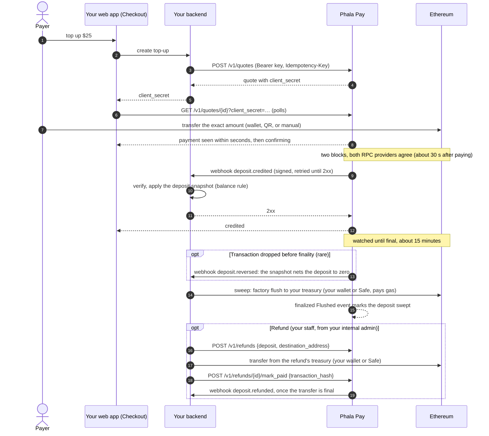

# Integration guide

For a merchant's backend team, who connect the merchant's Phala Pay account (`acct_…`) to the
API. Phala Pay is open-source, self-hosted software: your **operator** runs its own instance
([self-hosting](self-hosting.md)), and you integrate with that instance, at the service URL the
operator gives you (its public origin); Phala offers no hosted service. The samples write
it as `https://api.phala-pay.example`. Phala Pay is API-only: the operator creates your account
(§5.1), and you manage everything else with your API keys and the SDKs; there is no dashboard.
Phala Cloud integrates exactly this way, as an ordinary account of Phala's own instance. Where
this guide and the code disagree, the code wins. The contract is defined by:

- [crates/topup/openapi.json](../crates/topup/openapi.json): every request and response shape,
  with an example of each, also served at `GET /openapi.json` and published as the
  [API reference](https://phala-network.github.io/phala-pay/) (its `Errors` section is where each
  error's `doc_url` points); the operator's admin API is the separate `openapi.admin.json`;
- [deploy/product/reference_product](../deploy/product/reference_product): a complete Python
  merchant backend (fulfillment, holds, refunds), run on Phala's staging;
- [architecture.md](architecture.md): the specification, especially §11 (the fulfillment
  webhook), §12 (API, events, customer UI), §14 (attestation, restore), and §15 (refunds and
  policies).

Phala Pay has the Python SDK and three lockstep JavaScript packages, all in this repository:

- [sdk/python](../sdk/python), `phala-pay` (import `phala_pay`): the backend client,
  `PhalaPay(...).quotes.create(...)` and `.webhooks.construct_event(...)` in Stripe's shape, over
  `topup_sdk` (signing, verification, address recomputation, `topup-sdk send-test-event`) and
  `topup_client`, generated from the OpenAPI document.
- [sdk/js](../sdk/js), `@phala/pay`: the framework-free browser checkout core, retrieval and wallet
  helpers, payment URIs, icons, formatting, and public types;
- [sdk/js-react](../sdk/js-react), `@phala/pay-react`: `<Checkout>`, `<DepositAddress>`, hooks,
  icons, and styles for React;
- [sdk/js-server](../sdk/js-server), `@phala/pay-server`: the merchant client and API types;
  `@phala/pay-server/helpers`: offline webhook verification, address recomputation, ledger helpers,
  and `flushTransaction` / `safeBatch` builders.

Samples below use them; every step is plain HTTP and ed25519, so any backend language can do the
same.

**Contents:** [Quickstart](#quickstart) · [1. Quotes](#1-quotes) (and deposit addresses,
treasuries, sweeps) · [2. Webhooks and fulfillment](#2-webhooks-and-fulfillment) ·
[3. Refunds](#3-refunds) · [4. Testing and go-live](#4-testing-and-go-live) ·
[5. Reference](#5-reference)

## Planned upgrades and reconnecting

An upgrade restarts the attested CVM. While the old process drains, new mutations return
`503 service_maintenance` with `Retry-After: 5`; no handler ran and the same Idempotency-Key can
be retried. Reads continue until the restart. During the restart, the gateway can return
connection failures or 502/503/504 without Retry-After (sometimes HTML). The observed staging
upgrade was unavailable for about 160 seconds. Payments remain on-chain and are scanned after
restart; webhook outbox delivery retries automatically.

For merchant backend work that can wait, enable SDK upgrade tolerance:

```ts
import { PhalaPay } from "@phala/pay-server";

const pay = new PhalaPay({ apiKey, pins, upgradeTolerance: true });
const created = await pay.quotes.create(params, { idempotencyKey: orderId });
```

Python uses the same opt-in:

```python
from phala_pay import PhalaPay

pay = PhalaPay(api_key, pins=pins, upgrade_tolerance=True)
created = pay.quotes.create(**params, idempotency_key=order_id)
```

It retries GETs and idempotent POSTs through those failures for up to five minutes, with bounded
backoff, one body/key, and cancellation support. The opt-in keeps the normal interactive defaults
(15 seconds per attempt, four attempts, 60 seconds total) intact. Explicit `requestDeadlineMs`
or Python `request_deadline` settings remain hard limits. Enable it per call with
`{ upgradeTolerance: true }` or Python `upgrade_tolerance=True`, or disable it per call on an
enabled client. Python interrupts (`KeyboardInterrupt`) terminate retries, including waits;
run synchronous SDK calls in a worker thread in async routes. Keep your application's request budget
long enough, or create the payment asynchronously and let the payer wait. On deadline exhaustion,
preserve the order's key for a later retry; do not turn an uncertain network outcome into a new
logical payment.

`<Checkout>` and `<DepositAddress>` from `@phala/pay-react` poll through temporary 5xx/network failures automatically,
retain the last view and selection, show a neutral reconnecting message, and resume once reachable.
They do not create a new checkout. Normal invalid-secret and address-mismatch handling remains.
Both SDKs follow the
[SDK contract amendment](design/sdk-ergonomics-reference.md#upgrade-tolerance-amendment-js-and-python-implemented).

## Quickstart

The whole integration is three pieces, as with Stripe's Payment Element: the backend creates a
quote, the browser renders the checkout with the quote's client secret, and the webhook fulfils.

**Install** `@phala/pay`, `@phala/pay-react` (for React), `@phala/pay-server`, and `phala-pay`
from npm/PyPI at your operator's service version,
and pin it ([§5.9, "Compatibility"](#compatibility); `X.Y.Z` below):

```sh
npm install --save-exact "@phala/pay@X.Y.Z" "@phala/pay-react@X.Y.Z" "@phala/pay-server@X.Y.Z" viem react react-dom
uv add "phala-pay==X.Y.Z"   # or: pip install "phala-pay==X.Y.Z"
```

**Configure.** `PHALA_PAY_API_BASE` is your operator's service URL. The operator creates your
account and sends your contact its first secret key,
`ppay_sk_test_…` (§5.1); roll it at once (`{"expires_in": 3600}`, then revoke it with the new
key) and keep the new key offline, for administration.
Create a restricted key for your servers (§5.4). Pin your account's webhook key for the mode from
its attestation (§5.3). Set your treasury on each chain you accept (§1.6): payments go only there,
and quotes answer `400 treasury_not_set` until it is. Then choose what you accept: **an account
accepts nothing until its payment settings list the chains and assets it takes**, in each mode
(`POST /v1/payment_settings` with the secret key, §1.9); quotes and deposit addresses answer
`400 asset_not_accepted` until they do.

**Pin your addresses (required).** Configure in your own server, never from an API response, the
inputs every address you show is recomputed from: your account id (`acct_…`), the forwarder
factory and implementation of the attested deployment (§5.5), and **your own treasury on each
chain**, as you proved it. The SDKs derive each address from these pins, never from the
response's `treasury`: a compromised service could return an attacker's treasury together with the
valid `CREATE2` address of that treasury, which a check over the response's own treasury would
pass. Pins-based clients fail closed without every pin (`AddressMismatchError`). The low-level
Python `TopupClient` permits a test-mode fallback to the response's treasury with a warning.

**1. Backend: create a quote, return its client secret.** Only the create response carries
`client_secret`; repeating the call with the same `idempotency_key` within 24 hours returns the
same response, secret included, which is how a reloaded page resumes.

```python
from phala_pay import PhalaPay

# PHALA_PAY_API_KEY is your server's restricted key, "ppay_rk_test_…" or "ppay_rk_live_…" (§5.4).
# PHALA_PAY_PINS encodes your service origin, account, attested forwarder and webhook keys,
# and your own treasury on each chain (§5.3, §5.5). Every quote's address is recomputed from these
# pins before it is returned, and one you cannot derive raises.
pay = PhalaPay.from_env()

@app.post("/topups")
def create_topup(body: TopupRequest, team: Team = Depends(current_team)) -> dict[str, str]:
    quote = pay.quotes.create(
        client_reference_id=team.id, amount=body.amount, chain_id=11155111, asset="pha",
        idempotency_key=body.order_id,
    )
    return {"client_secret": quote.client_secret, "expected_address": quote.address}
```

**2. Frontend: render the checkout.** The component reads the quote's public view with the client
secret (no signature, CORS `*`) and offers a browser wallet (EIP-6963), a QR code (EIP-681), and
manual payment, with live status until the payment is credited.

```tsx
"use client";
import { Checkout } from "@phala/pay-react";
import "@phala/pay-react/styles.css";

<Checkout
  clientSecret={clientSecret}
  expectedAddress={expectedAddress}
  apiBase={PHALA_PAY_API_BASE}
  onSuccess={() => router.refresh()}
  onExpire={() => startOver()}
/>
```

`expectedAddress` is required: it is the address your backend recomputed, and the checkout fails
closed, showing nothing to pay, when the quote it reads names another one. Its wallet button reads
"Pay with crypto" (`buttonText`); `appearance` themes it to match the page, a test-mode quote says
"Test mode", and `onChange` reports every status change (§1.2). Without React,
`new PhalaPay({ apiBase }).checkout(clientSecret, { expectedAddress })` gives the same live
status.

**3. Webhook: verify, then apply the deposit.** Every `deposit.*` event carries the whole
deposit; apply it to `client_reference_id`'s balance per deposit, serially, by the balance rule
(§2.3), commit, then answer `2xx`; `onSuccess` in the browser is display only (§2).

```python
from phala_pay import SignatureVerificationError

@app.post("/webhooks/phala-pay")
async def webhook(request: Request) -> Response:
    try:
        event = pay.webhooks.construct_event(
            await request.body(), request.headers, WEBHOOK_KEYS, ACCOUNT, expected_livemode=False
        )
    except (SignatureVerificationError, ValueError):
        return Response(status_code=400)
    if event.type.startswith("deposit."):
        # Credit, refund, and reversal alike: merge the snapshot and move the balance by the
        # change in what the deposit nets to, in one transaction per deposit (§2.3).
        apply_deposit(event.deposit)
    return Response(status_code=200)
```

A Node backend verifies the same way with `constructEvent(rawBody, headers, WEBHOOK_KEYS,
{ expectedAccount: ACCOUNT, expectedLivemode: false })` from `@phala/pay-server/helpers`.
[sdk/examples/fastapi_app.py](../sdk/examples/fastapi_app.py) is this backend in full, with an
idempotent, snapshot-driven SQLite ledger (`apply_deposit`) and tests of partial refunds,
reversals, and out-of-order delivery; Phala's staging reference product runs the Phala Pay demo, a
cloud console's billing page, on [pay.phala.com](https://pay.phala.com/).

## 1. Quotes

### 1.1 How it works

A quote is the way to pay a known amount, as a PaymentIntent is in Stripe: the user states an
amount in dollars and receives a locked price, an exact token amount, and a single-use address to
pay within the window. A quote is a **payment instruction at a locked price, not a guarantee of
payment in full**: an underpayment, an overpayment, or a late payment to its address is still
credited, at spot, for what arrived (§1.3). Treat an order as paid in full only when the deposit's
`price_source` is `quote` (or its `amount` is what you expected). For top-ups of any amount at any time, give the customer a persistent
deposit address instead (§1.5). The service watches Ethereum for transfers to its addresses, waits for the
route's confirmation (two blocks on Ethereum), prices each deposit, and screens it. A deposit that
passes is credited, typically **about 30 seconds after paying**, and the service tells you
with a signed `deposit.credited` webhook. It keeps watching the deposit until it is final (about
15 minutes on Ethereum). In the rare case that a reorganization before then proves the payment
replaced (another transaction spent the payer's nonce, or another transfer holds its position at
finality), the deposit is reversed and a signed `deposit.reversed`, whose deposit nets to zero,
takes the credit back, as a refund's `deposit.refunded` takes back its share (§2.3). A payment
whose transaction leaves the chain with its nonce unspent is not reversed, since it could still be
included: the deposit stays credited and not final, counts against your cap on credit before
finality (§1.8), and the operator is alerted. You own the balance: you
verify the signature and credit the deposit once, the pattern of Stripe Checkout fulfillment
([docs.stripe.com/checkout/fulfillment](https://docs.stripe.com/checkout/fulfillment)). The
addresses are CREATE2 forwarders that can only pay your treasury; you sweep them there when you
choose, from your own wallet or Safe (§1.7).



### 1.2 Creating and showing a quote

Read `GET /v1/config` (`pay.config.retrieve()`) for what the page shows instead of hardcoding. It
is your **effective payment config**: every asset your payment settings accept (§1.9) on a chain
where you have a treasury, each with your terms: the asset (chain, asset code, contract,
decimals), the minimum `amount` in cents (`min_amount`), the minimum and maximum deposit in token
units (`min_deposit_atomic`, `max_deposit_atomic`), the refund floor, the quote window, spread,
and tolerance, `confirmations` (the stricter of the chain's floor and yours: `"2"` on Ethereum
by default, the payment's block and one more; `"3"` on an OP-stack chain such as Base, the
payment's 2-second block and two more), the typical credit time (`typical_credit_seconds`, 30 on
Ethereum, 7 on Base), and the typical finality time (`typical_finality_seconds`, 900); and your
caps in the key's mode: open quotes (`max_open_quotes`), their credit in cents
(`max_open_amount_per_account`), one customer's (`max_open_amount_per_customer`, which also
bounds one quote), and one customer's quotes per minute
(`quote_creations_per_customer_per_minute`). A quote of an asset your settings do not accept is
`400 asset_not_accepted`. A quote keeps the terms it was issued with, shown in its `terms`,
whatever your settings say later. Quotes are priced at
`spot / (1 + quote_spread_bps / 10 000)`; a payment valued at spot (late, wrong amount, second
payment) carries no spread; network and exchange fees are the payer's; sweep gas is yours, paid
when you sweep, and never reduces a credit.

**What `amount` means.** A deposit's `amount` in cents is a **valuation**: the USD value of the
tokens at the locked or spot price, which you credit to your customer. What you receive is the
tokens themselves, in forwarders that pay your treasury; Phala Pay converts nothing, so you carry
the token's price risk from the payment until you sell it.

`POST /v1/quotes {client_reference_id, amount, currency: "usd", chain_id, asset, metadata?}` with an
`Idempotency-Key` returns the quote:

```json
{
  "id": "qt_0c6e1d0a9b3f4c2e8d7a6b5c4d3e2f10", "object": "quote", "livemode": false,
  "client_reference_id": "team-42", "treasury": "0x…", "amount": 2500, "currency": "usd", "chain_id": 11155111, "asset": "pha",
  "amount_atomic": "100502600000000000000", "exchange_rate": "0.24875621",
  "address": "0x…", "payment_uri": "ethereum:0x…@11155111/transfer?address=0x…&uint256=…",
  "status": "open", "expires_at": 1790410500, "created": 1790409600,
  "payment": null, "deposit": null, "client_secret": "qt_…_secret_…",
  "metadata": {"order_id": "6735"}
}
```

- `client_reference_id` is your customer's id, such as your workspace id (1 to 200 characters,
  Stripe Checkout's name); the customer is created by its first quote or deposit address.
- `treasury` is the treasury the quote's address pays: your treasury of the chain when it was
  created (§1.6).
- `amount` is an integer in US cents; `amount_atomic` is the exact token amount to pay, a decimal
  string in base units, rounded up to four token decimals (the route's
  `asset.quote_amount_decimals`) so the payer reads and types a short amount such as `100.5026 PHA`;
  show every digit of it. The rounding is the payer's, below 0.0001 token, and the credit stays
  exactly `amount`; `exchange_rate` is the locked price in USD per token with 8 decimal places;
  times are Unix seconds.
- `status` is `open`, `complete` (a matching payment consumed it), `expired`, or `canceled`. A
  quote stays `open` past `expires_at` until both endpoints cover its address beyond that time, so a payment mined in
  time is never reported as expired: hide the address once `expires_at` has passed and offer a
  new quote.
- `payment` is what the waiting screen shows once a transfer is seen on chain, display only:
  `status` (`seen` once in a block, `recorded` once it is a deposit at the route's
  confirmation), `chain_id`, `asset`, `tx_hash`, `amount_atomic`,
  `confirmations` and `estimated_final_at` while `seen`, `matches_quote` (credited at the quoted
  price when true), and the `dep_` id it has or will have. A seen payment can disappear in a
  reorg and is never a credit.
- `deposit` is the deposit that completed the quote (`expand[]=deposit` returns it whole).
- `metadata` holds your own key/value pairs, such as your order id; the deposit that pays the
  quote starts with a copy (§1.4).
- `GET /v1/quotes/{id}` resumes a checkout; `POST /v1/quotes/{id}/cancel` cancels an unpaid
  quote by setting `cancel_requested_at` and ending its payment window. The response stays
  `open`; coverage later completes cancellation with `quote.canceled`. An in-window payment
  discovered afterwards consumes the quote normally. Hide the payment address after requesting cancellation.
- A quote above the remaining open exposure fails with `400 exposure_cap_exceeded`; its message
  states what is left.

Validate the amount against `/v1/config` before creating the quote, and map a refused creation
(`ApiError.code` in Python) to a message the user can act on; never show the service's message
verbatim:

| `code` | Tell the user |
|---|---|
| `amount_too_small` (400) | The minimum top-up is `min_amount`. |
| `amount_too_large` (400) | The amount is above the maximum for one payment; split it. |
| `exposure_cap_exceeded` (400) | Too many unpaid quotes are open; pay or wait for one to expire, or enter a smaller amount. |
| `paused`, `chain_frozen` (400) | Crypto top-ups are temporarily unavailable. |
| `price_unavailable`, `unavailable`, `service_restoring` (503), `rate_limit`, `customer_rate_limit` (429) | Try again in a minute (`Retry-After` says how long). |

Fresh quote snapshots have a hard daily cap of 100 per price chain and environment. Exhaustion
returns retryable `503 price_unavailable`; the service never substitutes a stale price. Manual
transfers are discovered every 60 seconds; dual coverage catches omissions and completes quote
expiry or cancellation within finality plus up to 10 minutes.

Semantics (spread, tolerance, expiry by dual coverage time, exposure caps) are
[architecture §9](architecture.md#9-quotes).

**Recompute every address before you show it.** A quote's address salt is
`keccak256(abi.encode(account, client_reference_id, "quote", quote_id))` with `account` your
`acct_` id, and the address is the factory's `CREATE2` clone of the implementation over **your
pinned treasury** of the quote's chain and that salt. `PhalaPay(api_key, pins=pins)` recomputes
every quote from those pins and raises `AddressMismatchError` when the quote names another
treasury, shows another address, or has no pinned treasury for its chain, so a user never pays an
address you did not derive. A Node
backend does the same with `verifyQuoteAddress(pins, quote)` from `@phala/pay-server/helpers`, which
returns the address. Pass the recomputed address to the page as `<Checkout expectedAddress>`,
which fails closed on any other. You need no address records of your own to credit:
`deposit.credited` carries the deposit, which names the customer (`client_reference_id`) and the
quote (`quote`), also for a late or wrong-amount payment.

**The payer's page.** Hand the quote's `client_secret` to the paying customer's page only, and
do not log it. The page reads `GET /v1/quotes/{id}?client_secret=…` without an API key, from any
origin, as Stripe.js reads a PaymentIntent: `{id, object, livemode, status, amount, currency,
asset, decimals, chain_id, amount_atomic, address, payment_uri, expires_at, payment_status,
confirmations, amount_credited, typical_credit_seconds}`, where `payment_status` is `none`,
`seen`, `confirming` (at the route's confirmation, being valued and screened), `credited`,
`rejected` (contact support), or `reversed` (a reorganization before finality replaced the credited
payment). While `credited`, `amount_credited` is what the payment
credited in cents, the deposit's `amount`: it differs from `amount` for a payment valued at spot
(another amount, or paid late), so show it rather than the quote's. `typical_credit_seconds` is
the typical time from paying to the credit at your account's confirmation for the chain, as
`GET /v1/config` reports it. It
carries no account, price, deposit id,
or transaction hash, and is rate-limited per quote. The secret is `{quote id}_secret_` and 64
lowercase hex digits (a nonce and the service's tag of it); treat it as opaque. A malformed or
forged secret reads nothing (`404`). Only `POST /v1/quotes` returns the secret; a
repeat with the same `Idempotency-Key` within 24 hours returns the same response, secret included.
`@phala/pay`'s `<Checkout>` is this page.

**Resume a checkout.** Keep the quote's `client_secret` in the browser (for example
`localStorage`, keyed by the signed-in account) until the checkout reaches `credited`, `expired`,
or `canceled`, or reports `error`. A payer who closes
the tab after paying then reopens the page on the same quote's progress instead of an empty form,
and does not pay twice.

**Drive the page from the checkout.** `<Checkout onChange>` is called once per status change with
`{ status, quote, error }`, like Stripe Elements' `onChange`. Hide your own "new payment" or
amount controls while the status is `seen` or `confirming`, so that a waiting payer does not
start a second payment. While waiting, tell the payer that the payment is credited in about the
quote's `typical_credit_seconds` (30 seconds on Ethereum, about 7 seconds on Base, about 5 minutes
under a `safe` policy, 15 minutes at `finalized`), that they can close the page, and that the credit arrives
automatically. `onSuccess(quote)` is called once credited; `quote.amount_credited` is what was
credited.

**Theme it.** Import `"@phala/pay-react/styles.css"` once in your application entry point.
Map your application's light/dark tokens to `--pp-*` properties on `.pp-root[data-theme]` in a
stylesheet loaded after the SDK's CSS, and omit `appearance` (`pay-theme.css` below):

```tsx
import "@phala/pay-react/styles.css";
import "./pay-theme.css";

<Checkout
  clientSecret={clientSecret}
  expectedAddress={expectedAddress}
  apiBase={PHALA_PAY_API_BASE}
  onChange={({ status }) => setPaymentInFlight(status === "seen" || status === "confirming")}
  onSuccess={() => { forgetClientSecret(account.id); router.refresh(); }}
  onExpire={() => forgetClientSecret(account.id)}
/>
```

```css
.pp-root[data-theme] {
  --pp-color-surface: var(--app-color-surface);
  --pp-color-text: var(--app-color-text);
  --pp-color-text-muted: var(--app-color-text-muted);
  --pp-color-border: var(--app-color-border);
  --pp-color-input: var(--app-color-input-border);
  --pp-color-primary: var(--app-color-primary);
  --pp-color-primary-foreground: var(--app-color-on-primary);
  --pp-color-focus: var(--app-color-focus-ring);
  --pp-color-success: var(--app-color-success);
  --pp-color-warning: var(--app-color-warning-text);
  --pp-color-danger: var(--app-color-danger);
  --pp-font-size: 1em;
}
```

Without `theme`, defaults suit light backgrounds only; on dark hosts map every color variable.
A color you leave unmapped keeps its light default, so on a dark card the status row (the
surface) would be light-on-light. `--pp-color-warning` and `--pp-color-danger` color text, so map
them to text-safe tokens. A mapping written for an earlier SDK must use the current names:
`--pp-color-text-secondary` is now `--pp-color-text-muted`, and an old name is silently ignored.

The components draw no frame or background: place them in your own card or dialog, and give it
inner padding of at least 4px so that the 2px focus outline is not clipped by its
`overflow: hidden`. They take your page's font; `--pp-font-size: 1em` also takes its text size.
Map `--pp-color-focus` to your focus ring color, distinct from the primary color, so that a
keyboard user can tell the focused choice from the selected one.

When you do not map your own tokens, `appearance.theme: "dark"` selects the built-in neutral dark
palette.
See [Appearance](../sdk/js/README.md#appearance) for every token and selector precedence.

### 1.3 Payment outcomes

A deposit's `status` is `pending` (recorded at the route's confirmation and being valued and
screened, or held while `settlement` or crediting of its treasury is paused, §1.6), then `credited`, or `rejected` with a
`rejection_reason`, or `reversed` (Stripe's `status` with booleans beside it). `final` turns true
once the deposit's block is final (about 15 minutes after paying on Ethereum; a final deposit can
no longer be reversed, and only a final one is refunded), and `swept` once a finalized sweep after
it moved its forwarder's balance to your treasury (§1.7). Nothing is reported as a deposit before
the route's confirmation (two blocks on Ethereum)
([architecture §7](architecture.md#7-states-and-pump)).
Phala's staging deposit driver asserts these outcomes on Sepolia
([deploy/phala.md, "Abnormal paths"](../deploy/phala.md#abnormal-paths)); the sandbox scenarios assert them
locally ([deploy/sandbox/README.md](../deploy/sandbox/README.md#scenarios)).

| Payment | Outcome visible to you |
|---|---|
| Exact quoted amount, in time (within `quote_tolerance_bps`) | Quote `complete`; `deposit.credited` with `price_source: "quote"` and exactly the quoted `amount`. |
| Underpayment beyond tolerance | Credited at spot for what arrived; quote not completed and later `quote.expired`; cancel refused with `400 quote_payment_received`. Payments are not accumulated against one quote: offer a new quote for the shortfall. |
| Overpayment beyond tolerance | Credited at spot for the full amount; quote not completed. |
| After the window (mined after `expires_at`) | `quote.expired`, then credited at spot (the deposit's `quote` still names the quote). A payment mined inside the window stays at the quoted price even if final later; the quote stays `open` past `expires_at` until then. |
| Second payment to a quote's address, or to a canceled quote's | Credited at spot. |
| Deposit address (§1.5), active or retired, any amount of an accepted token on any listed network | Credited at spot when confirmed; the deposit has `quote: null` and names the `deposit_address`, its `chain_id`, and its `address`. |
| A routed token your payment settings do not accept (§1.9), on a chain or for an asset not configured, or anything while the account accepts nothing | `rejected(asset_not_accepted)` once both providers confirm it, before it is valued; never credited; refundable once final, above the route's dust floor, like any rejected deposit (§3). The settings that decide are those current when the payment is recorded. A payment that completes a quote (its asset, in time, within its tolerance) is honoured at the quote's terms even if you stopped accepting the asset after issuing it. |
| Token without a route | Once final (about 15 minutes, up to one more reconciliation round), `rejected(unsupported_asset)`; never credited; the tokens stay in the forwarder. |
| Below your `min_amount` | `rejected(below_minimum)`. |
| Outside your `min_deposit_atomic`..`max_deposit_atomic`, or credit overflow | `rejected(out_of_bounds)` or `rejected(out_of_range)`. |
| Sanctioned sender | `rejected(sanctioned)`; not refundable. |
| Known same-sender, same-nonce replacement agreed finalized by both endpoints, or its transfer is gone at finality | Deposit `reversed`; `deposit.reversed` if you were told of it (credited or rejected): its `amount_reversed` takes the whole credit back (§2.3). A quote it completed always reopens with its reservation; coverage later expires or cancels it. A transaction re-included in another block keeps its deposit id and is not reversed. |
| A payment made through a contract (a router, a swap output) whose transaction is re-included before finality against other state, so that it pays you another amount, or another of your addresses | The first deposit is `reversed` as above, and the transfer now in the final chain is a **new deposit with a new id**, credited (or rejected) through the usual events, already final. The new deposit's `replaces` names the reversed one, and the reversed one's `replaced_by` names it (both `null` when the other deposit is in another account or mode). If it pays the same quote, it completes that quote in the first deposit's place, with no `quote.expired` in between. The events of the two deposits can arrive in any order (a new deposit's `deposit.rejected` can even come before the old one's `deposit.reversed`): apply each through the balance rule (§2.3), which nets the customer to what the final chain paid whatever the order. A plain transfer of a routed token cannot change this way: routes never take fee-on-transfer or rebasing tokens. |
| You refuse the credit (for example a closed customer) | Deposit `credited`; you hold it and refund it (§2.4). |

User-facing copy per state and reason, including what never to show, is in
[architecture §12, product UI](architecture.md#customer-experience-obligations-product-ui).

### 1.4 Metadata

Quotes, deposits, and refunds carry `metadata`, as Stripe objects do
([docs.stripe.com/api/metadata](https://docs.stripe.com/api/metadata),
[docs.stripe.com/metadata](https://docs.stripe.com/metadata)): up to 50 key/value pairs for your
own use, keys of up to 40 characters without square brackets, values of up to 500 characters,
strings only. Phala Pay never reads it. **Do not store sensitive information in metadata**, such
as personal data, credentials, or payment details; keep those in your own database and put its
record id in metadata instead.

- Set it on create: `metadata` on `POST /v1/quotes` and `POST /v1/refunds`. A key set to `""` is
  left out.
- Update it with `POST /v1/quotes/{id}`, `POST /v1/deposits/{id}`, or `POST /v1/refunds/{id}`
  `{"metadata": {…}}`, in any status. The update merges: a key with a value is set, a key set to
  `""` is unset, keys you do not send are kept, and `{"metadata": ""}` unsets every key. The
  50-key limit applies to the result.
- A deposit's metadata is initialized from its quote's (or its deposit address's, §1.5) when the
  deposit is recorded, and is
  independent afterwards: updating one does not change the other. This is how Stripe Checkout's
  `payment_intent_data.metadata` sets the PaymentIntent's metadata, and how a PaymentIntent's
  metadata is copied to its Charge. So an order id set on the quote arrives in the
  `deposit.credited` webhook's `data.object.metadata`, and a second payment to the same address
  carries it too.
- Reads with your API key and every webhook's `data.object` include it; the payer's
  `client_secret` view does not, as Stripe omits metadata from publishable-key reads.
- A limit violation is `400 parameter_invalid` with `param` naming `metadata[key]` (the key,
  value, or type is invalid) or `metadata` (too many keys, or not an object or `""`).
- `metadata` is part of the request an `Idempotency-Key` identifies (§5.6): the same key with
  other metadata is `400 idempotency_key_reused`.

```python
quote = pay.quotes.create(client_reference_id="team-42", amount=2500, chain_id=11155111, asset="pha",
                          idempotency_key=order.id, metadata={"order_id": order.id})
pay.deposits.update(deposit.id, metadata={"fulfilled_at": str(now)})
pay.refunds.update(refund.id, metadata={"ticket": ""})   # unsets `ticket`
```

### 1.5 Deposit addresses

A deposit address is the customer's own address, **one address for all the tokens and networks
you accept** (§1.9), like the stable bank-transfer details Stripe gives each customer
([customer balance funding instructions](https://docs.stripe.com/payments/customer-balance/funding-instructions)),
and like the one deposit address an exchange gives a user for every token and every EVM chain.
It never expires: the customer sends **any amount of an accepted token, at any time, on any
listed network**, and each transfer is credited at the market (spot) rate when it arrives,
about 30 seconds after paying, through the same `deposit.credited` webhook as a quote payment.
**Send only listed tokens**: a token that is not listed is not credited.

| Use | When |
|---|---|
| A quote (§1.2) | The customer buys something of a known price and must see the exact token amount and the rate before paying. |
| A deposit address | Top-ups and balances: the amount is the customer's choice, they may pay repeatedly, or they pay from an exchange that cannot send an exact amount within a window. |

```python
address = pay.deposit_addresses.create(client_reference_id="team-42",
                                       metadata={"team_id": "team-42"})
# {"id": "da_…", "object": "deposit_address", "livemode": false, "client_reference_id": "team-42",
#  "address": "0xabc…", "version": 1, "salt": "0x…", "status": "active",
#  "created": 1790409600, "retired_at": null, "metadata": {"team_id": "team-42"},
#  "networks": [
#    {"chain_id": 11155111, "address": "0xabc…", "treasury": "0x…",
#     "assets": [{"asset": "pha", "contract": "0x…", "decimals": 18,
#                 "payment_uri": "ethereum:0x…@11155111/transfer?address=0xabc…"}]},
#    {"chain_id": 84532, "address": "0xabc…", "treasury": "0x…", "assets": [ … ]}]}
```

- `POST /v1/deposit_addresses {client_reference_id}` returns the customer's **active** address
  with a new `client_secret` for the customer's page,
  issuing it the first time: call it whenever the page opens; the same request returns the same
  address until it is rotated, and it adds a network supported since. Addresses are per mode: a
  test key never sees a live address, and `networks` lists the chains of that mode.
- **One address, or one per network.** The address is the same on every network only where the
  forwarder factory is the same deployment (the same factory address and implementation, which the
  deterministic deployment gives every supported chain) and your treasury is the same address (an
  EOA, or a Safe deployed at the same address on each chain), on an EVM chain with the same
  `CREATE2` rule; then the top-level `address` is it. Where a network's treasury differs, that network's address differs,
  and the top-level `address` is `null`: show each network's own `networks[].address` then, never
  one address for all.
- Show only the networks in `networks` and the tokens in their `assets`: the networks and tokens
  your payment settings accept, read when the address is returned, so a change of your settings
  shows on the next read. A transfer of a listed token on a listed network is credited; a routed
  token you do not accept is `rejected(asset_not_accepted)`, any other token `rejected
  (unsupported_asset)`, and neither is credited. Funds sent on a network that is not listed are not seen:
  they stay at the address on that chain and can be swept only once the forwarder factory is
  deployed there, and only if your treasury is the same address on that chain; contact the
  operator.
- `POST /v1/deposit_addresses/{id}/rotate` retires the address and returns the customer's next
  one, a new address on every network (for example after the address was exposed somewhere it
  should not be). **A retired address is still credited**; stop showing it, but never tell the
  customer a payment to it is lost. A customer rotates at most 10 times an hour
  (`429 customer_rate_limit`, with `Retry-After`), and rotating a retired address is `400 deposit_address_retired`.
- `metadata` (§1.4) on the create request is merged into the returned address's;
  `POST /v1/deposit_addresses/{id} {"metadata": {…}}` updates it on an active or retired address,
  a rotation carries it to the next address, and each deposit to the address starts with a copy,
  so it arrives in `deposit.credited` like a quote's. The deposit names the `deposit_address` and
  the `chain_id` and `address` it arrived on.
- `GET /v1/deposit_addresses/{id}` and `GET /v1/deposit_addresses?client_reference_id=…&status=…`
  read them; `GET /v1/deposits?deposit_address=da_…` lists what reached one.
- `payments` lists the address's payments of the last 24 hours, newest first, in a quote's
  `payment` shape: `seen` within about a block of arriving (with its `confirmations`), then
  `recorded` as a deposit, which `GET /v1/deposits?deposit_address=da_…` follows to `credited`.
  Display only: credit from `deposit.credited`. The customer's page reads the same, without an
  API key, from `GET /v1/deposit_addresses/{id}?client_secret=…` (`ClientDepositAddress`, any
  origin, rate-limited), with each payment's progress: `seen`, `confirming`, `credited`,
  `rejected`, or `reversed`, and each network's `typical_credit_seconds`. Each create or rotation
  issues a new secret and the newest 10 stay valid, as a Stripe CustomerSession's; give it only to
  that customer's page and do not log it.
- Recompute the address before showing it, as for quotes: the salt is
  `keccak256(abi.encode(account, livemode, client_reference_id, "deposit_address", version))`
  with the types `(string, bool, string, string, uint256)` (no chain, no asset), and each
  network's address is the factory's `CREATE2` for that network's `treasury` and the salt.
  `PhalaPay(api_key, pins=pins)` checks every network
  of an active address over your pinned treasury of its chain and raises `AddressMismatchError`
  (`verifyDepositAddress(pins, address)` in `@phala/pay-server/helpers`);
  `topup_sdk.deposit_address(...)` recomputes any version offline.
- A network pays the treasury it was issued for, forever. When your treasury on one network
  changes, that network's address changes (the others do not); payments to the old address on
  that network are still credited and still reach the old treasury, and a refund of such a deposit
  is paid from the old treasury, so keep control of it (you are told through `treasury.*`
  events, §1.6). A network is issued only on a chain where you have a treasury.
- Limits: 100 000 active addresses per account in live mode and 1 000 in test mode
  (`400 deposit_address_cap_exceeded`; ask the operator to raise it); no new address is issued
  while `quotes` is paused (`400 paused`), and a network frozen by reconciliation gets no new
  address until it is lifted.

**Page copy.** "One address for all listed tokens and networks. Send only listed tokens."
Let the customer pick the network and the token; show that network, the token contract, the full
address with a copy button, and a QR of that token's `payment_uri` (it carries the token, chain,
and address and no amount): "Send only PHA, USDC on Sepolia, Base Sepolia. Any amount is credited
at the market rate when it arrives, usually in about 30 seconds on Sepolia and about 7 seconds on
Base Sepolia. You can reuse this address." Each network's time is its `typical_credit_seconds` in
the address's public view (above), at the confirmation your account's payments on that chain wait
for, as `GET /v1/config` reports it; until the view is loaded the page names no time.
`<DepositAddress depositAddress={…} clientSecret={…} apiBase={…}>` from `@phala/pay-react`
renders exactly that from `address` and `networks` (pass only those and the `client_secret` to the
browser) and, with the secret, shows each payment as it arrives: "1.5 PHA received on Sepolia, 1
confirmation", then "credited".

Both React components pause polling in hidden tabs and read immediately on visibility regain,
with uniform ±20% jitter on their normal intervals and failure backoff, respecting `Retry-After`.
After ten minutes without a public-view change, `DepositAddress` uses an idle base interval of
`max(pollInterval, 15000)` milliseconds, so a longer configured interval stays unchanged;
any change or visibility regain resets that window and restores `pollInterval` (default 3000 ms).
Optional `onChange(state)` receives the `ClientDepositAddress` view after the first successful read
and then once per content change, including confirmations and credit times. Unlike
`<Checkout onChange>`, it does not report loading. Use it to update your page without
additional polling; credit from your webhook. Checkout uses its existing error state after three
consecutive non-terminal 4xx responses other than 408/429; 404 still stops on the first response.

### 1.6 Treasuries

Your treasury is the only address your forwarders can pay: one per chain and mode, an EOA or a
Safe deployed on that chain. You set it through the API with a signed EIP-4361 (Sign-In with
Ethereum) message, which proves you control it and that it exists on the chain; the operator never
sets it.

```sh
# 1. The message to sign, usable once: 10 minutes for an EOA, 24 hours for a Safe.
curl -sS https://api.phala-pay.example/v1/treasuries/challenge -H "Authorization: Bearer $KEY" \
  -H 'content-type: application/json' -d '{"chain_id": 11155111, "address": "0x…"}'
# 2. Sign `message` exactly as returned, then submit it.
curl -sS https://api.phala-pay.example/v1/treasuries -H "Authorization: Bearer $KEY" \
  -H 'content-type: application/json' -d '{"chain_id": 11155111, "message": "…", "signature": "0x…"}'
```

- **EOA:** sign with `personal_sign` (EIP-191), for example `cast wallet sign "$MESSAGE"`;
  `deploy/sandbox/set-treasury.sh` does both steps from a test key, and the Python SDK does them
  with `pay.treasuries.set_eoa(chain_id=…, address=…, private_key=…)` (install
  `phala-pay[eoa]`); it refuses a key that is not the address's before anything is sent.
- The address is screened for sanctions (`400 treasury_sanctioned`), again when a pending change
  is due to apply (a listed one is `canceled` with `cancellation_reason: "sanctioned"`), and every
  day while it is your treasury: a listed treasury pauses your account's `quotes` and
  `settlement` until the operator reviews it with you.
- **When it applies.** A chain's first treasury, and any test-mode change, apply at once. A later
  live change is `pending` for 48 hours, then applies; `treasury.created` tells every
  enabled webhook endpoint of the mode at once, whatever events it subscribes to, so a leaked key
  cannot redirect payments unseen: cancel an unrequested change with
  `POST /v1/treasuries/{id}/cancel` and roll your keys (§5.4). One change waits per chain
  (`400 treasury_change_pending`).
- **What changes.** New quotes, and the chain's network of each of your deposit addresses (§1.5),
  pay the new treasury; each quote shows the `treasury` its address pays. Everything issued before
  keeps paying the old treasury for good (the address commits to it): those payments are still
  credited, and their refunds are paid from the old treasury (§3), so keep control of it. Update
  the treasury you pin in your server (Quickstart) when the change applies (`treasury.updated`):
  until then your pins refuse the new treasury's addresses, and after it the old one's.
- **Pause crediting of a treasury.** If a treasury is compromised (for example a former
  treasury's key leaked), `POST /v1/treasuries/{id}/pause` (`pay.treasuries.pause(id)`, a secret
  key) stops crediting every deposit to the forwarders over that treasury's address: new payments
  there stay `pending` and no `deposit.credited` is sent, so you do not credit customers for funds
  that a thief can sweep; deposits already credited are unchanged. `POST /v1/treasuries/{id}/resume`
  credits what it held. The operator can pause a treasury too, in an incident; your resume does not
  lift the operator's pause (`crediting_paused_by` lists both). Each change is `treasury.updated`
  ([runbook](../deploy/runbooks/treasury-credit-pause.md)).

**Safe treasuries.** The Safe must be deployed on the chain, at its `finalized` block (about 15
minutes on Ethereum): a counterfactual Safe is refused (`treasury_not_deployed`), and so are
ERC-6492 signatures. The service calls the Safe's EIP-1271 `isValidSignature(bytes32 hash, bytes
signature)` with `hash` the message's EIP-191 hash, on two RPC providers at `finalized`, and
requires `0x1626ba7e`. On a Safe (v1.3.0 and later, with the default CompatibilityFallbackHandler)
that call does not check the owners' signatures of `hash` itself: the handler wraps it in the
EIP-712 `SafeMessage(bytes message)` of the Safe's domain `{chainId, verifyingContract: <Safe>}`,
with `message = hash`, and checks the owners' signatures of that, as the Safe executes a
transaction. So the owners never `personal_sign` the challenge (that is refused); they sign it as a
**Safe message**, which is what Safe{Core} SDK's Protocol Kit does for a string message
([Safe docs, message signatures](https://docs.safe.global/sdk/protocol-kit/guides/signatures/messages);
[`CompatibilityFallbackHandler` v1.4.1](https://github.com/safe-global/safe-smart-account/blob/v1.4.1/contracts/handler/CompatibilityFallbackHandler.sol);
[Protocol Kit `generateTypedData`](https://github.com/safe-global/safe-core-sdk/blob/0cc12cbb18128c5e1c1067ac3917f08ab9b4fd21/packages/protocol-kit/src/utils/eip-712/index.ts)):

```typescript
import Safe, { hashSafeMessage, SigningMethod } from '@safe-global/protocol-kit'

const challenge = await createChallenge({ chain_id, address: SAFE_ADDRESS }) // POST /v1/treasuries/challenge
let protocolKit = await Safe.init({ provider: RPC_URL, signer: OWNER_1_KEY, safeAddress: SAFE_ADDRESS })
let safeMessage = protocolKit.createMessage(challenge.message) // the EIP-4361 text, unchanged
safeMessage = await protocolKit.signMessage(safeMessage, SigningMethod.ETH_SIGN_TYPED_DATA_V4)
// Up to the threshold, each further owner signs the same object:
protocolKit = await protocolKit.connect({ provider: RPC_URL, signer: OWNER_2_KEY })
safeMessage = await protocolKit.signMessage(safeMessage, SigningMethod.ETH_SIGN_TYPED_DATA_V4)

const signature = safeMessage.encodedSignatures() // 65 bytes per owner, in ascending owner order
// Optional: the same check the service makes (at the latest block instead of `finalized`).
await protocolKit.isValidSignature(hashSafeMessage(challenge.message), signature) // true
await submitTreasury({ chain_id, message: challenge.message, signature }) // POST /v1/treasuries
```

- **Owners in different places.** One owner proposes the message to the Safe Transaction Service
  with API Kit, `apiKit.addMessage(SAFE_ADDRESS, {message: challenge.message, signature:
  buildSignatureBytes([ownSignature])})`; the others add theirs with
  `apiKit.addMessageSignature(safeMessageHash, …)`, where `safeMessageHash =
  await protocolKit.getSafeMessageHash(hashSafeMessage(challenge.message))`; Safe{Wallet} lists the
  message at `https://app.safe.global/transactions/messages?safe=<prefix>:<Safe>`. Once the
  threshold is reached, `(await apiKit.getMessage(safeMessageHash)).preparedSignature` is the
  signature to submit. A Safe's challenge lasts 24 hours for this.
- **On chain instead.** A Safe transaction, executed by the owners like any other, with
  `operation: DelegateCall` to the Safe's `SignMessageLib`, calling
  `signMessage(hashSafeMessage(challenge.message))`, records the approval in the Safe; submit
  `"signature": "0x"` once that transaction is at `finalized`, within the challenge's 24 hours.
- Submit the collected signature with the Python SDK as for an EOA:
  `challenge = pay.treasuries.challenge(chain_id=…, address=SAFE)`, the owners sign
  `challenge.message` as above, then `pay.treasuries.create(chain_id=…, message=challenge.message,
  signature=signature)`.
- The service's tests run exactly these three flows (1-of-1, 2-of-3, and `SignMessageLib`) against
  Safe v1.4.1 built from `safe-global/safe-smart-account` at tag v1.4.1, whose code equals the
  canonical deployment's, and refuse a non-owner's signature, too few signatures, and an owner's
  `personal_sign` of the message.

### 1.7 Balance, sweeps, and the forwarder export

Payments wait in their forwarders until you sweep them to your treasury: nothing Phala runs can
move them, and a forwarder can pay only the treasury in its address. You choose when, and pay the
gas, with one `factory.flush(treasury, salts, token)` per token and treasury (design D4).

- `GET /v1/balance` (`pay.balance.retrieve()`, Stripe's Balance): per chain and token, the
  `amount_atomic` your forwarders hold (deposits not reversed, minus finalized sweeps) and the
  `final_amount_atomic` part of it from final deposits, which is safe to sweep.
- `GET /v1/forwarders` (`pay.forwarders.list()`): every forwarder issued in the mode, for quotes
  and for deposit address networks (current and superseded, `superseded_at`), with its `chain_id`,
  `address`, `factory`, `salt`, and `treasury`: the export that keeps your funds recomputable and
  sweepable even without Phala Pay. With `sweepable=<token>` it lists only forwarders with a final
  unswept balance of that token that may be swept: never one holding a deposit rejected as
  `sanctioned`, and never one paying a treasury a sanctions list names (`503` when screening
  cannot answer).
- `GET /v1/sweeps` (`pay.sweeps.list()`, Stripe's Payouts): every finalized `Flushed` event of
  your forwarders, whoever sent the flush, as `sw_…` objects with the forwarder, token, treasury,
  amount, and transaction. A deposit is `swept` once a sweep after it moved its forwarder's balance.

The call is built offline, from the forwarders, by the SDKs:

```python
from topup_sdk import flush_transactions, safe_batch, write_safe_batch

forwarders = list(pay.forwarders.list(chain_id=1, sweepable=PHA))
calls = flush_transactions(forwarders, PHA)  # one {to, data, value} per treasury, 200 each
# An EOA treasury, or any wallet: send each call as an ordinary transaction.
# A Safe treasury: write a Transaction Builder batch for the owners.
write_safe_batch("sweep.json", safe_batch(1, SAFE, calls, name="Phala Pay sweep 2026-10"))
```

The batch file is the Safe{Wallet} Transaction Builder's `BatchFile`
([models.ts](https://github.com/safe-global/safe-react-apps/blob/e8cccfb9a1042fa2954087988bae59c3b8c81780/apps/tx-builder/src/typings/models.ts)),
with the app's own `meta.checksum`, so it imports without a "modified" warning. An owner opens
Safe{Wallet} > Apps > Transaction Builder, drags the file in, and creates the batch; the owners
sign and execute it as any Safe transaction
([Safe help](https://help.safe.global/en/articles/40841-transaction-builder)).
`@phala/pay-server/helpers` has the same `flushTransactions` and `safeBatch` for a Node backend.
`pay.export_account(directory)` writes every list, `forwarders.json` included, to JSON files.

### 1.8 Confirmations and pausing

- **A stricter confirmation.** A chain's `confirmations` in your payment settings (§1.9), such as
  `POST /v1/payment_settings {"chains": [{"chain_id": 1, "confirmations": "finalized", "assets":
  [{"asset": "pha"}]}]}`, credits that chain's payments only at the stricter of the chain's floor
  and your value: a depth such as `"12"`, `"safe"` (OP-stack chains only), or `"finalized"`, never
  weaker than the floor (`400` otherwise). From weaker to stricter: a depth, a deeper depth,
  `"safe"`, `"finalized"`. On an OP-stack chain such as Base, the floor's depth counts blocks on
  the sequencer's unsafe head, which Base reports reorganized only once ever; `"safe"` waits,
  about 5 minutes, until the block is derived from data posted to Ethereum, which the sequencer
  cannot rewrite on its own, and `"finalized"` until that data is final. `null` keeps the floor.
  A payment waits for the requirement of the settings it is bound to (those current when it was
  recorded, or its quote's) or the operator's current floor, whichever is stricter: a change
  applies to payments recorded after it, so to hold payments already recorded, pause crediting
  of the treasury (§1.6). `GET /v1/config` reports each chain's `confirmations` and
  `typical_credit_seconds`. **If you sell goods or
  services you cannot take back (withdrawable balances, gift cards, anything delivered off
  platform), use `finalized`**: a credit before finality can still be reversed by a
  reorganization, and a reversal is recoverable only by clawing the credit back (§2.3); a deposit
  waits `pending` until final meanwhile.
- **The cap on credit before finality.** However you configure confirmations, the credit of your
  deposits credited but not final yet is capped per mode: $1 000 by default
  (`max_unfinalized_credit`, 100 000 cents), which the operator raises or lowers for your account on
  request. A deposit whose credit would take that total past the cap is not rejected: it stays
  `pending` and is credited as soon as it is final (about 15 minutes on Ethereum), or earlier once
  other deposits become final and make room. Plan for it in your UI's waiting state (§1.3).
- **Pause issuing.** `POST /v1/account/pause {"scopes": ["quotes"]}` (`pay.account.pause_quotes()`)
  stops new quotes, deposit addresses, and networks in both modes, for an emergency such as a
  leaked key during a treasury time-lock; payments to existing addresses keep being credited.
  `POST /v1/account/resume` lifts your own pause; a pause the operator set stays in
  `paused_scopes` until the operator lifts it. Both are announced as `account.updated`.

### 1.9 Payment settings

Your payment settings say what you accept and on what terms, per mode, like Stripe's
[payment method configurations](https://docs.stripe.com/api/payment_method_configurations): the
chains and assets you take, a stricter confirmation per chain, and your terms on each asset,
chosen from your operator's routes within the bounds the operator sets. **A new account accepts
nothing**: quotes and deposit addresses answer `400 asset_not_accepted`, and a payment to an
address is `rejected(asset_not_accepted)`, until you configure the mode. Manage them with the
secret key; a restricted key can read them (`account.read`) but not change them (§5.4).

```python
settings = pay.payment_settings.update(chains=[
    {"chain_id": 11155111, "assets": [{"asset": "usdc"}, {"asset": "usdt"}]},
    {"chain_id": 84532, "confirmations": "safe",
     "assets": [{"asset": "usdc", "quote_spread_bps": 0, "min_amount": 500}]},
])
# GET /v1/payment_settings: {"object": "payment_settings", "livemode": false,
#  "status": "configured", "revision": "psrev_…", "updated": 1790409600,
#  "quote_creations_per_customer_per_minute": null, "chains": [ … as sent … ],
#  "available": [{"chain_id": 11155111, "status": "active",
#                 "confirmations": {"floor": "2", "default": "2"},
#                 "assets": [{"asset": "usdc", "accepted": true, "enabled": true,
#                             "quote_spread_bps": {"default": 0, "min": 0, "max": 500}, …}, …]}]}
```

- **What you can set.** Per chain, `confirmations` (stricter than the floor, §1.8). Per asset:
  `quote_ttl_seconds`, `quote_spread_bps`, `quote_tolerance_bps` (two-sided: a payment within it of
  the quoted amount, under or over, completes the quote at its `amount`), `min_amount` (cents),
  `min_deposit_atomic`, `max_deposit_atomic`, and `min_refund_atomic`. Top-level:
  `quote_creations_per_customer_per_minute` (1 to 60). A term not sent, or `null`, takes the
  operator's default, so you follow a change of it. `available` lists every chain and asset of the
  mode with its defaults and bounds; a value outside them is `400 parameter_invalid` with the exact
  `param` path and the bounds. The rounding of a quote's amount (`quote_amount_decimals`) is the
  operator's.
- **Updates.** A parameter not sent is unchanged. `chains`, when sent, replaces the whole list,
  and a term an element leaves out resets to the default; `"chains": []` accepts nothing. Writes
  are last-write-wins: two concurrent updates apply one after the other, and the later one is
  current. Each change has a new `revision` and is announced as `payment_settings.updated` with
  `previous_attributes`, delivered to every endpoint whatever it subscribes to.
- **Active chains.** A chain is offered only where you also have a treasury (`available[].status`
  `active`; `treasury_not_set` until you set one, §1.6).
- **Which settings govern a payment.** A quote keeps the terms it was issued with; a payment that
  completes it (its asset, in time, within its tolerance) is credited on them even after you
  stop accepting the asset. Every other payment is governed by the settings current when it is
  recorded: a change applies to payments recorded after it, never to one recorded before.
- **Disabled pairs.** If the operator tightens a bound so that your terms on an asset no longer
  fit together (for example a maximum deposit below your minimum), that asset is `enabled: false`:
  not offered or credited until you or the operator change it.
- **After a service restore** your settings are `held` until you reconfirm them (§5.12).

### Transaction-hash hints

`@phala/pay` submits a hint automatically when `payWithWallet` returns the broadcast hash for
a quote retrieved by its client. `<Checkout>` needs no integration change. The hint starts
receipt polling immediately; manual transfers still use the normal scanner.

For a custom wallet flow, submit the returned hash yourself:

```ts
await pay.submitTransaction(clientSecret, transactionHash);
// For a deposit-address client secret, also select an issued network:
await pay.submitTransaction(addressClientSecret, transactionHash, { chainId: 84532 });
```

Server forwarding uses the merchant key:

```ts
await pay.quotes.submitTransaction(quoteId, { transaction_hash: transactionHash });
await pay.depositAddresses.submitTransaction(addressId, {
  transaction_hash: transactionHash, chain_id: 84532,
});
```

Python exposes the same operations:

```python
pay.quotes.submit_transaction(quote_id, transaction_hash=transaction_hash)
pay.deposit_addresses.submit_transaction(
    address_id, transaction_hash=transaction_hash, chain_id=84532
)
```

Plain HTTP accepts `POST /v1/quotes/{id}/transactions` with `{"transaction_hash":"0x…"}` and
`POST /v1/deposit_addresses/{id}/transactions` with
`{"transaction_hash":"0x…","chain_id":84532}`. Browser calls authenticate with the object's
`client_secret` query parameter; server calls require `quotes.write` or
`deposit_addresses.write`. A quote uses its stored chain, a deposit address requires one of
its issued networks, and the server derives the recipient. Extra body fields do not select an
address or change payment terms.

Every submission responds `202` with
`{"object":"transaction_submission","transaction_hash":"0x…","status":"received"}`.
This acknowledges receipt only. Unknown objects, invalid credentials, unrelated or unmined
transactions, duplicates and exhausted limits give no payment signal. Continue polling the quote
or deposit address and fulfill only from verified webhooks.

Hints can record only a successful routed ERC-20 transfer agreed by both RPC endpoints at the
route's confirmation. The worker first polls read for inclusion, waits for both endpoints' heads
at confirmation depth, then fetches complete independent evidence on each endpoint. Lagging
receipt visibility keeps polling within the task budget; only confirmed evidence disagreement
raises an alert. They do not advance coverage or cause expiry, cancellation, rejection or
credit by themselves. Each task is limited to 12 read calls and 8 verify calls including retries
and head polling, and 90 seconds on Ethereum chains or 30 seconds on Base chains. Limits are
3/minute and 10/day per authenticated object, four active tasks and a hard 150 tasks
per environment per UTC day. Hint endpoints do not use a peer-IP limit: dstack's HAProxy ingress
forwards TCP without PROXY protocol, so the service sees the same ingress IP for every client.
Browser preflight returns an empty `204` with `Access-Control-Max-Age: 600`. A not-ready endpoint parks hints in a bounded process-local queue
for at most 15 minutes. Exhausted, dropped or interrupted hints leave detection to the scanner;
wallet submission errors never change an already broadcast payment's result.

## 2. Webhooks and fulfillment

### 2.1 The event

`deposit.credited` is the one event that moves a balance. The service writes it when a deposit
passes screening, in the same transaction that marks the deposit `credited`: the credit is owed
to you whatever you answer, until a `deposit.reversed` takes it back (§2.3).

```http
POST {your webhook endpoint's url}
content-type: application/json
webhook-id: evt_26a20351ab10595a852f9c1aa0372d73
webhook-timestamp: 1790409600
webhook-signature: v1a,<base64 ed25519 over "{webhook-id}.{webhook-timestamp}.{raw body}">

{"id": "evt_26a20351ab10595a852f9c1aa0372d73", "object": "event", "type": "deposit.credited",
 "created": 1790409590,
 "data": {"object": {"id": "dep_3f1c2b9e6a8d5c479e210b7d4f6a8c13", "object": "deposit",
                     "client_reference_id": "team-42", "quote": "qt_…", "status": "credited",
                     "amount": 1234, "currency": "usd", "price_source": "quote",
                     "metadata": {"order_id": "6735"}, …}}}
```

- `data.object` is the deposit as `GET /v1/deposits/{id}` returned it when it was credited: a
  snapshot rendered in the transaction that credits it and never changed afterwards
  ([Stripe](https://docs.stripe.com/api/events/object)). Its `status` is `credited`; a later
  sweep, refund, or reversal does not change it, but sends its own `deposit.*` event with a new
  snapshot: fetch the deposit for its current state.
- `amount` is the credit in cents: exactly the quote's `amount` when `price_source` is `quote`,
  otherwise spot when the deposit is confirmed (§1.3).
- `quote` is the quote of the receiving address, also when a late or wrong-amount payment was
  valued at spot; it is `null` for a deposit address's payment, which names its
  `deposit_address` instead.
- `metadata` is the deposit's, which starts as a copy of the quote's (§1.4). As the rest of
  `data.object`, it is what the deposit held when it was credited.
- `webhook-id` is the event's `id`: `evt_` and the hex of
  `uuid_v5(DEPOSIT_NAMESPACE, "deposit.credited:" + deposit UUID)`
  (`topup_sdk.credited_event_id`), so every retry, resend, and re-emission after a service
  restore carries the same id.

### 2.2 The fulfillment function

```python
from topup_sdk import SignatureError, verify_webhook

RANK = {"pending": 0, "credited": 1, "rejected": 1, "reversed": 2}

def handle_webhook(headers: dict[str, str], raw_body: bytes) -> int:
    try:
        # Pinned keys (§5.3); fails closed for another account or mode; 300 s tolerance.
        event = verify_webhook(
            headers, raw_body, WEBHOOK_KEYS, expected_account=ACCOUNT, expected_livemode=False
        )
    except SignatureError:
        return 400
    with db.transaction():
        if inbox.contains(event.id):  # a redelivery: the first is kept and applied already
            return 204
        if event.type.startswith("deposit."):
            apply_deposit(event.data["object"])  # every deposit.* event, the balance rule (§2.3)
        # The delivery as received, for history and for a service restore (§5.12): the raw body
        # bytes and the webhook-id, webhook-timestamp, and webhook-signature headers.
        inbox.insert(event.id, event.type, raw_body, headers)
    return 204  # only after the commit

def apply_deposit(snapshot: dict) -> None:
    view = deposits.lock_or_insert(snapshot["id"])  # "dep_…", unique; one delivery at a time
    if view.held or (view.new and refuses(snapshot)):  # unknown, closed, or suspended customer
        view.hold()  # never applied; support later refunds it (§2.4)
        return
    if RANK[snapshot["status"]] > RANK[view.status]:
        view.status = snapshot["status"]
    view.amount = view.amount or snapshot["amount"] or 0
    view.refunded = max(view.refunded, snapshot["amount_refunded"])
    view.reversed = max(view.reversed, snapshot["amount_reversed"])
    nets = (view.amount - view.refunded - view.reversed
            if view.status in ("credited", "reversed") else 0)
    ledger.credit(snapshot["client_reference_id"], nets - view.applied)  # the change only
    view.applied = nets
```

`phala_pay`'s `webhooks.construct_event` (Quickstart) is the same verification with a typed
event. [sdk/examples/fastapi_app.py](../sdk/examples/fastapi_app.py) (`apply_deposit`) is this in
full on SQLite; [deploy/product/reference_product/fulfillment.py](../deploy/product/reference_product/fulfillment.py)
adds holds, refunds, and the webhook inbox, with its tests in
[deploy/product/tests](../deploy/product/tests). A repeat of a deposit's credit with a different
`amount` follows only a service restore: keep the first amount and report it (obligation 5).

### 2.3 Obligations

| # | Obligation | Why |
|---|---|---|
| 1 | Verify the `v1a` signature over the raw body against your account's pinned key for the mode, and that the event's `account` and `livemode` are yours; answer `400` otherwise. | Only the attested service may credit, and only your own account's events: a key is per account and mode, so another merchant cannot replay its events to you. |
| 2 | Credit at most once per deposit id (`dep_…`): the credit and its record in one transaction under a unique index; concurrent deliveries credit once. | Delivery is at least once and may be concurrent. |
| 3 | Answer `2xx` only after that commit, and quickly (the service waits 20 s); do slow work (emails) from a queue. | Anything else is retried, with full-jitter backoff up to 1 h, forever. |
| 4 | Refuse by holding (§2.4), never by failing the delivery. | A refused credit answered `5xx` is retried forever. |
| 5 | On a repeat with a different `amount`, keep the first credit and report it to the operator. | Only a service restored from backup re-prices a spot deposit, and only one whose delivery you did not give the operator ([architecture §14](architecture.md#14-configuration-and-deployment)); the deliveries you give the operator after a restore are kept as delivered, their credit stands, and they are not sent again (§5.12). |
| 6 | Keep each delivery as your receiver got it, once per `webhook-id`: the raw body bytes and the `webhook-id`, `webhook-timestamp`, and `webhook-signature` headers, in the same transaction as its credit. | After a service restore only a delivery the service signed can be imported, so a parsed or re-serialized event cannot prove the credit you were told of (§5.12). |
| 6 | Apply `deposit.refunded` and `deposit.reversed` by the balance rule below, from the snapshot, per deposit, serially (a held credit was never applied, so nothing is taken back from it). | A credit is made about 30 seconds after paying, before finality; a reorg that drops the payment's transaction is rare and recoverable only this way. A partial refund takes back its share of the credit. |

#### The balance rule and event ordering

Every `deposit.*` event (`deposit.credited`, `deposit.refunded`, `deposit.reversed`,
`deposit.rejected`) carries the whole deposit with cumulative amounts the service computes, so
you never derive a claw-back yourself:

- `amount`: the credit in cents.
- `amount_refunded`: the cents of `amount` its succeeded refunds take back, pro rata to the
  refunded tokens (`amount × amount_refunded_atomic / amount_atomic`), rounded down so it never
  exceeds the refunded share, and all of `amount` once fully refunded. Computed from the
  cumulative refunded amount, it only grows.
- `amount_reversed`: all of `amount` once the deposit is `reversed`, else 0. Only a final deposit
  is refunded and a final deposit is never reversed, so a deposit has one or the other.

**A deposit nets to `amount − amount_refunded − amount_reversed` cents while its `status` is
`credited` or `reversed`, and to 0 while it is `pending` or `rejected`.** Keep, per deposit, the
latest view you applied and what it netted to; on each event, in one transaction that locks the
deposit's row (so deliveries of one deposit apply one at a time):

1. Merge the snapshot into your view: the later `status` wins (`pending`, then `credited` or
   `rejected`, then `reversed`; a status never moves back), and the larger `amount_refunded` and
   `amount_reversed` win (they never decrease).
2. Compute what the merged view nets to, and move the customer's balance by the difference from
   what the deposit netted to before; store both.

Events may arrive in any order, late, or repeated, and each delivery is retried independently, so
never act on the event type or on arrival order: the merge makes the result the same whatever the
order, and a repeat changes nothing. A `deposit.reversed` that arrives before `deposit.credited`
leaves the deposit netting to 0, and the late credit then changes nothing; a `deposit.refunded`
that arrives first applies its claw-back together with the credit. Event `created` times order a
deposit's events for display, but the merge, not `created`, decides the balance.
[sdk/examples/fastapi_app.py](../sdk/examples/fastapi_app.py) (`apply_deposit`) and the reference
product ([deploy/product/reference_product/fulfillment.py](../deploy/product/reference_product/fulfillment.py))
implement it, with tests of partial refunds, reversals, and out-of-order delivery.

Optional hardening, your choice: fetch `GET /v1/deposits/{id}` in `fulfill` and require
`status: "credited"` with the same amount; recompute the deposit id, `dep_` and the hex of
`uuid_v5(NS, "{chain_id}:{tx_hash}:{receipt_log_index}")` (`topup_sdk.deposit_id`), where
`receipt_log_index` is the transfer's position among its transaction's receipt logs (0 for a plain
token transfer), and verify the cited log on your own node at finality (a deposit with `replaces`
set has another id: verify its log alone, §1.3); per-deposit and per-period caps as review holds. None is needed for
correctness: as with a card processor, the credit is authorized by the service's signature.
Do not credit from a checkout page's own fetch of the deposit: credits come only from signed
events, and the event follows the `credited` commit within a second.

#### Promotions are your own logic

Phala Pay reports each deposit's exact USD value and nothing else: a bonus, a discount, or any
other incentive is your product's decision, applied in your own fulfillment. Phala Pay has no
promotion setting. A pattern that stays correct under the balance rule: fix the rate when you
credit (on the order, so ending a promotion changes no earlier deposit), keep the bonus as a
ledger line of its own beside the credit, and bring it, on every `deposit.*` event and in the same
transaction, to its share of what the deposit nets to:

```python
bonus_target = nets_to * bonus_bps // 10_000  # cents, rounded down; nets_to as above
change = bonus_target - bonus_so_far            # one ledger line when non-zero
```

A partial refund then takes back its share of the bonus, a full refund or a reversal all of it,
and a repeated or reordered event changes nothing, so refunding or reversing never leaves a bonus
behind. The staging reference product's +10% on credits paid in PHA is this pattern
([fulfillment.py](../deploy/product/reference_product/fulfillment.py), `bonus_bps` in its config);
the live demo on [pay.phala.com](https://pay.phala.com/) shows it as a demo merchant's promotion.

### 2.4 Refusing a credit

The service never asks whether you accept a deposit. To refuse one (a customer you do not know, a
closed or suspended customer, your own caps), record it as held and answer `2xx`; once the final
deposit is refundable and support has a destination address from the payer, your staff refund it
from your internal admin (§3): you pay it from your treasury, attach the transaction, and
`deposit.refunded` follows. To stop issuing new addresses, pause your `quotes` (§1.8); to hold
crediting of one compromised treasury's forwarders, pause its crediting (§1.6). Holding one
customer's crediting (`settlement`) is an operator action, for an incident: ask the operator.

### 2.5 Phala Cloud ledger mapping

Phala Cloud's backend, as an example of a ledger: find-or-create an `Order` (`provider = crypto_topup`, `order_flow_code = 'crypto-top-up'`,
`provider_order_id` = the deposit id `dep_…`, unique per flow), the credit transaction with
`funding_source = crypto:<asset>:<chain>`, and `complete_order_payment`, in one transaction
([architecture §11](architecture.md#11-fulfillment-webhook)).

### 2.6 Delivery and event types

Every event, `deposit.credited` included, is Standard Webhooks with the asymmetric `v1a` scheme,
signed with your account's key in the event's mode and `POST`ed to each enabled webhook endpoint of
your account in that mode that subscribes to its type (§5.11):

```text
webhook-id: evt_…
webhook-timestamp: <Unix seconds of this attempt>
webhook-signature: v1a,<base64 ed25519 over "{webhook-id}.{webhook-timestamp}.{raw body}">
                   (one space-separated entry per key while a rotation overlaps, §5.3)

{"id": "<same evt_ id>", "object": "event", "account": "acct_…", "livemode": false,
 "type": "deposit.credited", "created": 1790409590, "actor": "system", "request": null,
 "data": {"object": {…}}}
```

The body is Stripe's [Event object](https://docs.stripe.com/api/events/object); the signature is
Standard Webhooks, not `Stripe-Signature`, because you hold only the service's public key.

- `data.object` is the object as it was when the event happened, rendered in the same
  transaction as the change and never re-rendered: every endpoint, retry, resend, and
  `GET /v1/events` read gets the same body, and a later change of the object does not alter it.
  Fetch the object for its current state.
- `*.updated` events add `data.previous_attributes`: the fields that changed, with their values
  before the change (a changed `metadata` holds only its changed keys; a field that was added is
  `null`).
- `request` is the API request that caused the event: `id`, the response's `Request-Id`, and
  `idempotency_key`, the `Idempotency-Key` it sent; `null` when the service's own workers caused
  it (a payment credited, a quote expired, a time-locked treasury applied). `actor` names who: the
  key id (`key_…`), `admin` for the operator, or `system`.

- Verify over the raw body bytes, never re-serialized JSON. Several space-separated signatures
  may appear during a key rotation; accept when one verifies.
- Answer `2xx` only after the credit and the event are durably stored. Anything else, a
  redirect (never followed), or no answer within 20 s is retried with full-jitter backoff whose
  ceiling starts at 30 s and doubles to 1 h, until delivered; a `429` or `503` with
  `Retry-After` (seconds or an HTTP date) waits at least that long, up to 1 h. An endpoint is never disabled for
  failing, so a credit is never dropped. While your endpoint keeps failing it is probed about once
  an hour, one event at a time; once it answers `2xx` its backlog is delivered. Answer `410 Gone`
  only to stop deliveries for good: it disables the endpoint at once (`disabled_reason: "gone"`)
  and your other endpoints get `webhook_endpoint.updated`. Every event stays in
  `GET /v1/events`; resend any with §5.11.
- Deduplicate by `webhook-id`; delivery is at least once.
- There is no ordering: `quote.expired` can arrive after the `deposit.credited` of a late
  payment, and a `deposit.reversed` before the `deposit.credited` of the same deposit. Act on
  the snapshot or fetched state (the deposit or quote), never on event order.
- Only `deposit.*` events move a balance, by the balance rule (§2.3): the deposit's
  `amount − amount_refunded − amount_reversed`; every other event is for notifications, history,
  and UI refresh.
- Ignore unknown event types and unknown fields.
- Resend a lost event yourself with `POST /v1/events/{id}/resend {webhook_endpoint}`: same id,
  same body (§5.11). The operator does not manage your endpoints or resend your events.

| Type | When | `data.object` |
|---|---|---|
| `deposit.credited` | At the route's confirmation, priced and screened: fulfill it (§2). | The deposit |
| `deposit.rejected` | Rejected (§1.3); `rejection_reason` says why. | The deposit |
| `deposit.reversed` | The deposit's transaction left the chain before finality; sent if you were told of the deposit (credited or rejected). Its `amount_reversed` takes its credit back (§2.3). | The deposit, `status: "reversed"` |
| `deposit.refunded` | A refund transaction is final; one event per refund. | The deposit, with its cumulative `amount_refunded_atomic` and `amount_refunded` |
| `refund.created` | A refund was requested (`POST /v1/refunds`, §3). | The refund, `status: "pending"` |
| `refund.updated` | A refund changed: marked paid, canceled (by you before `mark_paid`), succeeded or failed, or its `metadata`; `data.previous_attributes` names what changed. | The refund |
| `refund.failed` | The transaction attached with `mark_paid` does not pay the refund: final without paying it, dropped, or never seen (§3); one event per refund, beside its `refund.updated`. Create a new refund to try again. | The refund, `status: "failed"` with its `failure_reason` |
| `quote.canceled` | Dual coverage completed a requested cancellation; payments outside its shortened window are credited at spot. | The quote, `status: "canceled"` |
| `quote.expired` | The finalized chain passed `expires_at` with the quote unpaid. | The quote |
| `treasury.created` | A treasury was proven (§1.6): `active` at once for a chain's first one and in test mode, else `pending` until `effective_at`. Cancel a change you did not request. | The treasury |
| `treasury.updated` | A pending treasury took effect (`status: "active"`), a newer one replaced it (`status: "replaced"`), or crediting of it was paused or resumed (`crediting_paused`, `crediting_paused_by`); `data.previous_attributes` has the former values. | The treasury |
| `treasury.canceled` | A pending change was canceled, by you or because a sanctions list named it at its effective time. | The treasury, `status: "canceled"` |
| `account.updated` | The operator changed your account (live mode, restriction, pauses), or your pause or webhook keys changed; `data.previous_attributes` names what changed. | The account, in the event's mode |
| `payment_settings.updated` | Your payment settings in the mode changed or were reconfirmed (§1.9); `data.previous_attributes` names what changed. | The payment settings, in the event's mode |
| `api_key.created`, `api_key.updated`, `api_key.revoked` | A key of the mode was created, rolled (`updated`, with its former `status` and `expires_at`), or revoked (§5.4). | The key, without its secret |
| `webhook_endpoint.created`, `webhook_endpoint.updated`, `webhook_endpoint.deleted` | An endpoint of the mode changed; `updated` carries the replaced values in `data.previous_attributes` (§5.11). | The endpoint, as it was after the change |
| `webhook_endpoint.test` | `POST /v1/webhook_endpoints/{id}/test`; sent to that endpoint only. | The endpoint |

The account events (`account.*`, `api_key.*`, `payment_settings.*`, `treasury.*`,
`webhook_endpoint.*`) are your security notices: every enabled endpoint of the mode receives them whatever its `enabled_events`.

#### Delivery health

Deliveries are retried until delivered, so a failing endpoint shows as a backlog, never as a
disabled endpoint. `GET /v1/webhook_endpoints/{id}` (and the list) reports, for each endpoint,
`pending_deliveries` (not delivered yet), `oldest_pending_at` (creation time of the oldest event
it has not received), and `last_attempt` (`at`, and the `status_code` it answered, `null` for a
timeout or refused connection). A growing `pending_deliveries` or an old `oldest_pending_at`
means the endpoint is failing: fix it, and its backlog is delivered at its next probe (within an
hour). `GET /v1/events?delivery_success=false` lists every event some endpoint has not received
(Stripe's [`delivery_success`](https://docs.stripe.com/api/events/list)); resend any with
`POST /v1/events/{id}/resend`. Since there is no dashboard or email channel, poll these from your
monitoring. The operator's daily report also lists endpoints failing for more than a day, and the
operator may contact you about one.

Every deposit and quote names its `client_reference_id`. Before the route's confirmation nothing
is sent: a page shows the payment from the quote's `payment` or the deposit address's `payments`
(or the payer's view read by `client_secret`).

### 2.7 Receipts

Recommended if you already bill with Stripe, and not required: record each credited deposit in
Stripe, so the customer gets the same invoice and receipt as for a card top-up.

- On `deposit.credited`, after the credit commits, create an invoice for the customer with one
  line of `amount` cents, finalize it, and mark it paid with
  [`Invoice.pay(paid_out_of_band=True)`](https://docs.stripe.com/api/invoices/pay): no charge
  is made. Make the line's price tax-inclusive
  ([`tax_behavior: "inclusive"`](https://docs.stripe.com/tax/products-prices-tax-codes-tax-behavior)),
  so the invoice total equals the credited amount.
- Do it once per `dep_` id. Store the invoice id against the deposit right after creating it,
  and resume from the stored id (finalize, then pay) instead of creating another. Stripe
  idempotency keys alone are not enough: Stripe
  [keeps them 24 hours](https://docs.stripe.com/api/idempotent_requests), and a retry can come
  later.
- When a deposit's `amount_refunded` or `amount_reversed` grows (§2.3), issue a
  [credit note](https://docs.stripe.com/api/credit_notes/create) on that invoice with
  `out_of_band_amount` for the growth, once per change.
- Do this from a queue, not inside the webhook's `2xx` path: a Stripe outage must not hold a
  credit (§2.3, obligation 3).

## 3. Refunds

A rejected deposit is refundable unless the reason is `sanctioned` or its amount is below the
route's `min_refund_atomic` (in `/v1/config`). A credited deposit is refunded only when you ask,
for a credit you did not apply or reverse, such as a held credit (§2.4;
[architecture §15](architecture.md#15-operating-policies)).

The service never moves funds: you pay every refund from your own treasury, in two steps, as
BTCPay Server's payouts do ([BTCPay payouts](https://docs.btcpayserver.org/Payouts/)). Refunds are
staff actions, as in Stripe's Dashboard: your support or finance staff start one
from your own internal admin, whose backend holds your secret key. Never offer a refund
as a self-service action to the paying user: a crypto refund is irreversible, and a credited
balance may already be spent. Request it by deposit id, not through the user's account, so that a
payment to an account that no longer exists (a deleted workspace, a mistyped id) is refundable
too. Ask the user for a destination address they control (never default to `from_address`,
which may be an exchange), then:

```http
POST /v1/refunds
Idempotency-Key: "…"

{"deposit": "dep_…", "destination_address": "0x…", "amount_atomic": "…",
 "metadata": {"reason": "duplicate", "ticket": "T-1"}}
```

```json
{"id": "re_…", "object": "refund", "deposit": "dep_…", "amount_atomic": "…",
 "destination_address": "0x…", "treasury": "0x…", "status": "pending",
 "failure_reason": null, "transaction_hash": null, "receipt_log_index": null,
 "created": 1790500000,
 "metadata": {"reason": "duplicate", "ticket": "T-1"}}
```

- `amount_atomic` is in token base units and defaults to the unrefunded remainder; more than the
  remainder is `400 amount_too_large`. A pending refund reserves its amount until it succeeds,
  fails, or is canceled.
- The destination is screened against the route's sanctions oracle: a listed address is
  `400 destination_sanctioned`, and `503 unavailable` means screening could not answer; retry.
- An ineligible deposit is `400 deposit_not_refundable`; a deposit that is not final yet (about
  15 minutes after its block on Ethereum) is `400 deposit_not_final`, so nothing is paid back for
  a payment that could still be reversed: retry after finality. A paused `refunds` scope is
  `400 paused`. The same `Idempotency-Key` with the same request returns the same response.

Then pay it: transfer exactly `amount_atomic` of the deposit's token from `treasury` to
`destination_address`, from your wallet or Safe, and attach the transaction:

```http
POST /v1/refunds/re_…/mark_paid

{"transaction_hash": "0x…", "receipt_log_index": 0}
```

- `treasury` is the treasury the deposit's own address pays, fixed when its quote was issued. It
  stays the sender to use even after you change your treasury; a transfer from any other address
  does not pay the refund.
- `receipt_log_index` (optional) names the transfer when one transaction pays several refunds: its
  position among the logs of the transaction's receipt (0 for the first), not the block-wide
  `logIndex` explorers show, which changes if the transaction is re-included in another block
  before finality. Without it, any matching transfer in the transaction counts. One transfer log
  pays one refund: naming a log another refund holds is `400 transfer_already_used`. A
  transaction re-included in another block keeps paying the refund.
- Once the transaction is final on both of the service's providers (refunds need no speed), the
  refund is `succeeded`, `deposit.refunded` is sent, and the deposit's `amount_refunded_atomic`
  (and `refunded`, once whole) shows it. A final transaction that does not pay it makes the refund
  `failed` with a `failure_reason` (`transaction_failed`, `transfer_not_found`,
  `sender_mismatch`, `destination_mismatch`, `amount_mismatch`, or `transfer_already_used`) and
  releases its reservation, and `refund.failed` is sent; create a new refund to try again.
  Attaching the same transaction again returns the refund; another one is
  `400 refund_unexpected_state`.
- **Once marked paid, a refund cannot be canceled** (`400 refund_unexpected_state`): the attached
  transaction may still be mined, and a second refund would pay the customer twice. It stays
  `pending`, holding its reservation, until it `succeeded`, or `failed` because the transaction is
  proven not to pay it: final without the transfer (above); or `transaction_not_found`, when
  neither provider has ever returned the transaction within 24 hours of `mark_paid` (a mistyped
  hash, or one never broadcast; do not broadcast it afterwards). An observed transaction that
  disappears stays pending with its reservation. Sender nonce changes cannot prove it dropped.
- `POST /v1/refunds/{id}/cancel` cancels a pending refund that has no transaction attached and
  releases its reservation. `GET /v1/refunds/{id}` reads a refund.
- When `deposit.refunded` arrives, apply its snapshot by the balance rule (§2.3): its
  `amount_refunded` is the part of the credit to take back, cumulative over the deposit's refunds
  (a held credit was never applied).

## 4. Testing and go-live

### 4.1 Your operator's service

You integrate with your operator's instance, at its service URL; which chains, tokens, and modes
it offers are its routes, listed by `GET /v1/config`. One deployment serves both modes, and your
key selects the mode (§5.2): `ppay_*_test_` keys act on test routes (test networks such as
Sepolia) and test objects, `ppay_*_live_` keys, issued once the operator enables live mode, on live
routes. Integrate in test mode. The repository's test routes are Phala's staging routes on
Sepolia and Base Sepolia, listed with their tokens and faucets in
[deploy/phala.md, "Staging routes"](../deploy/phala.md#staging-routes); Base Sepolia's credit at
depth 3, typically about 7 seconds after paying. Route files carry no treasury, so set your own on
each chain first (§1.6).

For example, Phala's own instance, which serves only Phala Cloud's account: production
`https://pay-api.phala.com` (live: Ethereum Mainnet; test: Sepolia; not deployed yet) and staging
`https://pay-api-staging.phala.com` (test: Sepolia and Base Sepolia; internal pre-production,
[deploy/phala.md, "Phala's instance"](../deploy/phala.md)).

### 4.2 Testing your receiver

`topup-sdk send-test-event` exercises your webhook receiver the way `stripe trigger` does:

```sh
cd sdk/python
uv run --locked topup-sdk keygen --keyid test-webhooks/v1 --seed-out /tmp/test-service.seed
# Configure your test instance to pin the printed webhook_public_key in place of your webhook key, then:
uv run --locked topup-sdk send-test-event --url https://test.example/topup/webhooks \
  --seed-file /tmp/test-service.seed --account acct_… --client-reference-id test-workspace \
  --amount 250
```

It sends a signed test-mode `deposit.credited` of your account, the same event again, a copy
signed by another key, and another account's event signed by the pinned key, and passes when
your answers are `2xx`, `2xx`, `4xx`, and `4xx`. Then check your ledger: exactly one credit
of `--amount` cents for `--client-reference-id`. The reference product's tests
([deploy/product/tests](../deploy/product/tests)) are a worked example of the §2 obligations.

### 4.3 Test mode

With a test key, your test-mode treasury set (§1.6), and your endpoint registered (§5.11), pay
test quotes and deposit addresses on your operator's test route (on the repository's Sepolia
route, with minted test PHA and Sepolia ETH for gas), and play the abnormal payments of §1.3; then sweep (§1.7) and refund (§3) one of them. Sepolia deposits are credited
about 30 seconds after paying and final about 15 minutes later. The reference product
([deploy/product/reference_product](../deploy/product/reference_product)) is a complete merchant
backend, run on Phala's staging, the model for fulfillment, holds, and refunds.

### 4.4 Go-live checklist

- [ ] `topup-sdk send-test-event` passes against your production code path, and the ledger holds
      one credit.
- [ ] Fulfillment keyed by the deposit id (`dep_…`) under a unique index, committed before `2xx`;
      refusals recorded as holds, never answered `5xx`.
- [ ] Live mode enabled by the operator; the first live key rolled on receipt and kept offline
      for administration; production servers run with a restricted live key (§5.4), kept in the
      secret store, never in code or logs; webhook URL agreed.
- [ ] Your account's live webhook key pinned from verified attestation of production (§5.3),
      and the receiver checking your `acct_…` id and `livemode: true`.
- [ ] Your live treasury proven on every chain you accept (§1.6), and your receiver alerting you on
      `treasury.created`, and your monitoring polling your endpoints' `pending_deliveries`
      (§2.6, Delivery health).
- [ ] Your pins configured in your server (Quickstart): `account`, `forwarder`, and your own
      live treasury of every chain you accept; every address recomputed from them before display
      (`PhalaPay(api_key, pins=pins)`, or `verifyQuoteAddress` in Node) and
      passed as `<Checkout expectedAddress>`; the `client_secret` handed only to the paying
      customer's page and never logged.
- [ ] A sweep path (§1.7): `flush_transactions` from an EOA, or a `safe_batch` file for the
      treasury Safe's owners.
- [ ] Webhook receiver verifies, stores every event by `webhook-id`, and drives UI from fetched
      state.
- [ ] Quote, waiting, history, and exception UI per
      [architecture §12](architecture.md#customer-experience-obligations-product-ui); amounts
      validated against `/v1/config` and quote-creation errors mapped to messages (§1.2); a
      checkout resumes after a reload; "new payment" hidden while a payment is `seen` or
      `confirming`.
- [ ] Refund path in your internal admin, by deposit id with a user-supplied address, also for
      held credits and unknown accounts; a refund marked paid is never canceled (§3).
- [ ] Every `deposit.*` event applied by the balance rule, per deposit, serially, from its
      snapshot, tested with partial refunds, a reversal, and out-of-order delivery (§2.3).
- [ ] Your live payment settings accept exactly the chains and assets you sell for (§1.9), and
      goods you cannot take back are sold only under `"confirmations": "finalized"` (§1.8).
- [ ] Alerts on your side: webhook signature failures (rate-limited, for example through error
      tracking rather than paging, since anyone can post to the URL), a repeated deposit id with a
      different amount, payments to unknown accounts, and held credits waiting for a refund.
- [ ] Receipts, if you issue them with Stripe: one out-of-band paid invoice per deposit, and a
      credit note per refund (§2.7).
- [ ] Optional hardening decided: caps, `GET /v1/deposits/{id}` check, own-node log verification.
- [ ] One quote payment and one deposit address payment credited end to end in test mode, one
      swept and one refunded.

## 5. Reference

### 5.1 Your account and first keys (done by the operator)

There is no signup: the operator creates your account after due diligence done offline
(design D8). Send the operator your company's details and a security contact (name and email).
The operator then:

1. creates the account with the admin-signed `POST /v1/admin/accounts`
   ([deploy/README.md](../deploy/README.md#operator-onboarding)), which returns its id, `acct_…`,
   and its first secret key of test mode, `ppay_sk_test_…`;
2. sends the key to your contact through an encrypted channel. **Roll it on receipt** (§5.4), so
   no one at your operator holds a working key.

Live mode is the operator's decision (`charges_enabled`); enabling it returns your first live key,
`ppay_sk_live_…`, handed over and rolled the same way. Until then a live key answers
`403 testmode_charges_only`. You register your webhook endpoints yourself, per mode (§5.11).

### 5.2 Keys and modes

A secret key is `ppay_sk_{test|live}_`, 43 random base62 characters, and a 6-character CRC32
checksum (GitHub's token format), so a mistyped key is refused without a lookup and secret scanners
recognise a leaked one. The service stores only its SHA-256 and shows the key once. A restricted
key has the same form with `ppay_rk_{test|live}_` (§5.4).

The key selects your account and the mode: a test key quotes on test routes (Sepolia) and reads
only test objects, a live key only live ones; another account's or the other mode's objects
answer `404`, as a missing one does. Keep keys in your secret store, never in code, logs, or a
browser.

### 5.3 Pin your account's webhook keys

The service signs your webhooks with your account's own ed25519 key for each mode (design D11),
derived inside its confidential VM at `settlement/{acct}/{live|test}/v{n}`; no other account's
events are signed with it. You hold only its public key, so nothing you store can forge a credit,
and the key is stable across releases. Pin it only from verified attestation, fetched with a
key of the mode (`account.read`) ([architecture §14](architecture.md#14-configuration-and-deployment)):

```sh
export TOPUP_ORIGIN=https://api.phala-pay.example   # your operator's service URL
export NONCE="$(openssl rand -hex 32)"
curl -fsS -H "Authorization: Bearer $PHALA_PAY_SECRET_KEY" \
  "$TOPUP_ORIGIN/v1/attestation?nonce=$NONCE" > attestation.json
# The official dstack verifier, pinned by digest (Docker): quote, TCB, event log, OS image.
jq '{quote: null, attestation: .tdx_quote}' attestation.json |
  deploy/dstack-verifier.sh > verification.json
jq -e --arg app "$APP_ID" --arg compose "$COMPOSE_HASH" \
  --arg report_data "$(jq -r '.report_data' attestation.json)" '
  .details.tcb_status == "UpToDate" and .details.app_info.app_id == $app
  and .details.app_info.compose_hash == $compose
  and .details.report_data == $report_data + ("0" * 64)' verification.json
```

`APP_ID` and `COMPOSE_HASH` are the values the operator gives you for the deployment
([deploy/README.md](../deploy/README.md#attestation-ingress-and-egress) shows how the operator
derives them). Then check that `report_data` binds your nonce, your account, the mode, and the
keys:

```python
import json, os
from topup_client.models import AttestationResponse
from topup_sdk import verify_attestation_binding

response = AttestationResponse.from_dict(json.load(open("attestation.json")))
keys = verify_attestation_binding(  # raises AttestationError
    response,
    bytes.fromhex(os.environ["NONCE"]),
    expected_account="acct_…",
    expected_livemode=False,
)
print([key.public_key for key in response.webhook_keys])  # whpk_, current first; pin them
```

`TopupClient.attestation(nonce)` fetches and runs the same binding check. The binding alone is
worthless without the verifier step: it proves only that the response is self-consistent.

Each `public_key` is in Standard Webhooks' form, `whpk_` and the standard base64 of the key's 32
raw bytes, which `report_data` binds; both SDK verifiers take the key in this form only.

`report_data` is `sha256(len(nonce) ‖ nonce ‖ len(account) ‖ account ‖ livemode ‖ (version ‖
public_key)*)`: one-byte lengths, the UTF-8 `acct_` id, one byte `1` live or `0` test, and each
listed key's version as 4 big-endian bytes followed by its 32 raw bytes.

**Rolling.** `POST /v1/account/webhook_keys/roll {expires_in}` (`TopupClient.roll_webhook_key`)
makes the next version sign every delivery; the current one keeps signing beside it for
`expires_in` seconds, so each delivery carries one `v1a` entry per key. In live mode the overlap is
172800 (48 hours, the default, as long as a treasury change's time-lock) to 604800 (7 days); test
mode also accepts `0`, which stops the old key at once. The overlap keeps your security notices
verifiable: someone holding a leaked secret key cannot cut off the key you pinned before a
treasury change they made applies. The roll itself is announced as `account.updated`, **signed by
the retiring key** as well, however late it is delivered, so the key you pinned always verifies
the notice that it is being replaced; treat an unexpected roll as a leaked key (§5.4). Fetch and
verify the new key from attestation, pin it next to the old one (`construct_event` and
`verify_webhook` accept a list), and drop the old one once it expires; `GET /v1/account` lists the
versions and their `expires_at`.

### 5.4 Manage and roll keys

With a secret key you manage the keys of its account and mode (design D7), as Stripe keys:

| Method and path | Purpose |
|---|---|
| `GET /v1/api_keys`, `GET /v1/api_keys/{id}` | The mode's keys (`key_…`), with `type` (`secret` or `restricted`), `permissions` (a restricted key's), `redacted` (prefix and last four), `status` (`active`, `expiring`, `expired`, `revoked`), `expires_at`, and `last_used` (to the minute); never the secret. |
| `POST /v1/api_keys` `{name?, type?, permissions?}` | A new secret key, or with `"type": "restricted"` a restricted key holding `permissions`; its `secret` is in this response only. |
| `POST /v1/api_keys/{id}/roll` `{expires_in?}` | A new key with the same name, type, and permissions; the old one keeps working for `expires_in` seconds (at most 604800, 7 days), then answers `401 api_key_expired`. `0`, the default, revokes it at once; a key rolling itself needs at least `3600` (`400 parameter_invalid`), so a lost response can be recovered with it. |
| `DELETE /v1/api_keys/{id}` | Revoke at once. The mode's last key that is neither revoked nor expiring cannot be revoked (`400 last_api_key`), so you always keep one. |

**Restricted keys.** Run production with a restricted key, Stripe's
[restricted keys](https://docs.stripe.com/keys#limit-access): `ppay_rk_…` holds only the
permissions it is created with, so a server compromise cannot redirect your funds or silence your
notices. Keep secret keys offline, for administration only: keys, treasuries (and their crediting
pause), webhook endpoints (and resending events), webhook keys, and account settings
(payment settings, pause) are managed only with a secret key, and no permission lets a
restricted key do so (it can never hold `api_keys.write`, `treasury.write`, `endpoints.write`, or
`account.write`) (`400` when requested, `403 permission_denied`
when tried). A `write` permission includes its resource's `read`. A checkout server needs:

```python
runtime = pay.api_keys.create(name="checkout server", permissions=[
    "quotes.write", "deposit_addresses.write", "deposits.read", "events.read", "refunds.read",
    "account.read",  # GET /v1/config
])
```

The grantable permissions are `account.read`, `api_keys.read`, `quotes.read|write`,
`deposit_addresses.read|write`, `deposits.read|write` (`write`: metadata), `refunds.read|write`,
`events.read`, `endpoints.read`, `treasury.read`, `sweeps.read`, and `forwarders.read`. Grant
`refunds.write` only to the internal admin that requests refunds.

A planned rotation: roll with an overlap (`{"expires_in": 86400}`), deploy the new key, and let
the old one expire. A leak: roll the leaked key at once, then revoke it with the new key
(`DELETE /v1/api_keys/{id}`); a key rolling itself keeps working for at least an hour
(`{"expires_in": 3600}`), so if the roll's response is lost, a retry with the same
`Idempotency-Key` returns the new key's id without its secret, and rolling that new key with the
old one issues a key you hold. If you lost every key of a
mode, or cannot win against an attacker who rolls too, ask the operator from your recorded
contact: they verify the request, may revoke the mode's keys, and issue a recovery key
([runbook](../deploy/runbooks/api-key-compromise.md)). Every key change is an `api_key.created`,
`api_key.updated`, or `api_key.revoked` event to your webhook endpoints, with the `actor` (a key
id, or `admin`) that made it; an operator change of your account is `account.updated`.

### 5.5 Authentication

Every request carries your API key, restricted or secret, as a Bearer token:

```http
Authorization: Bearer ppay_rk_test_…
```

Only `Bearer` is accepted (no HTTP Basic). A missing key is `401 api_key_missing`, a malformed,
unknown, or revoked one `401 api_key_invalid`, and a rolled key past its expiry
`401 api_key_expired`. Requests are limited per account and mode, 100 per second live and 25 test
(Stripe's numbers), with a platform-wide test-mode ceiling: `429 rate_limit`, retry after the
response's `Retry-After` seconds, with backoff.

```python
from phala_pay import PhalaPay

# Set PHALA_PAY_API_KEY and PHALA_PAY_PINS in your server's environment.
# Pins (Quickstart) bind your service origin, account, attested forwarder and webhook keys
# (§5.3, §5.5), and your own treasury per chain (§1.6). Every quote and deposit address is
# recomputed from them before it is returned; a missing pin fails closed.
with PhalaPay.from_env() as pay:
    config = pay.config.retrieve()
    quote = pay.quotes.create(client_reference_id="team-42", amount=2500, chain_id=11155111,
                              asset="pha")
```

Every response carries `Request-Id: req_…`
([Stripe](https://docs.stripe.com/api/request_ids)); quote it to support. An event caused by one
of your requests names it in `request.id`, with the request's `Idempotency-Key` (§2.6). A failed
request raises `ApiError` with `status_code`, `code`, `param`, `doc_url`, `request_id`, and, on a
`429`, `retry_after`.

Your account id, `acct_…` (`GET /v1/account`), is the first input of every quote's address salt;
include it in your pins for both live and test mode.

### 5.6 Idempotency and retries

Every `POST` accepts an `Idempotency-Key` header (design §13, Stripe's idempotent requests): an
RFC 8941 string (`"8e03…"`, as in the IETF Idempotency-Key draft) or a bare token (Stripe's form),
up to 255 characters, kept per account and mode for 24 hours. As Stripe's, the result is saved once
the request starts executing, whatever it is: a repeat of the same request (method, path, and body)
returns the first response again with `Idempotent-Replayed: true`, a `400` or a `500` included, so
a retry after a failure whose effects you cannot see never runs the request twice. A request that
did not execute is not saved, and a retry with its key runs it: one refused by authentication or
by the key's permissions (`401`, `403`, `testmode_charges_only` included), one that failed
validation (`parameter_*`), was rate limited (`429`), or met `503 unavailable`; a key never replays
a response to a request it may not make. The same key with another
request is `400 idempotency_key_reused` (`type: idempotency_error`); a repeat while the first
request still runs is `409 idempotency_key_in_use`, retry with the same key. Without a key every
`POST` runs. The response is saved in the same transaction as the request's changes, so a retry
after a lost response or a crash replays it and never creates a second quote, refund, key, or
endpoint. A request that has not reached its changes a minute later (for example, still waiting
for a price) loses its key to a repeat of it, which runs it, and then answers
`409 idempotency_key_in_use` without changing anything; one already making its changes commits,
and the repeat waits for it and replays its response. A replayed key creation or roll returns the
key without its `secret`, which is never stored: if a roll's response was lost, roll the new key
(its id is in the replay) with the old one, which a key rolling itself keeps for at least an hour
(§5.4). Canceling a
canceled quote and revoking a revoked key return it unchanged. Updating metadata is
idempotent by its merge: sending the same `metadata` again leaves the object unchanged.

`TopupClient.create_quote` and `create_refund` send a fresh key unless you pass one, and reuse it
on every retry.

`TopupClient` retries transport errors, `429` (after its `Retry-After`), `500`, `502`, `503`,
`504`, and `409 idempotency_key_in_use`, up to 4 attempts with exponential backoff from 0.5 s; a
response marked `Idempotent-Replayed` is the request's saved outcome and is raised, not retried.

### 5.7 Endpoints

The [generated API reference](https://phala-network.github.io/phala-pay/) lists every operation,
parameter, response schema, and required permission from
[`openapi.json`](../crates/topup/openapi.json). Your key selects the account and mode; foreign
objects answer `404`, as missing ones do. For Python calls, see the
[SDK resource reference](../sdk/python/README.md#reference).

### 5.8 Errors

Errors are Stripe's error object, `{"error": {"type", "code", "message", "param", "doc_url"}}`
([docs.stripe.com/api/errors](https://docs.stripe.com/api/errors)): `type` is
`invalid_request_error`, `idempotency_error`, or `api_error` (5xx); `param` names the request
parameter when there is one; `doc_url` is the code's section of the
[API reference](https://phala-network.github.io/phala-pay/#section/Errors). Codes are stable;
messages are not. As Stripe's, the status says what kind of failure it is: `400` means the request
cannot succeed as sent or in the objects' current state (a business rule, not a conflict between
requests), and `409` is only an `Idempotency-Key` still in use. Every response names its request in
`Request-Id` (§5.5), and every `429` says when to retry in `Retry-After` (seconds).

The [error reference](https://phala-network.github.io/phala-pay/#section/Errors) lists every code
and its remedy. Handle `400` business-state errors explicitly; an unchanged retry will not help.
Retry transport errors, `429`, `503`, and `409 idempotency_key_in_use` with backoff and the same
`Idempotency-Key`. A saved `500` replays rather than executing again (§5.6).
During a restore, all requests with a merchant API key, reads included, return
`503 service_restoring` (§5.12).

### 5.9 Versioning and deprecation

The service, all three JavaScript packages, and the Python SDK share one version and are released together. They are pre-1.0 (0.x),
versioned by SemVer's rules for 0.x: a minor release may break what came before it, and a patch
release only fixes or adds.

#### API

- The path prefix is `/v1`. A minor release may change the API incompatibly (endpoints, fields,
  error codes, event types and payloads) with no deprecation window and no second prefix.
- Any release may add endpoints, optional request fields, response fields, error codes, and event
  types: ignore unknown response fields and event types.
- `info.version` in `openapi.json` is the service release (the Cargo workspace version).
- Every integrator-visible change is recorded in [CHANGELOG.md](../CHANGELOG.md), a breaking one
  marked **Breaking**. Read it before you move to a new minor release; your operator tells every
  account's recorded contact when it deploys one.

#### SDK

- `phala-pay`, `@phala/pay`, `@phala/pay-react`, and `@phala/pay-server` are released with the service, at its version, changed or not: a
  minor release may break the public API (`phala_pay` and `topup_sdk` exports, generated
  `topup_client` names, the JavaScript exports and component props); pin the version you tested.
- Each release's `topup_client` is generated from that release's `openapi.json`.
- Only `make -C sdk/python generate` changes `src/topup_client`; CI fails if regeneration is not a
  no-op, so a PR that changes `openapi.json` regenerates the client in the same PR.

#### Compatibility

Use the SDK version equal to your operator's service version, `info.version` of its
`GET /openapi.json`: against service v0.9.2, use `@phala/pay`, `@phala/pay-react`,
`@phala/pay-server`, and `phala-pay` 0.9.2. No other pairing is supported, so upgrade the SDKs
when your operator upgrades the service.
[CHANGELOG.md](../CHANGELOG.md) records each release's SDK changes under "JS SDK" and "Python SDK".

### 5.10 SDK development

Building, testing, and releasing the SDKs is in [CONTRIBUTING.md](../CONTRIBUTING.md#sdks); the
local sandbox, `make sandbox-local`, runs every payment scenario against a local stack
([deploy/sandbox/README.md](../deploy/sandbox/README.md)).

### 5.11 Webhook endpoints and events

You manage your receivers with your secret key, per mode, as Stripe's
[webhook endpoints](https://docs.stripe.com/api/webhook_endpoints): at most 16 per mode.

| Method and path | Purpose |
|---|---|
| `POST /v1/webhook_endpoints` `{url, enabled_events, description?, metadata?}` | Register an endpoint. `url` is `https` on port 443; in test mode also `http` on port 80; no credentials or fragment. `enabled_events` lists types (§2.6), or `["*"]` for all. `400 webhook_endpoint_cap_exceeded` past 16. |
| `GET /v1/webhook_endpoints` | Your endpoints, newest first; `limit`, `starting_after`, `ending_before` (`we_…`). |
| `GET /v1/webhook_endpoints/{id}` | One endpoint: `url`, `enabled_events`, `status` (`enabled` or `disabled`), `disabled_reason` (`gone` after a `410 Gone`, or `null` when you disabled it; failures never disable it), `description`, `metadata`, and its delivery health: `pending_deliveries`, `oldest_pending_at`, `last_attempt` `{at, status_code}` (§2.6). |
| `POST /v1/webhook_endpoints/{id}` `{url?, enabled_events?, description?, disabled?, metadata?}` | Change it; `disabled: true` stops it and its pending deliveries, `false` re-enables it. `metadata` merges as in §1.4. |
| `DELETE /v1/webhook_endpoints/{id}` | Delete it: `{id, object: "webhook_endpoint", deleted: true}`. |
| `POST /v1/webhook_endpoints/{id}/test` | Send it a signed `webhook_endpoint.test`, enabled or not; there is no URL challenge. |
| `GET /v1/events` | Every event of the mode, newest first, whether or not it was delivered: `type` (a type, or a group such as `deposit.*`) or `types[]` (up to 20), `delivery_success` (`false`: events an endpoint has not received), `created[gt\|gte\|lt\|lte]`, `limit`, `starting_after`, `ending_before` (`evt_…`). Each event carries `actor`, `request`, and `pending_webhooks`: this is your account's audit log. |
| `GET /v1/events/{id}` | One event, as it was delivered. |
| `POST /v1/events/{id}/resend` `{webhook_endpoint}` | Deliver it again to one enabled endpoint (`400 webhook_endpoint_disabled` otherwise), with the same `webhook-id` and body, as the Stripe CLI's `events resend`. |

- A change to an endpoint is announced as `webhook_endpoint.updated` or `.deleted` to every enabled
  endpoint, and first to the changed one, at the URL it had before the change, even when the
  change disables or deletes it. Treat an endpoint change you did not make like a leaked key:
  roll your keys (§5.4) and restore the endpoint.
- Deliveries leave through an egress proxy that refuses addresses that are not publicly routable
  (private, loopback, link-local and cloud metadata, CGNAT); such a URL fails like an unreachable
  one: retried, never disabled. Redirects are never followed.
- Undelivered events stay in `GET /v1/events`. After re-enabling an endpoint, page through the
  events it missed (`created[gte]`) and resend each; your receiver deduplicates by `webhook-id`.

### 5.12 After a service restore

If the service's database is lost it is restored from backup, which loses at most the last minute
before the loss (the **restore point**). The service then starts frozen: every request with an API
key, reads included, answers `503 service_restoring` with `Retry-After` until the operator has
reconciled it with you (a key you revoked after the restore point would otherwise work again).
Nothing is credited or delivered meanwhile; payments keep arriving at your addresses and are
credited after the freeze. The operator sends your contact the restore point and asks, from your
own records since then, for:

- the API keys you revoked or rolled, secret and restricted (the `key_…` id, or the prefix and last
  four characters): the restore made them valid again, and the operator revokes them again;
- the latest `treasury` object of each treasury you received an event about: a change you
  canceled is canceled again before any treasury change can apply, and crediting you paused
  (`POST /v1/treasuries/{id}/pause`) or resumed is paused or resumed again before anything is
  credited;
- the webhook endpoints you deleted: they are deleted again before deliveries resume;
- the deposit addresses you received (`client_reference_id`, `address`, and `id` or `version`):
  the address is derived from your account, mode, customer, and version, so the operator issues
  the same address again, and payments made to it since are credited;
- the quotes you created (the quote object: `id`, `client_reference_id`, `chain_id`, `asset`,
  `amount`, `amount_atomic`, `exchange_rate`, `address`, `created`, `expires_at`, `metadata`, and
  its `client_secret` if you kept it): the address is derived from the quote id, so the operator
  issues the same quote again, and a payment made to it since is credited. Your record of its
  locked price is not proof the service issued it, so the payment is credited at spot, unless you
  also hold its `deposit.credited`, which carries the quote's credit; the re-issued quote's window
  closes at the restore, so its page shows it expired, and with its `client_secret` the page reads
  it again (the same holds for a deposit address's `client_secret`);
- the delivery of every `deposit.credited`, `deposit.rejected`, and `deposit.reversed` event you
  received, as your receiver got it: the raw body and its `webhook-id`, `webhook-timestamp`, and
  `webhook-signature` headers. The operator imports only what the service signed. Each is kept as
  the event, so when the deposit is rebuilt from the chain it is not sent again, and the credit a
  `deposit.credited` told you stands: the deposit keeps its `amount`, and its refunds and reversal
  are computed from it, not from a re-valued amount.

Keep these records from the start (the raw deliveries of obligation 6 of §2.3, every
`POST /v1/quotes` and deposit address response whole, and your keys' prefixes and last four
characters). A delivery counts only byte for byte, with its three headers: store the body before
parsing it, in the transaction that applies it. A `client_secret` is a capability to read its
quote or address: store it like a credential (restricted access, never logged), and send it to the
operator only over the incident's channel. The reference product keeps all three in its ledger
and prints them in the operator's request bodies with `python -m reference_product
fetch-restore-records` ([deploy/phala.md](../deploy/phala.md#staging-reference-product)). A quote
or a delivered credit you cannot produce is lost
with the restore: a payment to a lost quote's address is not found, and a spot deposit whose
`deposit.credited` you cannot produce is re-valued. Keys and endpoints you created after the restore point are
gone: create them again after the freeze lifts. So are refunds you created or marked paid after
it: create them again and mark them paid with the same transaction; the deposit's cumulative
`amount_refunded` keeps the balance rule (§2.3) from taking anything back twice. You can also register a lost deposit address
yourself after the freeze: `POST /v1/deposit_addresses` returns version 1 identically, and each
`POST /v1/deposit_addresses/{id}/rotate` the next version, but payments made before you register
it are then not found; give the operator your records instead.

**Reconfirm your payment settings.** The restored payment settings may predate a change you made,
and no delivered event can prove which configuration is your latest (one may never have been
delivered). So after a restore every account's settings, in each mode, are `held`: nothing is
quoted or issued (`400 payment_settings_unconfirmed`), and a payment recorded meanwhile waits,
neither credited nor rejected, unless its outcome was delivered to you before (that outcome
stands). Once the freeze lifts, send your complete configuration with `POST /v1/payment_settings`,
even if unchanged (§1.9): it ends the hold, and every waiting payment is decided under it. While
held, `chains` is required (`400 parameter_missing` without it), and a parameter you leave out
takes its default: nothing of the restored settings is carried over.
