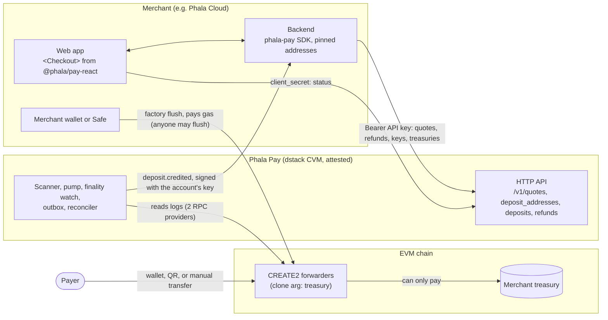

# How Phala Pay works

Phala Pay is open-source, self-hosted software for an API-only, multi-tenant crypto payments
service in Stripe's shape. This page explains the model for every audience. The
[architecture](architecture.md) is the specification, and the [design](design/multi-tenant.md)
records why each decision was made.

## Operators, merchants, and customers

Each operator runs its own instance in its own dstack confidential VM (CVM), for its own
merchants, from a verified release of Phala Pay and a repository that holds only its settings.
[Self-hosting](self-hosting.md) is the path from there to a credited deposit. Phala runs an
instance only for Phala Cloud and offers no hosted service to others.

The operator onboards each merchant as an account (`acct_…`) through the admin API. The merchant
does everything else with its API keys and the SDKs; there is no dashboard. Phala Cloud is an
ordinary account of Phala's instance.

The service turns deposits of configured ERC-20 tokens into USD-valued credits. It tells the
merchant what to credit with signed `deposit.credited` webhooks, which the merchant fulfills once
per deposit.

It is software, not custody:

- Deposit addresses are CREATE2 forwarder contracts that can only pay the merchant's own treasury.
- The service holds no funds and sends no transactions.
- The merchant sweeps and refunds from its own wallet or Safe.
- The service runs inside a dstack CVM, and each account pins its own webhook signing key from
  attestation.

## Quotes and deposit addresses

A **quote** locks a price: the customer receives an exact amount and a single-use address, and
pays within the window.

Each customer can also have one persistent, rotatable **deposit address** for every supported
token on every chain (the same address wherever the treasury is the same). Any amount sent to it
is credited at spot, like the stable bank-transfer details of Stripe's customer balance.

## Routes

A route is one chain and one token, in test or live mode. Routes are settings that each operator
commits to its environment repository, so they are part of the attested deployment; further
merchants are accounts, not configuration.

The repository's committed routes are Phala's staging routes, test routes on Sepolia and Base
Sepolia, listed in [deploy/phala.md, "Staging routes"](../deploy/phala.md#staging-routes).
Production-eligible examples use Chainlink-priced stablecoins
([USDT mainnet template](../examples/phala-cloud-usdt.yaml)). The
[PHA mainnet template](../examples/phala-cloud-pha.yaml) is staging/noncommercial only: PHA has
no second Allowed independent price source ([price sources](configuration.md#price-sources)).

## Architecture at a glance



## Payment lifecycle

```text
merchant backend creates a quote (or the customer's deposit address) with its API key
  → service locks the price and computes a CREATE2 forwarder address over the merchant's treasury
  → the merchant recomputes the address from its own pins before showing it
  → a checkout transaction hint starts immediate verification; unhinted transfers are discovered
    by the fixed five-minute read scan
  → recorded once its block reaches the confirmation (2 blocks on Ethereum, about 30 s after
    paying; 3 blocks on an OP-stack chain such as Base, about 7 s; or the account's stricter
    policy)
  → both RPC providers independently agree on receipt, transaction, header and transfer fields;
    the quote is taken at that instant
  → sanctions screening and per-deposit bounds
  → credited: a signed deposit.credited webhook, retried until the merchant fulfills it once
  → independent dual checkpoints every ten minutes watch finality; a payment a reorg proves
    replaced becomes deposit.reversed; one gone
    with its nonce unspent stays credited, not final, within the cap, and alerts the operator
  → the merchant (or anyone) flushes forwarders to its treasury; the service marks deposits swept
    from the finalized Flushed events
  → hourly dual log coverage and custody reconciliation per forwarder
```

No payment needs an operator step, and there is no failure state: anything that cannot complete
retries with backoff and raises an alert on age. Deterministic denials are recorded with evidence
and never credited.

## Who owns what

| Party | Owns |
|---|---|
| Service | Addresses, chain evidence, finality, screening, pricing, deposit state, credits and their webhooks, the swept status it reads from the chain, and reconciliation. |
| Operator | Creating accounts, deciding live access, issuing first and recovery keys, handling incidents, and its own compliance. |
| Merchant | Its keys, treasuries, webhook endpoints, sweeps, and refunds (and their gas), and its customers' identity (KYC), balances, entitlements, and billing policy. |

Payers, treasuries and refund destinations are screened against verified OFAC SDN snapshots
and audited operator supplements. A stale or unavailable negative answer holds the decision;
positive hits still deny. This is direct address-list screening; operators own broader compliance.
